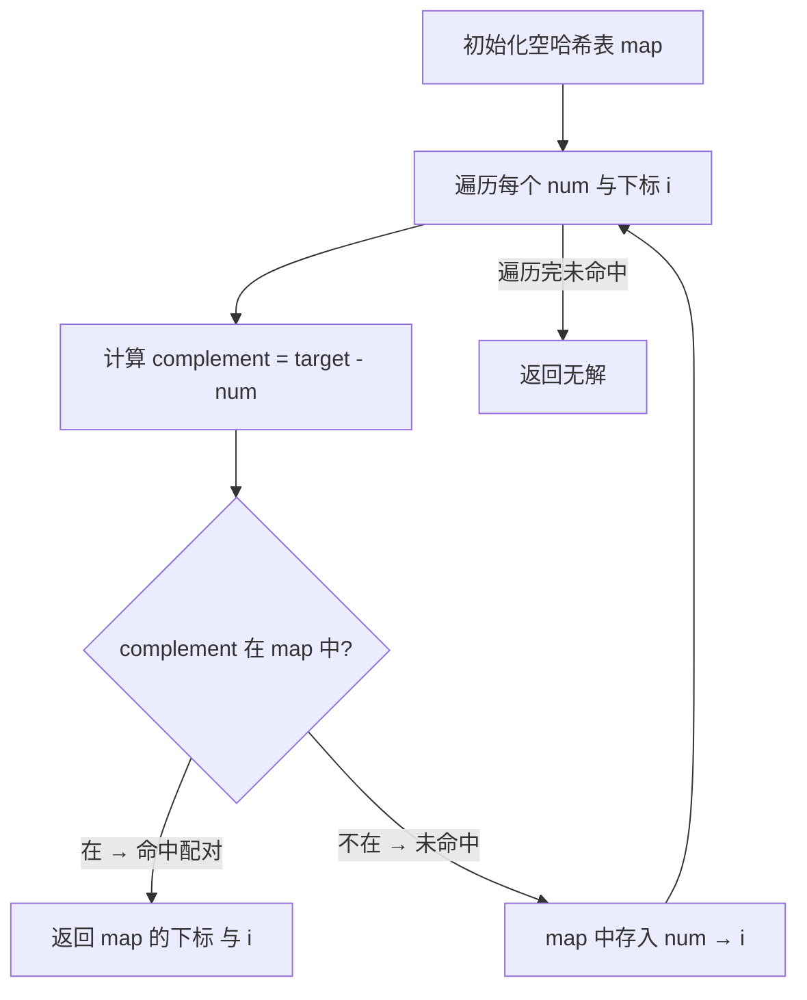
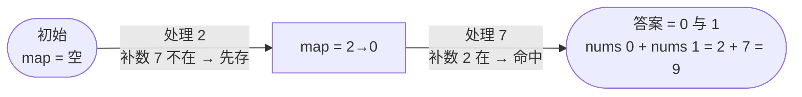

# 1. 两数之和

## 📌 题目

给定一个整数数组 `nums` 和一个整数目标值 `target`，请你在该数组中找出 **和为目标值** _`target`_  的那 **两个** 整数，并返回它们的数组下标。
你可以假设每种输入只会对应一个答案，并且你不能使用两次相同的元素。
你可以按任意顺序返回答案。

示例：
```
输入：nums = [2,7,11,15], target = 9
输出：[0,1]
解释：因为 nums[0] + nums[1] == 9 ，返回 [0, 1] 
```

🔗 [LeetCode 1](https://leetcode.cn/problems/two-sum/description/?envType=study-plan-v2&envId=top-100-liked)

## 🛒 人话理解 & 🧠 思路演进



**总体一句话**：一边遍历一边把「已扫过的数 → 下标」存进哈希表，每来一个数先查它的补数 `target - num` 在不在表里，在就命中、不在就先存后走——把暴力法的第二层循环换成了 `O(1)` 查表。

### 🔬 逐步推演（动画式）

以 `nums = 2, 7, 11, 15`, `target = 9` 为例——从左到右就是算法的时间线：**每个节点是一次状态快照（哈希表内容），箭头上写这一步处理了谁、做了什么决策**：



### 生活中的算法
还记得上次去超市购物吗？你拿着一张100元钞票，挑选了一些商品，收银员告诉你总价是87元。这时候，收银员要找给你13元。但如果收银柜里只有零散的1元、5元、10元，收银员该如何快速地从这些零钱中找出两张，正好加起来等于13元呢？

这就是我们今天要讨论的"两数之和"问题在生活中的一个实例。

### 问题描述
LeetCode第1题"两数之和"是这样描述的：给定一个整数数组nums和一个整数目标值target，请你在该数组中找出和为目标值target的那两个整数，并返回它们的数组下标。

假设每种输入只会对应一个答案，而且不能重复使用相同的元素。

这不就是收银员找零钱的问题吗？数组就是收银柜里的零钱，target就是要找给顾客的金额。

### 最直观的解法：暴力穷举
如果你是收银员，最直观的做法是什么？大概率是这样：拿起第一张钞票，然后挨个和其他钞票配对，看看加起来是不是13元。不行的话，再拿第二张钞票，继续和后面的钞票配对...

这就是我们的暴力解法，它朴素但有效。具体来说：
1. 拿起第一个数字
2. 依次与后面的每个数字相加，检查是否等于目标值
3. 如果找到了，就返回这两个数字的位置
4. 如果没找到，就拿起第二个数字，重复步骤2和3
5. 以此类推，直到找到答案或检查完所有可能

让我们用一个具体的例子来模拟这个过程：
```
nums = [2, 7, 11, 15], target = 9
第一轮：拿起2
2 + 7 = 9，找到答案了！
返回[0, 1]
如果没这么幸运：
2 + 11 = 13，不是9，继续
2 + 15 = 17，不是9，继续
拿起7...
```

这种思路可以用代码这样实现：

> 👉 代码实现见下方「🐍 Python 代码」

### 优化解法：哈希表
让我们回到超市的场景。假设收银员手里拿着一张5元，要找给顾客13元。这时候收银员在想：我现在需要找一张8元的（13 - 5 = 8）。如果能立即知道柜台里有没有8元，问题就解决了。

这就是哈希表解法的核心思想：我们可以使用一个哈希表来记录每个数字出现的位置，这样就能在O(1)时间内查找任何数字。

### 哈希表解法的原理
1. 创建一个哈希表，用于存储每个数字及其下标
2. 遍历数组中的每个数字current
3. 计算需要配对的数字complement = target - current
4. 在哈希表中查找complement
   - 如果找到了，说明我们找到了答案
   - 如果没找到，把当前数字和它的下标放入哈希表，继续遍历

### 算法步骤（伪代码）
1. 创建空的哈希表map
2. 对于数组中的每个数字nums[i]：
   - 计算complement = target - nums[i]
   - 如果map中包含complement，返回[map.get(complement), i]
   - 否则，将nums[i]和i放入map中
3. 如果遍历完还没找到，返回空数组

### 示例运行
让我们用示例数据模拟一下：
```
nums = [2, 7, 11, 15], target = 9

第一步：i = 0
- current = 2
- complement = 9 - 2 = 7
- map为空，找不到7
- 将2和它的下标0放入map：{2:0}

第二步：i = 1
- current = 7
- complement = 9 - 7 = 2
- 在map中找到了2！
- 返回[map.get(2), 1]，也就是[0, 1]
```

### 代码实现

> 👉 代码实现见下方「🐍 Python 代码」

### 暴力解法vs哈希表解法
让我们比较一下这两种解法：
暴力解法用两层循环检查所有可能的组合，时间复杂度是O(n²)，但空间复杂度只有O(1)。它的优点是直观、易于理解，适合处理小规模数据。

哈希表解法只需要遍历一次数组，时间复杂度是O(n)，但需要额外的哈希表存储数据，空间复杂度是O(n)。它用空间换时间，特别适合处理大规模数据。

### 题目模式总结
这道题虽然简单，但它体现了一个重要的算法模式：**查找配对元素**。

这种模式在算法题中经常出现，比如：
- 判断数组中是否存在两个数的差等于某个值
- 在排序数组中找出两个数，它们的平方和等于某个值
- 在字符串中找出两个字符，它们的ASCII码之和等于某个值

解决这类问题的通用思路是：
1. 先思考暴力解法：两层循环遍历所有可能的组合
2. 考虑优化：能否将"查找配对元素"的过程优化到O(1)时间复杂度
3. 思考数据结构：通常哈希表是优化这类问题的利器

### 小结
通过这道题，我们不仅学会了如何解决"两数之和"，更重要的是理解了一个常见的算法模式。下次遇到类似的"找配对元素"问题，我们就知道该如何思考了。

学习算法最重要的不是背解法，而是理解思维方式。希望这篇文章对你有帮助！

## 🐍 Python 代码

### 🥊 暴力解（朴素对照）

双重循环枚举所有数对，逐一判断和是否等于 target——思路最直白。

```python
from typing import List

class Solution:
    def twoSum(self, nums: List[int], target: int) -> List[int]:
        n = len(nums)
        for i in range(n):                 # 固定第一个数
            for j in range(i + 1, n):      # 依次与后面的数配对
                if nums[i] + nums[j] == target:
                    return [i, j]
        return []   # 题目保证有解，这里只是兜底
```

- 时间复杂度：`O(n²)`，双重循环
- 空间复杂度：`O(1)`
- ⚠️ n 一大就超时。观察到「配对查找」可换成 `O(1)` 查询 → 用哈希表把第二层循环压成常数，演进到下方 `O(n)` 解法。

### ⚡ 最优解（哈希表一次遍历）

```python
class Solution:
    def twoSum(self, nums: List[int], target: int) -> List[int]:
        hashmap = {}  # 记录「已经扫过的数 → 它的下标」
        # 对每个数，看它需要的「补数 target-nums[i]」是否在前面扫过的数里；
        # 必须先查后存：若先存再查，当 target == 2*nums[i] 时会把自己和自己配对
        for i in range(len(nums)):
            if target - nums[i] in hashmap:
                return [i, hashmap[target - nums[i]]]   # 命中：返回 [当前下标, 补数的下标]
            hashmap[nums[i]] = i                        # 没命中：把当前数存下，留给后面的数去配对
```
