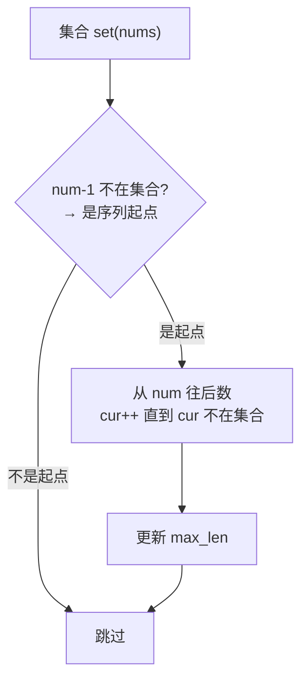

# 128. 最长连续序列

## 📌 题目

给定一个未排序的整数数组 `nums` ，找出数字连续的最长序列（不要求序列元素在原数组中连续）的长度。

请你设计并实现时间复杂度为 `O(n)` 的算法解决此问题。

示例：

```
输入：nums = [100,4,200,1,3,2]
输出：4
解释：最长数字连续序列是 [1, 2, 3, 4]。它的长度为 4。
```

🔗 [LeetCode 128](https://leetcode.cn/problems/longest-consecutive-sequence/description/?envType=study-plan-v2&envId=top-100-liked)

## 🛒 人话理解



**类比**：手里一把扑克牌，想找最长的连续顺子。最笨的法子是排序后扫一遍（O(nlogn)），但要 O(n)。

**关键洞察**：一个数能接上连续序列，**当且仅当它是某个序列的起点**。怎么判断起点？看 `num-1` 在不在集合里——不在，它就是起点。只从起点开始往后数长度，每个数最多被起点访问一次，总 O(n)。

### 思路步骤

这个问题要求时间复杂度为O(n)，可以使用哈希表（字典）来实现。

1. 创建一个哈希表：
    - 用来存储每个数对应的连续序列的长度。
2. 遍历数组： 
    - 对于每个数，如果它已经在哈希表中，直接跳过。
    - 如果是新数：
        - 检查这个数的左右相邻数是否在哈希表中，取出它们对应的连续序列长度 left 和 right。
        - 计算当前数的连续序列长度：cur_length = left + right + 1。
        - 更新最大长度 max_length。
        - 更新当前数及其连续序列两端点的长度为 cur_length。
3. 返回最大长度：
    - 在遍历结束后，即可得到最长的连续序列长度。

## 🐍 Python 代码

### 🥊 暴力解（朴素对照）

先排序，再线性扫描统计最长连续段——思路最直观。

```python
from typing import List

class Solution:
    def longestConsecutive(self, nums: List[int]) -> int:
        if not nums:
            return 0
        nums = sorted(set(nums))   # 去重 + 排序
        max_len = 1
        cur = 1
        for i in range(1, len(nums)):
            if nums[i] == nums[i - 1] + 1:   # 与前一个连续
                cur += 1
                max_len = max(max_len, cur)
            else:                            # 断开，重新计数
                cur = 1
        return max_len
```

- 时间复杂度：`O(n log n)`，排序是主要开销
- 空间复杂度：`O(n)`，去重后的数组
- ⚠️ 不满足题目要求的 `O(n)` 复杂度，仅作思路对照。观察到「只从序列起点 num-1∉集合 开始数」即可让每个数只被访问一次 → 演进到下方 `O(n)` 的哈希表解法。

### ⚡ 最优解（哈希表，O(n)）

```python
class Solution:
    def longestConsecutive(self, nums):
        if not nums:
            # 如果输入列表为空，直接返回0
            return 0
        
        # 创建一个哈希表，用于记录每个数所在序列的长度
        num_dict = {}
        max_length = 0

        # 遍历数组中的每个数
        for num in nums:
            if num in num_dict:
                # 如果当前数已经在哈希表中，跳过（避免重复计算）
                continue
            
            # 获取当前数左边和右边相邻数的连续序列长度
            left = num_dict.get(num - 1, 0)
            right = num_dict.get(num + 1, 0)

            # 当前数所在连续序列的总长度
            cur_length = left + right + 1
            
            # 更新最大长度
            max_length = max(max_length, cur_length)
            
            # 关键：只需更新这条新序列的「两个端点」。
            # 因为以后只有紧贴端点外侧的数才可能再来接龙（get(num±1) 只问邻居），
            # 中间的数永远不会被再次问到，所以存端点就足够维护正确长度。
            num_dict[num] = cur_length
            num_dict[num - left] = cur_length      # 左端点
            num_dict[num + right] = cur_length     # 右端点

        # 返回最长的连续序列长度
        return max_length
```
