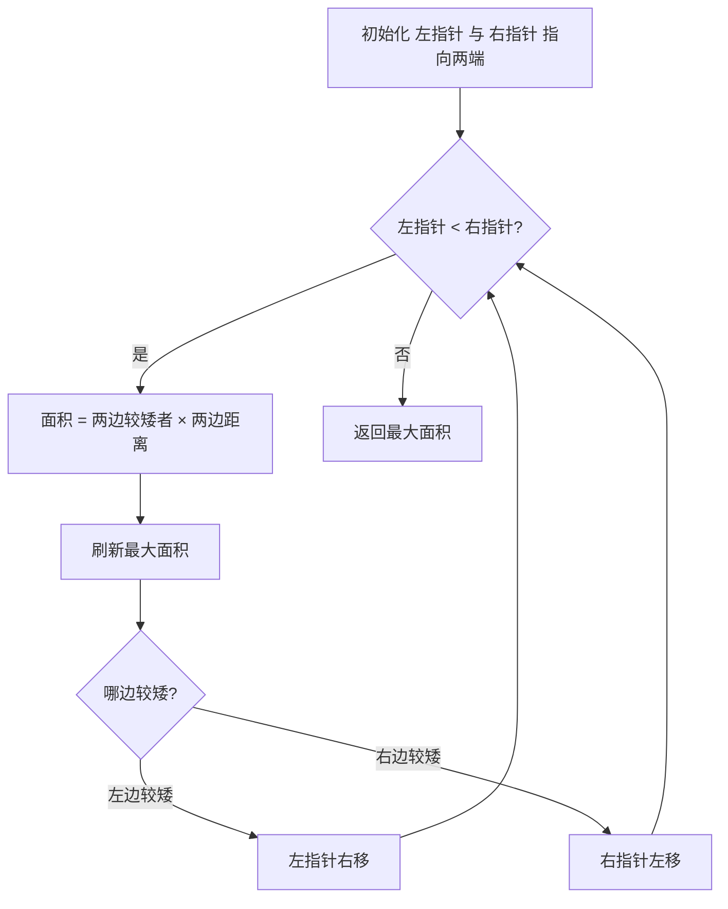
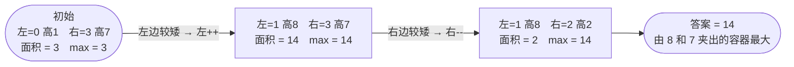

# 11. 盛最多水的容器

## 📌 题目

给定一个长度为 `n` 的整数数组 `height` 。有 `n` 条垂线，第 `i` 条线的两个端点是 `(i, 0)` 和 `(i, height[i])` 。

找出其中的两条线，使得它们与 `x` 轴共同构成的容器可以容纳最多的水。

返回容器可以储存的最大水量。

说明：你不能倾斜容器。

示例：


```
输入：[1,8,6,2,5,4,8,3,7]
输出：49 
解释：图中垂直线代表输入数组 [1,8,6,2,5,4,8,3,7]。在此情况下，容器能够容纳水（表示为蓝色部分）的最大值为 49。
```

🔗 [LeetCode 11](https://leetcode.cn/problems/container-with-most-water/description/?envType=study-plan-v2&envId=top-100-liked)

## 🛒 人话理解 & 🧠 思路演进



**总体一句话**：左右双指针从两端向中间收，每次算面积刷新最大值，并永远移动「较矮」的一边——因为移动较高边只会让宽度变小、高度不会更高，面积只会更小。

### 🔬 逐步推演（动画式）

以 `height = 1,8,2,7` 为例——从左到右就是算法的时间线：**每个节点是一次状态快照（左右指针位置、本步面积、当前 max），箭头上写这一步算出多少、怎么决策**：



### 生活中的算法
你有没有遇到过这样的场景：家里要举办派对，需要准备一个大容器来调制果汁。面前有很多不同高度的挡板，你需要选择两个，插到容器里，这样就能盛放饮料了。挡板的高度不同，间距也可以调整，你要怎么选择才能盛放最多的饮料呢？

这就是我们今天要讲的"盛最多水的容器"问题。本质上，我们要在一排不同高度的"墙"中选择两堵墙，使它们之间能容纳最多的水。

### 问题描述
LeetCode第11题"盛最多水的容器"是这样描述的：给定一个长度为n的整数数组height，有n条垂线，第i条线的两个端点是(i, 0)和(i, height[i])。找出其中的两条线，使得它们与x轴共同构成的容器可以容纳最多的水。

比如，输入height = [1,8,6,2,5,4,8,3,7]，最大容积是49（由height[1]=8和height[8]=7构成，宽度为7）。

### 最直观的解法：暴力枚举法
最容易想到的方法就是：尝试所有可能的容器组合，找出能盛水最多的那个。就像我们实际准备容器时，可能会挨个试一试每种组合。

具体步骤是这样的：
1. 使用两层循环，遍历所有可能的左右边界组合
2. 对每个组合，计算其能容纳的水量
3. 更新最大水量

让我们用一个小例子来模拟这个过程：
```
height = [1,8,6,2]

尝试所有组合：
(0,1): min(1,8) * 1 = 1
(0,2): min(1,6) * 2 = 2
(0,3): min(1,2) * 3 = 3
(1,2): min(8,6) * 1 = 6
(1,3): min(8,2) * 2 = 4
(2,3): min(6,2) * 1 = 2

最大容积 = 6
```

这种思路可以用代码这样实现：

> 👉 代码实现见下方「🐍 Python 代码」

### 优化解法：双指针法
仔细思考，我们其实不需要尝试所有组合。关键是理解：容器的容积取决于两个因素：
1. 两边中较短的那条边（决定了水的高度）
2. 两边的距离（决定了水的宽度）

如果我们从最宽的容器开始，逐渐向内收缩，每次都移动较短的那条边，就一定不会错过最大容积。

### 双指针法的原理
为什么这样做是对的？假设我们有两个指针left和right：
1. 容积由较短的边决定
2. 如果移动较长的边，宽度减小，而高度最多只能是较短边的高度
3. 所以移动较长的边，容积一定会减小
4. 但移动较短的边，可能会找到一个更高的边，容积可能增大

### 算法步骤（伪代码）
1. 初始化左右指针指向数组两端
2. 当左右指针未相遇时：
   - 计算当前容积
   - 更新最大容积
   - 移动较短的那条边的指针
3. 返回最大容积

### 示例运行
让我们用一个例子[1,8,6,2,5,4,8,3,7]模拟这个过程：
```
初始状态：left=0(高度1), right=8(高度7)
容积=min(1,7)*8=8，移动left

left=1(高度8), right=8(高度7)
容积=min(8,7)*7=49，移动right

left=1(高度8), right=7(高度3)
容积=min(8,3)*6=18，移动right

...依此类推
```

### 代码实现

> 👉 代码实现见下方「🐍 Python 代码」

### 暴力法vs双指针法
让我们比较这两种解法：

暴力法的时间复杂度是O(n²)，需要遍历所有可能的组合。它的优点是直观易懂，适合用来理解问题。但在处理大规模数据时效率较低。

双指针法的时间复杂度是O(n)，只需要遍历一次数组。它通过巧妙的证明，保证了不会错过最优解，同时大大提高了效率。

两种方法的空间复杂度都是O(1)，因为只需要常数级的额外空间。

### 题目模式总结
这道题体现了两个重要的算法思想：
1. **双指针技巧**：通过移动两个指针来解决问题
2. **贪心思想**：每次都移动较短的边，期望找到更好的解

这种模式在很多问题中都有应用，比如：
- 两数之和（排序数组）
- 三数之和
- 接雨水

解决这类问题的通用思路是：
1. 观察问题中的单调性质
2. 寻找可以优化的搜索策略
3. 证明优化策略的正确性

### 小结
通过这道题，我们不仅学会了如何找到能盛最多水的容器，更重要的是理解了如何用双指针技巧来优化搜索过程。这种思维方式在很多算法问题中都能派上用场。

记住，解决算法问题时，不要满足于暴力解法，多思考是否存在更优雅的方案。有时候，看似复杂的问题，找到正确的思路后，解法会变得异常简单！

## 🐍 Python 代码

### 🥊 暴力解（朴素对照）

双重循环枚举所有左右边界组合，逐一计算容器面积取最大——思路最直白。

```python
from typing import List

class Solution:
    def maxArea(self, height: List[int]) -> int:
        n = len(height)
        max_volume = 0
        for i in range(n):                # 左边界
            for j in range(i + 1, n):     # 右边界
                volume = min(height[i], height[j]) * (j - i)
                max_volume = max(max_volume, volume)
        return max_volume
```

- 时间复杂度：`O(n²)`，双重循环枚举所有组合
- 空间复杂度：`O(1)`
- ⚠️ n 一大就超时。观察到「移动较长的一边面积只会更小」→ 用左右双指针 `O(n)` 收敛。

### ⚡ 最优解

```python
class Solution:
    def maxArea(self, height: List[int]) -> int:
        start, end = 0, len(height) - 1
        max_volume = 0

        while start < end:
            # 面积 = 两边较矮者(决定水位) × 两边距离(宽度)
            volume = min(height[start], height[end]) * (end - start)
            max_volume = max(max_volume, volume)

            # 核心：永远移动「较矮」的那一边。
            # 面积被较矮边卡住，移动较高边只会让宽度变小、高度不会更高 → 面积只会更小；
            # 移动较矮边才可能遇到更高的边、让面积变大，所以这样不会错过最优解。
            if height[start] < height[end]:
                start += 1     # 左边较矮，舍弃左边
            else:
                end -= 1       # 右边较矮(或等高)，舍弃右边

        return max_volume
```
