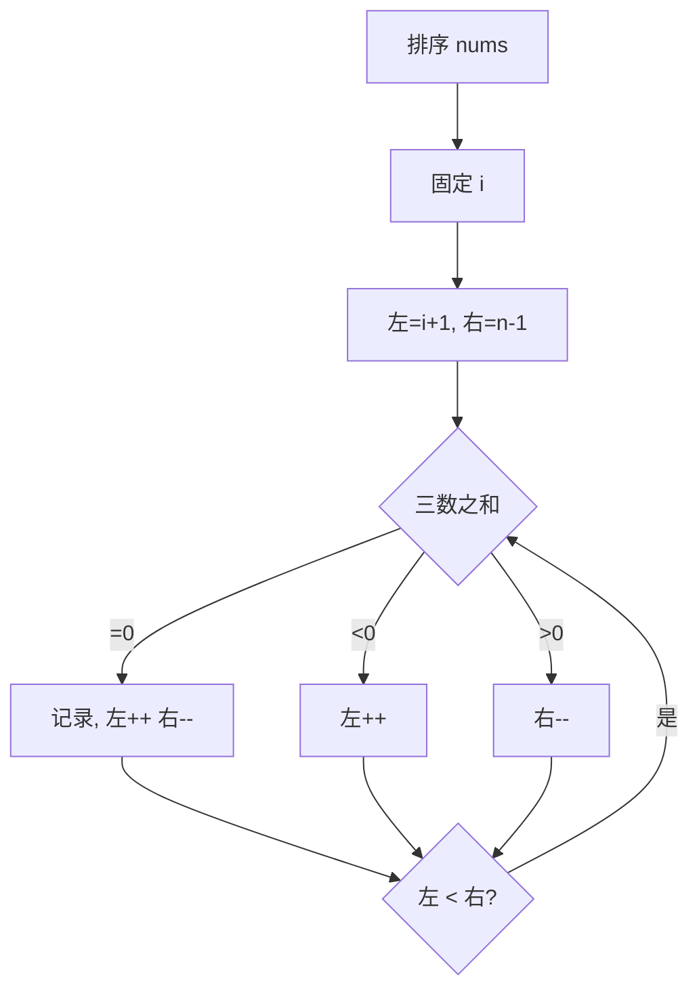

# 15. 三数之和

## 📌 题目

给你一个整数数组 `nums` ，判断是否存在三元组 `[nums[i], nums[j], nums[k]]` 满足 `i != j`、`i != k` 且 `j != k` ，同时还满足 `nums[i] + nums[j] + nums[k] == 0` 。请你返回所有和为 `0` 且不重复的三元组。

注意：答案中不可以包含重复的三元组。

示例：

```
输入：nums = [-1,0,1,2,-1,-4]
输出：[[-1,-1,2],[-1,0,1]]
解释：
nums[0] + nums[1] + nums[2] = (-1) + 0 + 1 = 0 。
nums[1] + nums[2] + nums[4] = 0 + 1 + (-1) = 0 。
nums[0] + nums[3] + nums[4] = (-1) + 2 + (-1) = 0 。
不同的三元组是 [-1,0,1] 和 [-1,-1,2] 。
注意，输出的顺序和三元组的顺序并不重要。
```

🔗 [LeetCode 15](https://leetcode.cn/problems/3sum/description/?envType=study-plan-v2&envId=top-100-liked)

## 🛒 人话理解 & 🧠 思路演进



### 生活中的算法
想象你是一个收银员，顾客给了你一张100元钱，商品只要85元。你要从收银柜里找零15元，但是柜子里只有一堆1元、2元、5元、10元的零钱。你会怎么做？你可能会拿起一张5元，然后找另外两张，加起来正好等于15元。

这就是我们今天要讲的"三数之和"问题的现实版本。不过在算法题中，我们要找的不是指定的和，而是和为0的三个数。

### 问题描述
LeetCode第15题"三数之和"是这样描述的：给你一个整数数组nums，请你找出所有和为0且不重复的三元组。

例如，给定数组 nums = [-1,0,1,2,-1,-4]，满足要求的三元组是：[[-1,-1,2], [-1,0,1]]

这个问题看似简单，但要处理好"不重复"这个要求，还真需要一些巧妙的思路。

### 最直观的解法：三重循环法
最容易想到的方法就是：用三重循环遍历所有可能的三元组组合。就像收银员可能会一张一张地尝试所有零钱的组合。

具体步骤是这样的：
1. 用三层循环遍历所有可能的三元组
2. 检查每个三元组的和是否为0
3. 如果找到了和为0的三元组，还要检查是否重复

让我们用一个小例子来模拟这个过程：
```
nums = [-1,0,1]

尝试所有组合：
(-1,0,1): -1 + 0 + 1 = 0 ✓
(-1,1,0): -1 + 1 + 0 = 0 （重复）
(0,-1,1): 0 + -1 + 1 = 0 （重复）
...

最终结果：[[-1,0,1]]
```

这种思路可以用代码这样实现：

> 👉 代码实现见下方「🐍 Python 代码」

### 优化解法：排序+双指针法
仔细想想，我们其实可以把问题转化为：固定一个数，然后在剩下的数中找两个数，使它们的和等于第一个数的相反数。这就变成了我们熟悉的"两数之和"问题！

关键是要先对数组排序，这样就可以：
1. 方便地跳过重复的数字
2. 使用双指针高效地寻找两个数

### 排序+双指针法的原理
1. 先将数组排序
2. 固定第一个数nums[i]，目标变成找两个数之和等于-nums[i]
3. 使用左右指针在nums[i]后面的区域寻找这两个数
4. 根据三数之和与0的比较，移动左右指针
5. 注意跳过重复的数字以避免重复的三元组

### 算法步骤（伪代码）
1. 对数组排序
2. 遍历数组，固定第一个数nums[i]：
   - 如果nums[i]大于0，后面不可能有解，直接结束
   - 如果nums[i]和前一个数相同，跳过以避免重复
   - 使用左右指针在[i+1, end]区间寻找两数之和等于-nums[i]的组合
3. 记录所有找到的三元组

### 示例运行
让我们用例子[-1,0,1,2,-1,-4]模拟这个过程：
```
排序后：[-4,-1,-1,0,1,2]

固定-4：
目标找和为4的两个数
left=1,right=5: -1+2=1<4，left++
left=2,right=5: -1+2=1<4，left++
left=3,right=5: 0+2=2<4，left++
left=4,right=5: 1+2=3<4，结束

固定第一个-1：
目标找和为1的两个数
left=2,right=5: -1+2=1，找到[-1,-1,2]！
right--继续找...

固定第二个-1：（跳过，避免重复）

固定0：
目标找和为0的两个数
left=4,right=5: 1+2=3>0，right--
left=4,right=4：指针相遇，结束
```

### 代码实现

> 👉 代码实现见下方「🐍 Python 代码」

### 三重循环vs排序+双指针
让我们比较这两种解法：

三重循环法的时间复杂度是O(n³)，空间复杂度是O(1)（不考虑存储结果的空间）。它的优点是直观易懂，缺点是效率太低。

排序+双指针法的时间复杂度是O(n²)，其中排序占用O(nlogn)。空间复杂度是O(logn)到O(n)，取决于排序算法的实现。它通过巧妙地利用排序数组的特性，将时间复杂度降低了一个维度。

### 题目模式总结
这道题体现了几个重要的算法思想：
1. **问题转换**：将三数之和转换为一个数加两数之和
2. **排序预处理**：通过排序简化后续的处理
3. **双指针技巧**：在排序数组中高效查找
4. **去重处理**：利用排序后的性质跳过重复元素

这种模式可以扩展到解决其他类似问题：
- 四数之和
- K数之和
- 最接近的三数之和

解决这类问题的通用思路是：
1. 考虑是否可以通过排序获得额外的性质
2. 能否将K数之和转换为K-1数之和
3. 如何高效地避免重复解

### 小结
通过这道题，我们不仅学会了如何高效地找出三数之和为0的组合，更重要的是理解了如何将一个复杂问题分解成更容易解决的子问题。这种思维方式在算法设计中非常重要。

记住，遇到复杂问题时，不要急于求解，先思考能否通过预处理（如排序）或问题转换来简化问题。有时候，看似复杂的问题，换个角度就豁然开朗！

## 🐍 Python 代码

### 🥊 暴力解（朴素对照）

三重循环枚举所有三元组，判断和是否为 0，并用集合去重——思路最直白。

```python
from typing import List

class Solution:
    def threeSum(self, nums: List[int]) -> List[List[int]]:
        n = len(nums)
        seen = set()                  # 用排序后的元组去重
        for i in range(n):
            for j in range(i + 1, n):
                for k in range(j + 1, n):
                    if nums[i] + nums[j] + nums[k] == 0:
                        seen.add(tuple(sorted([nums[i], nums[j], nums[k]])))
        return [list(t) for t in seen]
```

- 时间复杂度：`O(n³)`（去重还需排序三元组，量级不变）
- 空间复杂度：`O(n)`（结果集）
- ⚠️ n 一大就严重超时。先排序再「固定一个数 + 左右双指针找两数之和」，降到 `O(n²)` 且天然支持去重。

### ⚡ 最优解

```python
class Solution:
    def threeSum(self, nums: List[int]) -> List[List[int]]:
        if len(nums) < 3: return []
        nums.sort()
        result = []
        
        for i in range(len(nums)):
            if nums[i] > 0: break                          # 排序后第一个数已 >0，三数之和不可能为 0，提前结束
            if i > 0 and nums[i] == nums[i - 1]: continue  # 外层去重：相同的「第一个数」只固定一次，避免重复三元组
            
            L, R = i + 1, len(nums) - 1   # 双指针在 i 之后找「两数之和 = -nums[i]」
            while L < R:
                total = nums[i] + nums[L] + nums[R]
                if total == 0:
                    result.append([nums[i], nums[L], nums[R]])
                    # 命中后跳过和当前 L/R 重复的数，避免产生重复三元组
                    while L < R and nums[L] == nums[L + 1]:
                        L += 1
                    while L < R and nums[R] == nums[R - 1]:
                        R -= 1
                    L += 1            # 再各走一步，越过刚才那组
                    R -= 1
                elif total < 0:
                    L += 1             # 和太小，需要变大 → 左指针右移
                else:
                    R -= 1             # 和太大，需要变小 → 右指针左移
        
        return result
```
