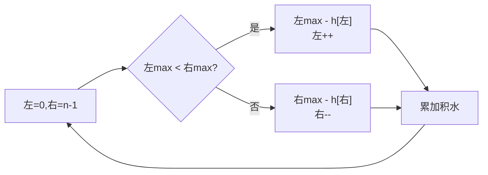

# 42. 接雨水

## 🛒 人话理解 & 🧠 思路演进



### 生活中的算法
你有没有注意过，很多户外运动的水壶都有不规则的凹凸形状？这些凹凸不仅便于握持，而且在横放时会形成天然的积水区域。如果下雨，雨水就会积聚在这些凹槽中。

这就是我们今天要讲的"接雨水"问题的生活映射。在算法中，我们要计算在一排高低不平的柱子之间，能够积攒多少雨水。每个凹陷的地方都可能积水，但具体能积多少，要看它左右两边最高柱子的情况。

### 问题描述

🔗 [LeetCode 42](https://leetcode.cn/problems/trapping-rain-water/description/?envType=study-plan-v2&envId=top-100-liked)

LeetCode第42题"接雨水"是这样描述的：给定 n 个非负整数表示每个宽度为 1 的柱子的高度图，计算按此排列的柱子，下雨之后能接多少雨水。

例如，输入 height = [0,1,0,2,1,0,1,3,2,1,2,1]，能接的雨水总量为6个单位。

### 最直观的解法：按列求解法
最容易想到的方法是：对于每一个位置，看看它能积多少水。要知道一个位置能积多少水，我们需要知道这个位置左右两边最高的柱子。这个位置能积的水就是两边最高柱子中较矮的那个减去当前位置的高度。

具体步骤是这样的：
1. 遍历每个位置
2. 找出这个位置左边最高的柱子
3. 找出这个位置右边最高的柱子
4. 用两边最高柱子中较矮的减去当前位置的高度
5. 如果结果大于0，就累加到总量中

让我们用一个小例子来模拟这个过程：
```
height = [3,1,2,4]

位置1（高度1）：
- 左边最高3
- 右边最高4
- min(3,4) - 1 = 2，可以积2单位水

位置2（高度2）：
- 左边最高3
- 右边最高4
- min(3,4) - 2 = 1，可以积1单位水

总共可以积3单位水
```

这种思路可以用代码这样实现：

> 👉 代码实现见下方「🐍 Python 代码」

### 优化解法：动态规划法
细想一下就会发现，我们在计算每个位置时，都要重复查找左右最高柱子。其实我们可以提前计算好每个位置的左右最大高度，这样就能避免重复计算。

这就是动态规划的思想：通过空间换时间，将计算结果保存下来重复使用。

### 动态规划法的原理
1. 创建两个数组，分别记录每个位置左边和右边的最大高度
2. 第一次遍历，从左向右计算每个位置左边的最大高度
3. 第二次遍历，从右向左计算每个位置右边的最大高度
4. 第三次遍历，根据左右最大高度计算每个位置能积的水量

### 算法步骤（伪代码）
1. 初始化leftMax和rightMax数组，长度等于height数组长度
2. 从左向右遍历：
   - leftMax[i] = max(leftMax[i-1], height[i])
3. 从右向左遍历：
   - rightMax[i] = max(rightMax[i+1], height[i])
4. 遍历每个位置，计算：
   - water[i] = min(leftMax[i], rightMax[i]) - height[i]

### 示例运行
让我们用height = [3,1,2,4]模拟这个过程：
```
第一次遍历（计算leftMax）：
leftMax[0] = 3
leftMax[1] = max(3,1) = 3
leftMax[2] = max(3,2) = 3
leftMax[3] = max(3,4) = 4

第二次遍历（计算rightMax）：
rightMax[3] = 4
rightMax[2] = max(4,2) = 4
rightMax[1] = max(4,1) = 4
rightMax[0] = max(4,3) = 4

第三次遍历（计算积水）：
位置1：min(3,4) - 1 = 2
位置2：min(3,4) - 2 = 1
总积水 = 3
```

### 代码实现

> 👉 代码实现见下方「🐍 Python 代码」

### 进一步优化：双指针法
我们还可以做得更好。注意到一个位置能积的水，取决于左右两边最高柱子中较矮的那个。利用这个特性，我们可以使用双指针来进一步优化空间复杂度。

### 双指针法的核心思想
- 使用左右两个指针从两端向中间移动
- 同时维护左右两边见过的最大高度
- 较小的那一边可以确定积水量，然后向中间移动
- 这样就不需要额外的数组来存储左右最大高度

### 代码实现

> 👉 代码实现见下方「🐍 Python 代码」

### 解法比较
让我们比较这三种解法：

按列求解法：
- 时间复杂度：O(n²)
- 空间复杂度：O(1)
- 优点：直观易懂
- 缺点：效率低，有大量重复计算

动态规划法：
- 时间复杂度：O(n)
- 空间复杂度：O(n)
- 优点：避免重复计算，思路清晰
- 缺点：需要额外空间

双指针法：
- 时间复杂度：O(n)
- 空间复杂度：O(1)
- 优点：时间和空间都达到最优
- 缺点：理解起来较难

### 题目模式总结
这道题体现了几个重要的算法思想：
1. **空间换时间**：通过预处理或记忆化来避免重复计算
2. **双指针技巧**：使用双指针来优化空间复杂度
3. **动态规划**：将问题分解为子问题并存储中间结果

这种解题模式在很多问题中都有应用，比如：
- 容器盛水问题
- 柱状图中最大的矩形
- 股票买卖的最佳时机

解决这类问题的通用思路是：
1. 先想最直观的解法
2. 观察是否存在重复计算
3. 考虑是否可以通过预处理优化
4. 进一步思考是否可以优化空间复杂度

### 小结
通过这道题，我们不仅学会了如何计算接雨水的容量，更重要的是理解了如何一步步优化算法的思维过程。从最直观的解法开始，通过观察特点，利用空间换时间，最后找到时间空间都最优的解法。

记住，算法优化往往是一个渐进的过程。当你遇到一个复杂问题时，先写出最基础的解法，然后再一步步优化。有时候，最优解往往就藏在最基础解法的深入思考中！

## 🐍 Python 代码

### 🥊 暴力解（朴素对照）

逐列求解：对每个位置，向左向右各扫一遍找最高柱子，用「左右最高中的较小值 − 当前高度」累加积水——思路最直白。

```python
from typing import List

class Solution:
    def trap(self, height: List[int]) -> int:
        n = len(height)
        total = 0
        for i in range(n):
            left_max = max(height[:i + 1])        # 含自身的左侧最高
            right_max = max(height[i:])           # 含自身的右侧最高
            total += min(left_max, right_max) - height[i]
        return total
```

- 时间复杂度：`O(n²)`，每个位置都重新扫描左右
- 空间复杂度：`O(1)`
- ⚠️ 重复扫描左右最高柱子导致超时。观察到左右最高可预先算好或用双指针维护 → 演进到下方 `O(n)` 双指针。

### ⚡ 最优解

```python
class Solution:
    def trap(self, height: List[int]) -> int:
        # 双指针：哪边最大值更小，就结算哪边
        left, right = 0, len(height) - 1
        left_max = right_max = total = 0
        # 关键：哪边「历史最高」更小就结算哪边——因为另一侧必有 ≥ 较大值的柱子挡着，
        # 所以较矮侧的水位由它自己的历史最高封顶，可放心结算并移动。
        while left < right:
            left_max = max(left_max, height[left])
            right_max = max(right_max, height[right])
            if left_max < right_max:          # 左边较矮，水由左边决定
                total += left_max - height[left]
                left += 1
            else:                             # 右边较矮，水由右边决定
                total += right_max - height[right]
                right -= 1
        return total
```
