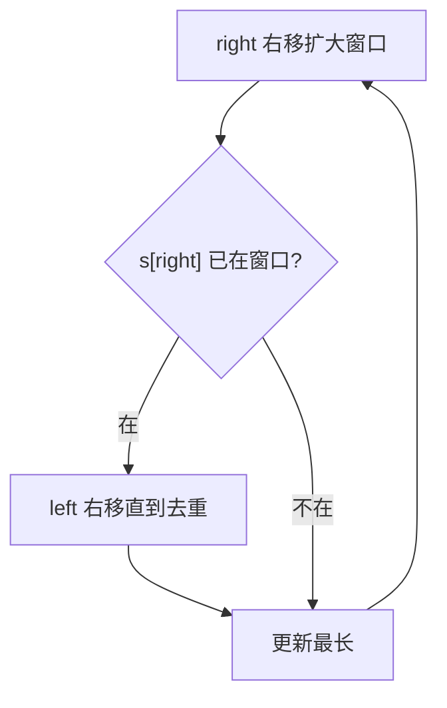

# 3. 无重复字符的最长子串

## 📌 题目

给定一个字符串 `s` ，请你找出其中不含有重复字符的 **最长子串** 的长度。

示例：
```
输入: s = "abcabcbb"
输出: 3 
解释: 因为无重复字符的最长子串是 `"abc"`，所以其长度为 3。
```

🔗 [LeetCode 3](https://leetcode.cn/problems/longest-substring-without-repeating-characters/description/?envType=study-plan-v2&envId=top-100-liked)

## 🛒 人话理解 & 🧠 思路演进



### 生活中的算法
你是否玩过"一指禅"游戏？就是沿着一串字母走，不能重复走过已经走过的字母。这个游戏的本质，其实就是在寻找无重复字符的最长子串。

在实际编程中，这个问题的应用非常广泛。比如在文本编辑器中查找不含重复字符的最长片段，或是在DNA序列分析中寻找无重复碱基对的最长序列。

### 问题描述
LeetCode第3题"无重复字符的最长子串"是这样描述的：给定一个字符串 s，请你找出其中不含有重复字符的最长子串的长度。

例如：
- 输入: s = "abcabcbb"，输出: 3（最长子串是 "abc"）
- 输入: s = "bbbbb"，输出: 1（最长子串是 "b"）
- 输入: s = "pwwkew"，输出: 3（最长子串是 "wke"）

### 最直观的解法：暴力枚举法
最容易想到的方法是：枚举所有可能的子串，检查每个子串是否包含重复字符，然后找出最长的那个。

让我们用一个例子来模拟这个过程：
```
s = "pwwk"

检查所有子串：
"p" - 长度1，无重复
"pw" - 长度2，无重复
"pww" - 长度3，有重复
"pwwk" - 长度4，有重复
"w" - 长度1，无重复
"ww" - 长度2，有重复
"wwk" - 长度3，有重复
"w" - 长度1，无重复
"wk" - 长度2，无重复
"k" - 长度1，无重复

最长的无重复子串长度为2
```

这种思路可以用代码这样实现：

> 👉 代码实现见下方「🐍 Python 代码」

### 优化解法：滑动窗口法
仔细观察会发现，当我们遇到重复字符时，不需要完全重新开始，而是可以从上一次该字符出现位置的下一个位置继续。这就是"滑动窗口"的思想。
举个例子，对字符串"abcdce"，当我们查看到"abcd"这个子串时，子串内没有重复字符。
但是，当我们继续前进，子串变成"abcdc"，现在c重复了！由于出现了第二个c，所以，第一个c之前的字符，都没有用了。
我们需要把第一个c，以及它前面的字符全部剔除出去，以保证c不再重复。

### 滑动窗口法的原理
1. 使用两个指针（left和right）维护一个窗口
2. 右指针不断向右移动，扩大窗口
3. 当遇到重复字符时，左指针移动到上一次该字符出现位置的下一位
4. 在这个过程中记录最大窗口大小

### 算法步骤（伪代码）
1. 初始化left = 0，right = 0，maxLength = 0
2. 使用Map记录每个字符最后出现的位置
3. 移动右指针，对于每个字符：
   - 如果字符已在窗口中，更新left指针
   - 更新字符的位置
   - 更新最大长度

### 示例运行
让我们用s = "abba"模拟这个过程：
```
初始状态：left = 0, right = 0, maxLength = 0
Map = {}

1. 处理'a'：
   Map = {a:0}
   窗口：[a]
   maxLength = 1

2. 处理'b'：
   Map = {a:0, b:1}
   窗口：[ab]
   maxLength = 2

3. 处理'b'：
   发现重复的'b'
   left移动到上一个'b'的下一位
   Map = {a:0, b:2}
   窗口：[b]
   maxLength = 2

4. 处理'a'：
   发现重复的'a'
   left移动到上一个'a'的下一位
   Map = {a:3, b:2}
   窗口：[ba]
   maxLength = 2
```

### 代码实现

> 👉 代码实现见下方「🐍 Python 代码」

### 解法比较
让我们比较这两种解法：

暴力枚举法：
- 时间复杂度：O(n²)
- 空间复杂度：O(min(m,n))，其中m是字符集大小
- 优点：直观易懂
- 缺点：效率低，有重复计算

滑动窗口法：
- 时间复杂度：O(n)
- 空间复杂度：O(min(m,n))
- 优点：一次遍历就能得到结果
- 缺点：需要额外空间存储字符位置

### 题目模式总结
这道题体现了几个重要的算法思想：
1. **滑动窗口**：使用双指针维护一个符合条件的区间
2. **空间换时间**：使用哈希表记录信息来优化查找
3. **重复利用信息**：不重新开始，而是利用已知信息继续搜索

这种解题模式在很多问题中都有应用，比如：
- 最小覆盖子串
- 字符串的排列
- 找到字符串中所有字母异位词

解决此类问题的通用思路是：
1. 考虑是否可以通过维护一个窗口来解决
2. 确定窗口的更新条件
3. 想清楚如何移动左右指针
4. 考虑是否需要额外的数据结构来优化

### 小结
通过这道题，我们不仅学会了如何找到最长无重复子串，更重要的是掌握了滑动窗口这个强大的算法技巧。从暴力解法到优化解法，我们看到了如何通过观察问题特点来优化算法。

记住，很多看似复杂的问题，都可以通过滑动窗口来优雅地解决。当你遇到类似的字符串处理问题时，不妨先想想是否可以用这个技巧！

## 🐍 Python 代码

```python
class Solution:
    def lengthOfLongestSubstring(self, s: str) -> int:
        if not s:
            return 0
        
        # 初始化指针和结果变量
        start, max_length = 0, 0
        char_index_map = {}  # 用于存储字符及其最后出现的位置

        for end in range(len(s)):
            if s[end] in char_index_map and char_index_map[s[end]] >= start:
                # 如果当前字符已经存在于字典中且其索引在start之后或等于start，说明有重复字符，
                # 需要移动start指针，以排除重复字符
                start = char_index_map[s[end]] + 1
            
            # 更新字符的最新索引位置
            char_index_map[s[end]] = end
            
            # 更新最长无重复子串的长度
            max_length = max(max_length, end - start + 1)

        return max_length
```
