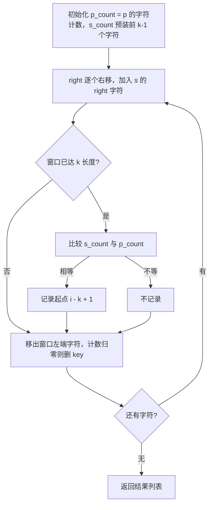
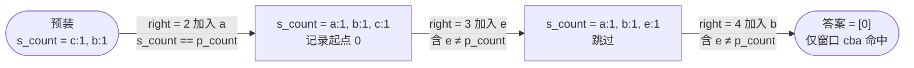

# 438. 找到字符串中所有字母异位词

## 📌 题目

给定两个字符串 `s` 和 `p`，找到 `s` 中所有 `p` 的 **异位词** 的子串，返回这些子串的起始索引。不考虑答案输出的顺序。

**异位词** 指由相同字母重排列形成的字符串（包括相同的字符串）。

示例：

```
输入：s = "cbaebabacd", p = "abc"
输出：[0,6]
解释：
起始索引等于 0 的子串是 "cba", 它是 "abc" 的异位词。
起始索引等于 6 的子串是 "bac", 它是 "abc" 的异位词。
```

🔗 [LeetCode 438](https://leetcode.cn/problems/find-all-anagrams-in-a-string/description/?envType=study-plan-v2&envId=top-100-liked)

## 🛒 人话理解 & 🧠 思路演进



**总体一句话**：维护一个固定长度为 `k`（`p` 的长度）的滑动窗口，用 `s_count` 跟踪窗口内字符计数；`right` 每步加入一个字符、左端移出一个字符，比较 `s_count` 与 `p_count` 是否相等，相等就记录起点。

### 🔬 逐步推演（动画式）

以 `s = "cbaeb"`、`p = "abc"` 为例（`k = 3`，`p_count = {a:1, b:1, c:1}`，`s_count` 预装 `s[:2] = "cb"` 即 `{c:1, b:1}`）——从左到右就是算法的时间线：**每个节点是一次状态快照（s_count 加入后 / 起点），箭头上写这一步加入了谁、怎么决策**：



### 生活中的算法
还记得小时候玩的"找朋友"游戏吗？每个人都有一个字母牌，需要找到拥有相同字母组合的伙伴。比如，拿着"ate"的同学要找到拿着"eat"或"tea"的同学。这其实就是在寻找字母异位词！

在实际应用中，字母异位词的检测有着广泛的用途。比如在密码学中检测可能的密文变体，或在文本分析中找出词语的不同排列组合。

### 问题描述
LeetCode第438题"找到字符串中所有字母异位词"是这样描述的：给定两个字符串 s 和 p，找到 s 中所有 p 的异位词的子串，返回这些子串的起始索引。不考虑答案输出的顺序。

异位词指由相同字母重排列形成的字符串（包括相同的字符串）。

例如：
- 输入: s = "cbaebabacd", p = "abc"
- 输出: [0,6]
- 解释: 起始索引等于 0 的子串是 "cba", 它是 "abc" 的异位词。起始索引等于 6 的子串是 "bac", 它也是 "abc" 的异位词。

### 最直观的解法：排序比较法
最容易想到的方法是：取出s中长度等于p的每个子串，将子串和p分别排序后比较是否相等。如果相等，就找到了一个异位词。

让我们用一个例子来模拟这个过程：
```
s = "cbae", p = "abc"

检查所有长度为3的子串：
"cba" -> 排序后："abc" = "abc"（p排序后） ✓
"bae" -> 排序后："abe" ≠ "abc"（p排序后） ✗
```

这种思路可以用代码这样实现：

> 👉 代码实现见下方「🐍 Python 代码」

### 优化解法：滑动窗口 + 字符计数法
仔细思考会发现，我们其实不需要对字符串排序。只要两个字符串包含相同的字符，且每个字符出现的次数相同，它们就是异位词。这启发我们使用字符计数的方法。

结合滑动窗口技巧，我们可以在一次遍历中完成所有比较。

### 算法原理
1. 使用数组记录p中每个字符的出现次数
2. 维护一个大小等于p长度的滑动窗口
3. 对窗口中的字符计数，与p的字符计数比较
4. 当找到匹配时记录起始索引

### 算法步骤（伪代码）
1. 初始化两个大小为26的数组，分别记录p和窗口中字符出现次数
2. 先统计p中字符出现次数
3. 使用滑动窗口遍历s：
   - 右边加入新字符，更新计数
   - 当窗口大小超过p长度时，左边移除字符，更新计数
   - 比较两个计数数组是否相等

### 示例运行
让我们用s = "cbae", p = "abc"模拟这个过程：
```
初始状态：
p的字符计数：[a:1, b:1, c:1]
窗口字符计数：[]

1. 添加'c'：
   窗口计数：[c:1]
   
2. 添加'b'：
   窗口计数：[b:1, c:1]
   
3. 添加'a'：
   窗口计数：[a:1, b:1, c:1]
   比较：相等 ✓
   记录索引0
   
4. 添加'e'，移除'c'：
   窗口计数：[a:1, b:1, e:1]
   比较：不等 ✗
```

### 代码实现

> 👉 代码实现见下方「🐍 Python 代码」

### 解法比较
让我们比较这两种解法：

排序比较法：
- 时间复杂度：O(n·k·log k)，其中k是p的长度
- 空间复杂度：O(k)
- 优点：直观易懂
- 缺点：需要频繁排序，效率较低

滑动窗口 + 字符计数法：
- 时间复杂度：O(n)
- 空间复杂度：O(1)（因为数组大小固定为26）
- 优点：一次遍历就能得到结果，无需排序
- 缺点：需要额外空间存储字符计数

### 题目模式总结
这道题体现了几个重要的算法思想：
1. **滑动窗口**：用于高效处理子串问题
2. **计数统计**：用计数替代排序来判断字符组成是否相同
3. **空间换时间**：使用额外空间来优化时间复杂度

这种解题模式在很多字符串问题中都有应用，比如：
- 无重复字符的最长子串
- 最小覆盖子串
- 字符串的排列

解决此类问题的通用思路是：
1. 考虑能否用计数方法代替排序
2. 思考是否可以用滑动窗口优化
3. 注意窗口更新时的计数维护
4. 考虑边界条件的处理

### 小结
通过这道题，我们不仅学会了如何找到字符串中的所有异位词，更重要的是掌握了字符统计和滑动窗口相结合的技巧。从排序比较到字符计数，我们看到了如何通过巧妙的思路来提升算法效率。

记住，在处理字符串相关的问题时，排序并不总是最好的选择。有时候，简单的计数可能会带来意想不到的效率提升！

## 🐍 Python 代码

### 🥊 暴力解（朴素对照）

取出每个长度等于 p 的子串，排序后与排序后的 p 比较——思路最直白。

```python
from typing import List

class Solution:
    def findAnagrams(self, s: str, p: str) -> List[int]:
        n, k = len(s), len(p)
        sorted_p = sorted(p)                # 目标排序结果，只算一次
        result = []
        for i in range(n - k + 1):          # 枚举每个长度为 k 的子串起点
            if sorted(s[i:i + k]) == sorted_p:
                result.append(i)
        return result
```

- 时间复杂度：`O(n · k · log k)`，n 为 s 长度，k 为 p 长度，每个子串都要排序
- 空间复杂度：`O(k)`，存放子串排序结果
- ⚠️ 反复排序效率低。观察到相邻窗口只差「进一个字符、出一个字符」→ 用计数数组维护，演进到下方 `O(n)` 的滑动窗口。

### ⚡ 最优解

```python
class Solution:
    def findAnagrams(self, s: str, p: str) -> List[int]:
        p_count = Counter(p)
        # 窗口先装进 p 的前 len(p)-1 个字符；循环里每步再「加一个」s[i]，
        # 这样窗口恰好凑满 len(p) 个（少装一个是为了配合下面的「先加后判」）
        s_count = Counter(s[:len(p)-1])
        
        result = []
        # 遍历字符串 s，从索引 len(p)-1 到 len(s)-1
        for i in range(len(p)-1, len(s)):
            # 将新的字符加入当前滑动窗口的计数器中
            s_count[s[i]] += 1
            
            # 如果当前窗口的字符计数器与 p 的字符计数器相同，则记录起始索引
            if s_count == p_count:
                result.append(i - len(p) + 1)
            
            # 移除窗口左侧即将滑出的那个字符（窗口起点 = i - len(p) + 1）的计数
            s_count[s[i - len(p) + 1]] -= 1
            # 关键：计数归零必须删 key！因为 Counter({'a':0}) != Counter()，
            # 若不删，上面的 s_count == p_count 会一直判不相等，漏掉所有答案
            if s_count[s[i - len(p) + 1]] == 0:
                del s_count[s[i - len(p) + 1]]
        
        return result
```
