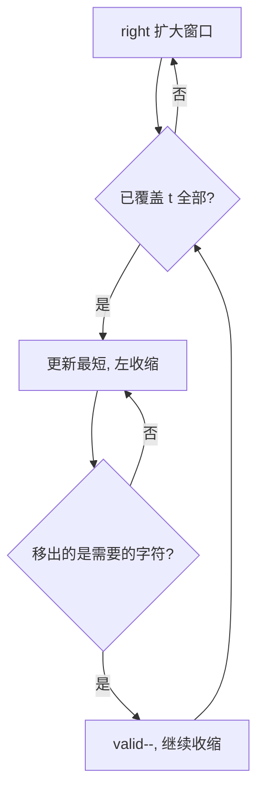

# 76. 最小覆盖子串

## 🛒 人话理解 & 🧠 思路演进



### 从生活中理解这个问题
想象你是一位珠宝设计师，要用一段项链（可能包含各种宝石）找出最短的一段，这段中必须包含顾客指定的所有种类的宝石。比如顾客要求必须有红宝石、蓝宝石和钻石，你需要找出包含这三种宝石的最短项链片段。

这就是"最小覆盖子串"问题的生活映射：在一个长字符串中找到包含目标字符串所有字符的最短子串。

### 问题描述

🔗 [LeetCode 76](https://leetcode.cn/problems/minimum-window-substring/description/?envType=study-plan-v2&envId=top-100-liked)

LeetCode第76题“最小覆盖子串”是这样描述的：给你一个字符串 S 和一个字符串 T，请在 S 中找出包含 T 所有字符的最小子串。

举个例子：
```
S = "ADOBECODEBANC"
T = "ABC"
输出: "BANC"

解释：我们要找的子串必须包含A、B和C，而"BANC"是所有满足条件的子串中最短的。
```

### 解题套路：滑动窗口模板的应用
滑动窗口是一类特殊的双指针技巧，特别适合处理子串、子数组的问题。我们先来理解这个通用模板。

### 滑动窗口通用模板

> 👉 代码实现见下方「🐍 Python 代码」

这个模板的精髓在于：
1. **两个指针**：控制窗口的左右边界
2. **数据结构**：维护窗口内的状态
3. **双层循环**：外层扩展右边界，内层收缩左边界
4. **更新规则**：清晰的窗口数据更新规则

### 运用模板解决最小覆盖子串
现在让我们用这个模板来解决我们的问题：

> 👉 代码实现见下方「🐍 Python 代码」

让我们用一个简单的例子来详细演示这个过程：
```
S = "ADOBEC"
T = "ABC"

1. 初始状态：
need = {A:1, B:1, C:1}
window = {}
valid = 0

2. 遇到'A'：
window = {A:1}
valid = 1  // A达到要求

3. 遇到'D'：
不是需要的字符，跳过

4. 遇到'O'：
不是需要的字符，跳过

5. 遇到'B'：
window = {A:1, B:1}
valid = 2  // B达到要求

6. 遇到'E'：
不是需要的字符，跳过

7. 遇到'C'：
window = {A:1, B:1, C:1}
valid = 3  // 所有字符都达到要求了

8. 开始收缩窗口...
```

### 滑动窗口解题模板的四个重点
1. **窗口定义**：
   - 明确窗口应该包含什么
   - 明确什么时候扩大窗口
   - 明确什么时候缩小窗口

2. **状态变量**：
   - 使用合适的数据结构记录状态
   - 明确状态的更新规则
   - 明确有效状态的判断条件

3. **更新规则**：
   - 扩大窗口时如何更新
   - 缩小窗口时如何更新
   - 什么时候更新结果

4. **边界条件**：
   - 初始化值的设置
   - 结果不存在的处理
   - 特殊情况的考虑

### 类似题目及解题思路
这个模板可以解决很多类似的问题：
- 字符串的排列
- 找到字符串中所有字母异位词
- 无重复字符的最长子串

解决这类问题的通用步骤：
1. 确定是否适合用滑动窗口
2. 定义窗口的意义
3. 确定状态变量和更新规则
4. 套用模板编写代码
5. 处理边界条件

### 小结
掌握滑动窗口模板，就像学会了一把万能钥匙，可以解开许多字符串子串问题的大门。记住：
1. 模板的核心是状态的维护和更新
2. 左右指针的移动要有明确的逻辑
3. 条件的判断要准确无误

下次遇到子串相关的问题，不妨先想想是否可以用这个模板来解决！

## 🐍 Python 代码

```python
from collections import Counter

class Solution:
    def minWindow(self, s: str, t: str) -> str:
        need = Counter(t)
        window = {}
        left = valid = 0
        start, min_len = 0, float('inf')
        for right, c in enumerate(s):
            if c in need:                        # 扩大窗口：纳入需要的字符
                window[c] = window.get(c, 0) + 1
                if window[c] == need[c]:
                    valid += 1
            while valid == len(need):            # 全部满足，尝试收缩
                if right - left + 1 < min_len:
                    start, min_len = left, right - left + 1
                d = s[left]
                left += 1
                if d in need:                    # 移出的是需要的字符
                    if window[d] == need[d]:
                        valid -= 1
                    window[d] -= 1
        return "" if min_len == float('inf') else s[start:start + min_len]
```
