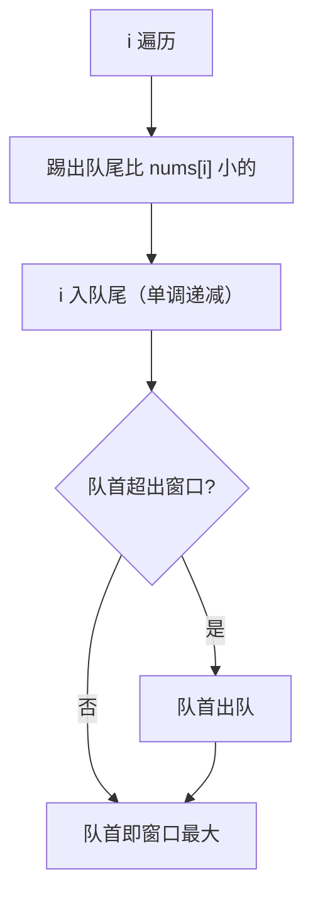

# 239. 滑动窗口最大值

## 🛒 人话理解 & 🧠 思路演进



### 用生活中的例子来理解
想象你是一位摄影师，在拍摄一场马拉松比赛。你的相机一次只能拍摄3个跑步者（就像一个宽度为3的窗口）。随着比赛进行，你的镜头不断向前移动，每次只移动一点点，要在每张照片中找出最高的那位跑步者的身高。这就是我们今天要解决的"滑动窗口最大值"问题。

### 问题是什么
LeetCode第239题“滑动窗口最大值”给我们一个任务：假设有一个数组，比如 [2,3,4,2,6,2,5,1]，然后给我们一个宽度为3的窗口。这个窗口会从左往右滑动，每次移动一格。我们需要记录下每个窗口中的最大值。

举个简单的例子：
```
数组：[2,3,4]  窗口大小：2

第一个窗口：[2,3] 4   最大值是3
第二个窗口：2 [3,4]   最大值是4

所以最终结果是：[3,4]
```

### 最简单的解决方案：看一看比一比
就像我们肉眼看照片找最高的人一样，最简单的方法就是每次都看窗口里的所有数字，找出最大的那个。

> 👉 代码实现见下方「🐍 Python 代码」

这个方法很直观，就像用眼睛一个一个数字比较。但是，如果数组很长，窗口很大，这样做就会很慢。

### 聪明的解决方案：排队游戏
现在我们来学一个更聪明的方法。想象一个游戏：

1. 我们有一群小朋友排队，每个小朋友手里举着一个数字牌。
2. 我们要保证队伍里的小朋友，从前到后手里的数字是从大到小的。
3. 当新的小朋友要进队时，就要把队伍后面所有比他数字小的小朋友请出队。
4. 队伍最前面的小朋友，就是当前窗口的最大值。

用代码来实现这个想法：

> 👉 代码实现见下方「🐍 Python 代码」

让我们用一个具体的例子来看这个过程：
```
数组：[3,1,4,2]  窗口大小：2

初始状态：队伍为空

1. 数字3来了：
   队伍：[3]
   
2. 数字1来了：
   因为1比3小，直接排在3后面
   队伍：[3,1]
   第一个窗口的最大值是3
   
3. 数字4来了：
   4比1大，1离开队伍
   4比3大，3离开队伍
   队伍：[4]
   第二个窗口的最大值是4
   
4. 数字2来了：
   2比4小，直接排在4后面
   队伍：[4,2]
   第三个窗口的最大值是4
```

### 为什么这样做更好？
1. 每个数字最多只会进队一次，出队一次
2. 我们不用每次都看窗口里的所有数字
3. 队伍的最前面永远是当前窗口的最大值

这就像在拍马拉松照片时，不用每次都量所有人的身高，而是保持一个有序的记录，随时知道当前画面中最高的人是谁。

### 小结
解决滑动窗口最大值问题，关键是要想到：
1. 我们不需要记住窗口里的所有数
2. 只需要保持一个"从大到小"的顺序
3. 及时把不在窗口范围内的数字删除

这样，我们就把一个看起来很复杂的问题，变成了一个简单的"排队游戏"！

## 🐍 Python 代码

```python
from collections import deque

class Solution:
    def maxSlidingWindow(self, nums: List[int], k: int) -> List[int]:
        res, q = [], deque()   # q 存下标，对应值保持单调递减
        for i in range(len(nums)):
            if q and q[0] < i - k + 1:          # 队首已滑出窗口
                q.popleft()
            while q and nums[q[-1]] < nums[i]:  # 踢掉队尾所有更小的
                q.pop()
            q.append(i)
            if i >= k - 1:                       # 窗口成形，队首即最大值
                res.append(nums[q[0]])
        return res
```
