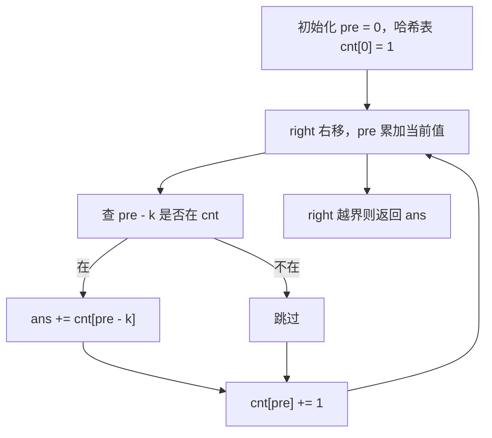
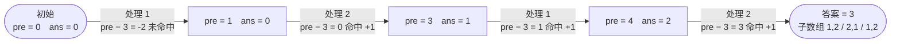

# 560. 和为 K 的子数组

## 📌 题目

给你一个整数数组 `nums` 和一个整数 `k` ，请你统计并返回该数组中和为 `k` 的子数组的个数。

子数组是数组中元素的连续非空序列。

示例：

```
输入：nums = [1,1,1], k = 2
输出：2
```

🔗 [LeetCode 560](https://leetcode.cn/problems/subarray-sum-equals-k/description/?envType=study-plan-v2&envId=top-100-liked)

## 🛒 人话理解 & 🧠 思路演进



**总体一句话**：一遍扫，边走边记每个前缀和的出现次数——当前前缀和 `pre` 若能找到 `pre - k`，说明中间夹着一段和为 `k` 的子数组，把那段的数量累加进答案。

### 🔬 逐步推演（动画式）

以 `nums = [1, 2, 1, 2]`、`k = 3` 为例——从左到右就是算法的时间线：**每个节点是一次状态快照（前缀和 pre / 答案 ans），箭头上写这一步处理了谁、查 pre − 3 命不命中**：



### 生活中的算法
你有没有这样的经历：每天往存钱罐里存一些零钱，某一天突然想知道，从哪天开始存到哪天结束，刚好能凑够买一件心仪物品的钱？这其实就是在寻找"和为特定值的连续数字序列"。

这个问题在金融分析、数据处理等领域都有着广泛的应用。比如分析股票的累计收益，寻找特定增长区间；或是在气象数据中寻找累计降雨量达到特定值的时间段。

### 问题描述
LeetCode第560题"和为K的子数组"是这样描述的：给你一个整数数组 nums 和一个整数 k，请你统计并返回该数组中和为 k 的连续子数组的个数。

例如：
- 输入：nums = [1,1,1], k = 2
- 输出：2
- 解释：有两个子数组之和为 2：[1,1] 和 [1,1]

### 最直观的解法：暴力枚举法
最容易想到的方法是：枚举所有可能的子数组，计算它们的和，统计等于k的个数。

让我们用一个例子来模拟这个过程：
```
nums = [1,2,3], k = 3

检查所有子数组：
[1] -> sum = 1 ≠ 3
[1,2] -> sum = 3 = 3 ✓
[1,2,3] -> sum = 6 ≠ 3
[2] -> sum = 2 ≠ 3
[2,3] -> sum = 5 ≠ 3
[3] -> sum = 3 = 3 ✓

找到两个和为3的子数组
```

这种思路可以用代码这样实现：

> 👉 代码实现见下方「🐍 Python 代码」

### 优化解法：前缀和 + 哈希表
仔细观察会发现，我们在计算子数组之和时做了很多重复计算。实际上，我们可以使用前缀和的概念来优化。更妙的是，我们可以结合哈希表来快速找到符合条件的子数组。

### 前缀和的原理
前缀和是到当前位置为止所有数的和。如果两个前缀和之差为k，那么这两个位置之间的子数组和就是k。

### 算法步骤（伪代码）
1. 初始化哈希表，记录前缀和出现的次数
2. 初始化前缀和为0，计数为1（空数组的前缀和）
3. 遍历数组，对于每个位置：
   - 更新前缀和
   - 查找是否存在前缀和等于(当前前缀和-k)的记录
   - 更新哈希表中前缀和的出现次数

### 示例运行
让我们用nums = [1,2,1,2], k = 3模拟这个过程：
```
初始状态：
前缀和Map = {0:1}
count = 0

1. 处理1：
   前缀和 = 1
   查找Map中是否有key为(1-3)=-2的记录：无
   更新Map = {0:1, 1:1}

2. 处理2：
   前缀和 = 3
   查找Map中是否有key为(3-3)=0的记录：有，count += 1
   更新Map = {0:1, 1:1, 3:1}

3. 处理1：
   前缀和 = 4
   查找Map中是否有key为(4-3)=1的记录：有，count += 1
   更新Map = {0:1, 1:1, 3:1, 4:1}

4. 处理2：
   前缀和 = 6
   查找Map中是否有key为(6-3)=3的记录：有，count += 1
   更新Map = {0:1, 1:1, 3:1, 4:1, 6:1}
```

### 代码实现

> 👉 代码实现见下方「🐍 Python 代码」

### 解法比较
让我们比较这两种解法：

暴力枚举法：
- 时间复杂度：O(n²)
- 空间复杂度：O(1)
- 优点：直观易懂
- 缺点：效率低，有大量重复计算

前缀和 + 哈希表法：
- 时间复杂度：O(n)
- 空间复杂度：O(n)
- 优点：一次遍历就能得到结果
- 缺点：需要额外空间存储前缀和信息

### 题目模式总结
这道题体现了几个重要的算法思想：
1. **前缀和技巧**：通过预处理简化区间和的计算
2. **哈希表应用**：用于快速查找满足条件的值
3. **空间换时间**：通过存储中间结果来提高效率

这种解题模式在很多问题中都有应用，比如：
- 和为k的最长子数组
- 连续数组（0和1数量相等）
- 矩阵区域和检索

解决此类问题的通用思路是：
1. 考虑是否可以通过预处理简化重复计算
2. 思考如何利用已计算的结果
3. 关注数值之间的关系转换
4. 考虑边界情况的处理

### 小结
通过这道题，我们不仅学会了如何找到和为k的子数组，更重要的是掌握了前缀和这个强大的预处理技巧，以及如何巧妙地结合哈希表来优化查找过程。

记住，当遇到需要频繁计算区间和的问题时，前缀和往往是一个很好的切入点。而当我们需要快速判断某个值是否存在时，哈希表常常能带来惊喜！

## 🐍 Python 代码

### 🥊 暴力解（朴素对照）

枚举所有子数组、边累加边统计和为 k 的个数——双重循环最直白。

```python
from typing import List

class Solution:
    def subarraySum(self, nums: List[int], k: int) -> int:
        n = len(nums)
        count = 0
        for i in range(n):            # 子数组起点
            cur = 0
            for j in range(i, n):     # 子数组终点，边累加边判断
                cur += nums[j]
                if cur == k:
                    count += 1
        return count
```

- 时间复杂度：`O(n²)`，双重循环枚举所有子数组
- 空间复杂度：`O(1)`
- ⚠️ 大量重复求和、n 一大就超时。观察到「子数组和 = 两个前缀和之差」→ 演进到下方 `O(n)` 的前缀和 + 哈希表解法。

### ⚡ 最优解

```python
class Solution:
    def subarraySum(self, nums: List[int], k: int) -> int:
        prefix_sum = 0  # 初始化前缀和
        prefix_sum_count = {0: 1}  # 预置空前缀（和为 0 出现 1 次），让从下标 0 起的子数组也能被统计
        count = 0  # 初始化计数器
        
        # 顺序：必须「先查后存」。先看历史里有几个前缀和 == prefix_sum-k（它们到当前位构成和为 k 的子数组），
        # 再把当前 prefix_sum 记入表；若先存后查，k=0 时会多算上当前位置自身。
        for num in nums:
            prefix_sum += num  # 更新当前前缀和
            count += prefix_sum_count.get(prefix_sum - k, 0)  # 如果存在符合条件的前缀和，则增加计数
            prefix_sum_count[prefix_sum] = prefix_sum_count.get(prefix_sum, 0) + 1  # 更新当前前缀和出现次数
                
        return count  # 返回计数结果
```
