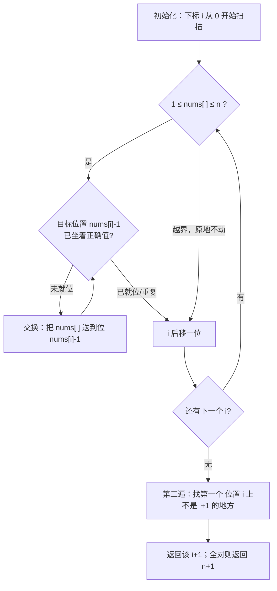
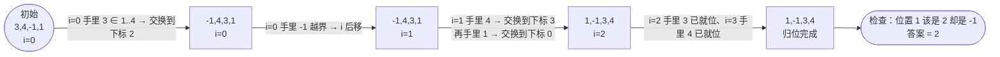

# 41. 缺失的第一个正数

## 🛒 人话理解 & 🧠 思路演进



**总体一句话**：原位哈希——把每个在 [1, n] 范围内的数 x 归位到下标 x-1（1→下标0，2→下标1……），归位后第一个"位置 i 上不是 i+1"的地方，i+1 即缺失的最小正整数。

### 🔬 逐步推演（动画式）

以 `nums = [3, 4, -1, 1]`（n=4）为例——从左到右就是扫描时间线：**每个节点是一次数组快照，箭头上写当前下标 i 手里拿着谁、做了什么决策**：



### 生活中的算法
想象你是一位图书馆管理员，正在整理一排连续编号的图书。这些书应该从1号开始按顺序排列，但是有些编号的书不见了。你的任务是找出第一个缺失的编号。这就像是在做点名，发现第一个没来上课的同学。

这个场景在生活中很常见。比如：
- 餐厅服务员查看哪个桌号是第一个空位
- 停车场管理员寻找第一个空闲的车位号
- 学校给新生分配第一个未使用的学号
- 医院为病人安排第一个可用的就诊序号

### 问题描述

🔗 [LeetCode 41](https://leetcode.cn/problems/first-missing-positive/description/?envType=study-plan-v2&envId=top-100-liked)

LeetCode第41题"缺失的第一个正整数"是这样描述的：给你一个未排序的整数数组 nums，请你找出其中没有出现的最小的正整数。请你实现时间复杂度为 O(n) 并且只使用常数级别额外空间的解决方案。

例如：
```
输入：nums = [3,4,-1,1]
输出：2
解释：数组中有1，3，4，所以第一个缺失的正整数是2。

输入：nums = [7,8,9,11,12]
输出：1
解释：数组中没有1，所以缺失的第一个正整数是1。
```

### 最直观的解法：排序后遍历
就像整理图书时，先把所有的书按编号排好序，然后从1开始检查，看哪个编号最先空缺。

让我们用一个简单的例子来理解：
```
原数组：[3,1,4,-1]
1. 先排序（只考虑正数）：[1,3,4]
2. 从1开始检查：
   - 1存在
   - 2不存在，找到答案！
```

### 优化解法：原地标记
仔细思考会发现一个关键点：如果数组长度为n，那么答案一定在[1, n+1]范围内。就像有10个学生的班级，第一个缺席的学号最大不会超过11。

我们可以把数组本身作为标记板，把每个数放到它应该在的位置上（就像把每本书放到对应的编号位置）。

### 原地标记的原理
1. 把每个在[1,n]范围内的数x放到索引x-1的位置
2. 再次遍历，第一个不在对应位置的数就指示了缺失的最小正整数
这就像是：
- 先把每本书放到它编号对应的书架位置
- 然后从1号位置开始检查，找到第一个空位置

### 示例演示
用 nums = [3,4,-1,1] 来说明（下面"手里"指当前下标 i 位置上的值）：

1. 归位阶段（while 循环把每个数送到它该坐的位置 nums[i]-1）：
   i=0 手里=3，索引2位置上坐着 -1，不同 → 交换 → [-1,4,3,1]
        此时手里变成 -1，超出 [1,n] 范围，停止，看下一个 i
   i=1 手里=4，索引3位置上坐着 1，不同 → 交换 → [-1,1,3,4]
        此时手里变成 1，索引0位置上坐着 -1，不同 → 交换 → [1,-1,3,4]
        此时手里变成 -1，超出范围，停止
   i=2 手里=3，索引2位置上已经是 3，相同 → 已就位，不交换，停止
   i=3 手里=4，索引3位置上已经是 4，相同 → 已就位，不交换，停止
   最终数组：[1,-1,3,4]

2. 检查阶段（找第一个"位置 i 上不是 i+1"的地方）：
   位置0：期望 1，实际 1，正确
   位置1：期望 2，实际 -1，对不上 → 缺失的最小正整数就是 2！

### 代码实现

> 👉 代码实现见下方「🐍 Python 代码」

### 解法比较
让我们比较这两种方法：

排序后遍历：
- 时间复杂度：O(nlogn)
- 空间复杂度：O(1)
- 优点：思路直观，易于理解
- 缺点：不满足时间复杂度要求

原地标记：
- 时间复杂度：O(n)
- 空间复杂度：O(1)
- 优点：满足所有要求，不需要额外空间
- 缺点：实现略微复杂，需要仔细处理边界情况

### 解题技巧总结
这道题给我们的启示：
1. 思考数据的取值范围很重要
2. 有时候可以把数组本身当作标记数组使用
3. 位置和值的对应关系常常能带来灵感
4. 不要害怕修改原数组，有时这是提高效率的关键

类似的问题还有：
- 数组中重复的数字
- 找到所有数组中消失的数字
- 寻找重复数

### 小结
通过缺失的第一个正整数这道题，我们学会了一个重要的思维方式：有时候看似需要额外空间的问题，可以通过巧妙利用输入数组本身来解决。这种思维不仅在这道题中有用，在处理其他需要标记或计数的问题时也很有启发。记住，当遇到需要找寻特定范围内缺失数字的问题时，考虑能否利用数组本身来存储信息！

## 🐍 Python 代码

### 🥊 暴力解（朴素对照）

最朴素：先排序，再从 1 开始找第一个没出现的正数——思路最直白。

```python
from typing import List

class Solution:
    def firstMissingPositive(self, nums: List[int]) -> int:
        nums.sort()                       # 排序，让正数按序排好
        target = 1                        # 从 1 开始依次找
        for x in nums:
            if x <= 0:                    # 负数和 0 跳过
                continue
            if x == target:               # 正好命中期望值，期望值 +1
                target += 1
            elif x > target:              # 中间断档，target 就是缺失的数
                break
        return target
```

- 时间复杂度：`O(n log n)`，主要是排序
- 空间复杂度：`O(1)`（不计排序的栈空间）
- ⚠️ 题目强制要求 `O(n)` 时间 + 常数空间，不满足复杂度要求，仅作思路对照。利用「答案一定落在 [1, n+1]」+ 原位哈希交换，可演进到下方 `O(n)` 解。

### ⚡ 最优解

```python
class Solution:
    def firstMissingPositive(self, nums: List[int]) -> int:
        n = len(nums)
        # 【原位哈希】目标是让每个值 x 都坐到下标 x-1 的位置
        #   （1 放到下标0，2 放到下标1……）。排好之后，
        #   第一个"位置 i 上不是 i+1"的地方，i+1 就是缺失的数
        for i in range(n):
            # 用 while 而不是 if：交换过来的新值可能也还没归位，
            # 要一直盯着当前位置 i，直到它"归位了"或"超出范围没救了"
            while (
                1 <= nums[i] <= n                 # ① 只管 [1,n] 范围内的数；≤0 或 >n 的数不影响答案，原地不动
                and nums[i] != nums[nums[i] - 1]  # ② 目标位置 nums[i]-1 上若已是正确值（或遇到重复），就停 —— 这一条同时负责"已就位就别换"和"去重 / 防死循环"
            ):
                # 把 nums[i] 送到它该坐的位置 nums[i]-1，把那里原来的值换回 i
                # （Python 会先把等号右边整体求值，再赋值给左边，
                #   所以不用担心先改了 nums[i] 导致下标错乱，写法是安全的）
                nums[nums[i] - 1], nums[i] = nums[i], nums[nums[i] - 1]

        # 第二遍：每个位置本应是 i+1，第一个对不上的位置，i+1 就是答案
        for i in range(n):
            if nums[i] != i + 1:
                return i + 1
        # 走到这里说明 1~n 全都在，那缺的就是 n+1
        return n + 1
```
