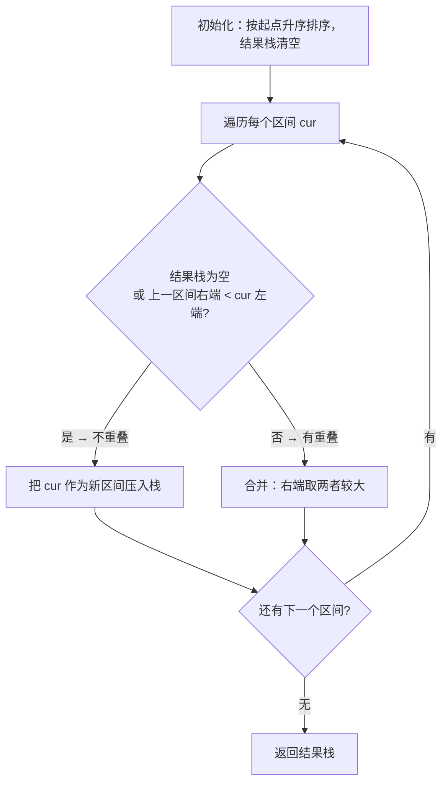

# 56. 合并区间

## 📌 题目

以数组 `intervals` 表示若干个区间的集合，其中单个区间为 `intervals[i] = [starti, endi]` 。请你合并所有重叠的区间，并返回一个不重叠的区间数组，该数组需恰好覆盖输入中的所有区间。

示例：

```
输入：intervals = [[1,3],[2,6],[8,10],[15,18]]
输出：[[1,6],[8,10],[15,18]]
解释：区间 [1,3] 和 [2,6] 重叠, 将它们合并为 [1,6].
```

🔗 [LeetCode 56](https://leetcode.cn/problems/merge-intervals/description/?envType=study-plan-v2&envId=top-100-liked)

## 🛒 人话理解 & 🧠 思路演进



**总体一句话**：先按起点排序，再线性扫描——对每个区间只和结果栈顶比一次，重叠就把右端拉长（取较大），不重叠就另起一段压入栈。

### 🔬 逐步推演（动画式）

以 `intervals = [[1,3],[2,6],[8,10],[15,18]]`（已按起点排好序）为例——从左到右就是扫描时间线：**每个节点是结果栈快照（段写成 起点至终点），箭头上写当前区间与栈顶怎么比、做了什么决策**：


### 生活中的算法
想象你是一位活动策划师，桌上摆着许多便利贴，每张写着不同的活动时间段：9:00-11:00的晨会、10:30-12:00的培训、14:00-16:00的项目汇报、15:00-17:00的团队建设...有些活动时间明显重叠了，为了让日程更清晰，你需要将这些重叠的时间段合并起来。比如晨会和培训重叠了，就可以合并为9:00-12:00的一个大时间段。

这种情况在生活中随处可见。比如医院的预约时段合并、健身房的预定时间优化、公司会议室的档期管理，甚至是地铁维修时段的规划等。

### 问题描述
LeetCode第56题"合并区间"是这样描述的：给出一个区间的集合，请合并所有重叠的区间。

例如：
```
输入：intervals = [[1,3],[2,6],[8,10],[15,18]]
输出：[[1,6],[8,10],[15,18]]
解释：区间 [1,3] 和 [2,6] 重叠，将它们合并为 [1,6]
```

### 最直观的解法：暴力合并
就像你整理日程表一样，最直观的方法是：拿起每张便利贴，和其他所有便利贴比较，看看能否合并。

让我们用一个简单的例子来理解：
```
时间段：[[1,4], [2,3], [3,6]]
1. 比较[1,4]和[2,3]：
   2在1-4之间，合并为[1,4]
2. 再比较[1,4]和[3,6]：
   3在1-4之间，4和6相邻，合并为[1,6]
最终得到：[[1,6]]
```

### 优化解法：排序后合并
仔细想想，如果我们先把所有时间段按开始时间排序，就像把便利贴按时间顺序贴在墙上，那么我们只需要一次遍历就能完成合并。这就像你在整理行程时，先按时间排好序，然后逐个看相邻的档期能否合并。

### 排序合并的原理
就像理财一样：
1. 先把所有区间按开始时间排序（就像把账单按日期排序）
2. 对于每个新区间，看它是否能和当前累积的区间合并：
   - 如果新区间的开始时间在当前区间的结束时间之前，就应该合并（就像新的收入在之前的投资周期结束前就到了，应该一起考虑）
   - 如果新区间和当前区间完全分离，就把当前区间存起来，开始新的累积（就像开始一个全新的投资周期）

### 示例运行
用日程安排的例子来说明：
```
原始日程：[[9,11], [10,12], [14,16], [15,17]]

1. 排序后（已按开始时间排好）：
   [[9,11], [10,12], [14,16], [15,17]]

2. 处理[9,11]：
   当前合并结果 = [[9,11]]

3. 看[10,12]：
   10点在9-11内，可以合并
   当前合并结果 = [[9,12]]

4. 看[14,16]：
   14点不在9-12内，存储之前结果，开始新区间
   当前合并结果 = [[9,12], [14,16]]

5. 看[15,17]：
   15在14-16内，可以合并
   最终结果 = [[9,12], [14,17]]
```

### 代码实现

> 👉 代码实现见下方「🐍 Python 代码」

### 解法比较
让我们比较这两种方法：

暴力合并：
- 时间复杂度：O(n²)
- 空间复杂度：O(1)
- 优点：直观易懂
- 缺点：效率较低，特别是当区间很多时

排序后合并：
- 时间复杂度：O(nlogn)，主要是排序的开销
- 空间复杂度：O(n)，用于存储结果
- 优点：高效且实现简单
- 缺点：需要额外空间存储结果

### 实用技巧总结
解决此类区间问题的关键点：
1. 考虑是否需要预处理（如排序）
2. 注意区间的开始和结束位置
3. 处理边界情况
4. 别忘了最后一个区间

类似的问题还有：
- 会议室预订
- 插入区间
- 区间列表的交集

### 小结
通过合并区间这道题，我们学会了如何高效地处理重叠区间问题。这个技巧不仅能解决算法题，在实际工作中处理时间安排、资源分配等问题时也很有用。记住，当遇到需要处理重叠区间的问题时，先排序再合并往往是一个简单而高效的解决方案！

## 🐍 Python 代码

### 🥊 暴力解（朴素对照）

不排序、直接两两比较：对每个区间都去和其他区间看是否重叠，能合就并，反复扫描直到没有可合并的为止——思路最直白。

```python
from typing import List

class Solution:
    def merge(self, intervals: List[List[int]]) -> List[List[int]]:
        # 复制一份，避免直接改入参
        cur = [list(it) for it in intervals]
        merged = True
        # 只要有合并发生就再扫一轮，直到一轮下来都没动过
        while merged:
            merged = False
            nxt = []
            for it in cur:
                placed = False
                for res in nxt:
                    # 判断 it 与已有区间 res 是否重叠
                    a, b = it[0], it[1]
                    c, d = res[0], res[1]
                    if not (b < c or d < a):        # 有交集
                        res[0] = min(res[0], a)
                        res[1] = max(res[1], b)     # 并入 res
                        merged = True               # 本轮发生合并
                        placed = True
                        break
                if not placed:
                    nxt.append(it)
            cur = nxt
        return cur
```

- 时间复杂度：`O(n²)`，最坏每轮只合并一对，要扫约 n 轮
- 空间复杂度：`O(n)`
- ⚠️ 区间一多就慢。观察到「先按起点排序后，只需一次线性扫描即可合并相邻重叠」→ 演进到下方 `O(n log n)` 解。

### ⚡ 最优解

```python
class Solution:
    def merge(self, intervals: List[List[int]]) -> List[List[int]]:
        # 按起始值排序区间
        intervals.sort(key=lambda x: x[0])
        merged_intervals = []
        
        for current in intervals:
            # 结果为空，或「上一个区间右端 < 当前左端」(无交集) → 开新区间。
            # 注意用 <：端点相贴(如 [1,2] 与 [2,3])算作重叠，会被合并。
            if not merged_intervals or merged_intervals[-1][1] < current[0]:
                merged_intervals.append(current)
            else:  # 有重叠：把右端延伸到两者较大值(左端已排序，必是上一个更小)
                merged_intervals[-1][1] = max(merged_intervals[-1][1], current[1])
        
        return merged_intervals
```
