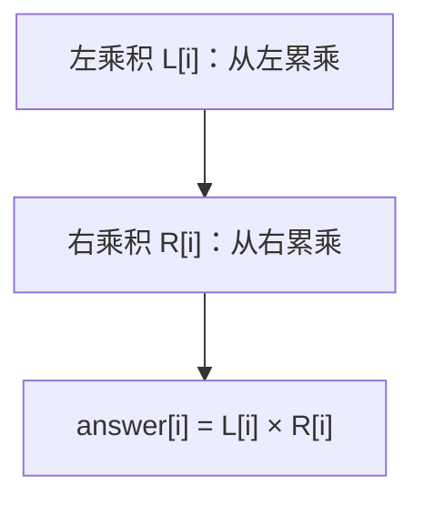

# 238. 除自身以外数组的乘积

## 📌 题目

给你一个整数数组 `nums`，返回 数组 `answer` ，其中 `answer[i]` 等于 `nums` 中除 `nums[i]` 之外其余各元素的乘积 。

题目数据 **保证** 数组 `nums`之中任意元素的全部前缀元素和后缀的乘积都在  **32 位** 整数范围内。

请不要使用除法，且在 `O(n)` 时间复杂度内完成此题。

示例：

```
输入：nums = [1,2,3,4]
输出：[24,12,8,6]
```

🔗 [LeetCode 238](https://leetcode.cn/problems/product-of-array-except-self/description/?envType=study-plan-v2&envId=top-100-liked)

## 🛒 人话理解 & 🧠 思路演进



### 生活中的算法
想象你是一家糕点店的老板，今天要制作不同种类的蛋糕。每个蛋糕都需要面粉、鸡蛋、糖和黄油，但用量不同。比如：
- 奶油蛋糕：2斤面粉，4个鸡蛋，1斤糖，0.5斤黄油
- 巧克力蛋糕：1斤面粉，3个鸡蛋，1.5斤糖，1斤黄油
- 水果蛋糕：3斤面粉，6个鸡蛋，2斤糖，1.5斤黄油

如果你想知道制作每种蛋糕时其他蛋糕总共需要多少原料，这就是一个典型的"除自身外的乘积"问题。比如计算奶油蛋糕之外的其他蛋糕需要的面粉总量：1 + 3 = 4斤。

这种计算在日常生活中很常见：比如计算团队中除某人外的总工时、计算除某个地区外其他地区的销售总额、或是计算除某天外其他天的平均温度等。

### 问题描述
LeetCode第238题"除自身以外数组的乘积"是这样描述的：给你一个整数数组 nums，返回一个新数组 answer，其中 answer[i] 等于 nums 中除 nums[i] 之外其余各元素的乘积。题目要求不能使用除法。

例如：
```
输入：nums = [1,2,3,4]
输出：[24,12,8,6]
解释：
24 是除了 1 以外其他数的乘积 2×3×4
12 是除了 2 以外其他数的乘积 1×3×4
8 是除了 3 以外其他数的乘积 1×2×4
6 是除了 4 以外其他数的乘积 1×2×3
```

### 最直观的解法：两层循环
最容易想到的方法是：对每个位置，重新遍历一遍数组计算除自身外的乘积。这就像是为每种蛋糕都重新统计一遍其他蛋糕的原料用量。

让我们用一个简单的例子来理解：
```
数组：[2,3,4]
1. 计算索引0的结果：
   跳过2，计算3×4=12
2. 计算索引1的结果：
   跳过3，计算2×4=8
3. 计算索引2的结果：
   跳过4，计算2×3=6
最终结果：[12,8,6]
```

### 优化解法：前缀积和后缀积
仔细思考会发现，对于每个位置，我们其实可以把它左边所有数的乘积和右边所有数的乘积分开计算。这就像是提前准备好了两份清单：一份记录从左到右累积的原料用量，另一份记录从右到左累积的原料用量。

### 前后缀积的原理
1. 先从左向右遍历，计算每个位置左边所有数的乘积
2. 再从右向左遍历，计算每个位置右边所有数的乘积
3. 两个乘积相乘就是答案

### 示例演示
用nums = [2,3,4,5]来说明：
```
1. 计算左边的乘积：
   left[0] = 1（没有左边的数）
   left[1] = 2
   left[2] = 2×3
   left[3] = 2×3×4

2. 计算右边的乘积：
   right[3] = 1（没有右边的数）
   right[2] = 5
   right[1] = 5×4
   right[0] = 5×4×3

3. 最终每个位置的结果是：
   result[0] = left[0] × right[0]
   result[1] = left[1] × right[1]
   result[2] = left[2] × right[2]
   result[3] = left[3] × right[3]
```

### 代码实现

> 👉 代码实现见下方「🐍 Python 代码」

### 解法比较
让我们比较这两种方法：

两层循环：
- 时间复杂度：O(n²)
- 空间复杂度：O(1)（不计算输出数组）
- 优点：思路简单直观
- 缺点：效率较低，特别是数组较大时

前后缀积：
- 时间复杂度：O(n)
- 空间复杂度：O(1)（不计算输出数组）
- 优点：高效且不需要额外空间
- 缺点：思路稍难理解

### 思考启发
这道题告诉我们：
1. 有时候把一个复杂的计算拆分成两部分会更简单
2. 可以利用输出数组来存储中间结果
3. 从不同方向遍历数组可能会带来新的思路
4. 预处理数据有时候能大大提高效率

类似的问题还有：
- 数组的前缀和
- 接雨水
- 柱状图中的最大矩形

### 小结
通过除自身以外数组的乘积这道题，我们学会了如何巧妙地利用前后缀积来优化计算。这种思维方式不仅适用于这道题，在处理需要考虑元素两侧信息的问题时都很有用。记住，当遇到需要对数组进行乘积运算的问题时，考虑是否可以利用前后缀的思想来简化计算！

## 🐍 Python 代码

```python
class Solution:
    def productExceptSelf(self, nums: List[int]) -> List[int]:
        n = len(nums)
        answer = [1] * n  # 初始化结果数组，全1
        # 计算前缀积并存储在 answer 中
        for i in range(1, n):
            answer[i] = answer[i - 1] * nums[i - 1]
            
        suffix_product = 1  # 初始化后缀积为1
        # 计算后缀积，并直接更新 answer
        for i in range(n - 1, -1, -1):  # 从后往前遍历数组
            answer[i] *= suffix_product  # 将当前后缀积乘以 answer 中对应位置的值
            suffix_product *= nums[i]  # 更新后缀积
        
        return answer
```
