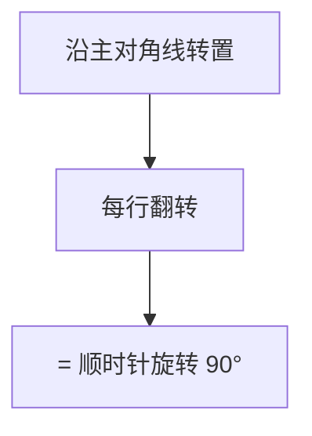

# 48. 旋转图像

## 📌 题目

给定一个 _n_ × _n_ 的二维矩阵 `matrix` 表示一个图像。请你将图像顺时针旋转 90 度。

你必须在 **原地** 旋转图像，这意味着你需要直接修改输入的二维矩阵。**请不要** 使用另一个矩阵来旋转图像。

示例：


```
输入：matrix = [[1,2,3],[4,5,6],[7,8,9]]
输出：[[7,4,1],[8,5,2],[9,6,3]]
```

🔗 [LeetCode 48](https://leetcode.cn/problems/rotate-image/description/?envType=study-plan-v2&envId=top-100-liked)

## 🛒 人话理解 & 🧠 思路演进



### 生活中的旋转
在这个自拍时代，我们经常需要调整照片的方向。有时拍出来的照片歪了，需要旋转90度；有时想要换个角度看看效果，来回旋转照片。这种旋转操作不仅存在于我们的日常生活中，在计算机图形学、图像处理等领域也是一个基础且重要的操作。

### 问题描述
LeetCode第48题"旋转图像"要求我们：给定一个 n × n 的二维矩阵 matrix 表示一个图像，将图像顺时针旋转 90 度。要求必须在原地旋转图像，也就是说，你需要直接修改输入的二维矩阵。

例如：
```
输入：matrix = [[1,2,3],
                [4,5,6],
                [7,8,9]]
输出：[[7,4,1],
       [8,5,2],
       [9,6,3]]
```

就像我们在手机相册里旋转照片一样，每个像素点都要移动到新的位置，但我们需要保证不使用额外的存储空间！

### 最直观的解法：辅助数组
最简单的想法就像我们复印一张照片，在新的纸上重新排列像素。虽然这种方法使用了额外空间，不符合题目要求，但它帮助我们理解旋转的本质。

### 辅助数组的实现

> 👉 代码实现见下方「🐍 Python 代码」

### 优化解法：原地旋转
仔细观察，我们发现90度旋转可以通过两步简单的操作完成：先沿对角线翻转，再沿竖直中线翻转。就像折纸一样，通过两次折叠就能达到旋转的效果！

### 原地旋转的原理
想象你在玩魔方：
1. 第一步：沿主对角线翻转（左上到右下的对角线）
   - [i,j] 变成 [j,i]
2. 第二步：沿竖直中线翻转
   - [i,j] 变成 [i,n-1-j]

### 示例运行
用3×3矩阵来说明：
```
原始矩阵：    对角线翻转：    竖直中线翻转：
1 2 3         1 4 7          7 4 1
4 5 6   →     2 5 8    →     8 5 2
7 8 9         3 6 9          9 6 3

第一步：对角线翻转
- (1,2)和(2,1)交换
- (1,3)和(3,1)交换
- (2,3)和(3,2)交换

第二步：竖直中线翻转
- 第1列和第3列交换
- 第2列保持不变
```

### 代码实现

> 👉 代码实现见下方「🐍 Python 代码」

### 解法比较
让我们比较这两种方法：

辅助数组法：
- 时间复杂度：O(n²)
- 空间复杂度：O(n²)
- 优点：直观易懂，容易实现
- 缺点：需要额外空间，不满足原地旋转的要求

原地旋转法：
- 时间复杂度：O(n²)
- 空间复杂度：O(1)
- 优点：不需要额外空间，完美满足题目要求
- 缺点：需要理解矩阵变换的数学原理

### 实用技巧总结
解决矩阵旋转问题的关键点：
1. 观察旋转前后元素位置的对应关系
2. 寻找可以分解的子操作（如翻转）
3. 正确处理边界情况
4. 小心不要重复交换元素

相关的矩阵变换问题：
- 矩阵转置
- 矩阵对称变换
- 顺时针/逆时针旋转任意角度

### 小结
通过旋转图像这道题，我们学会了如何通过巧妙的数学变换来完成矩阵旋转。这种思维方式不仅能解决算法题，在图像处理、计算机图形学等领域都有广泛应用。记住，当遇到需要变换矩阵的问题时，可以考虑将复杂的变换分解为简单的操作组合，这样往往能得到更优雅的解决方案！

## 🐍 Python 代码

### 🥊 暴力解（朴素对照）

最直白的想法：开一个同样大小的新矩阵，按「旋转 90° → 位置 [i][j] 落到 [j][n-1-i]」逐格搬运，再拷回原矩阵。思路最简单，但用了额外空间，不满足「原地」要求。

```python
from typing import List

class Solution:
    def rotate(self, matrix: List[List[int]]) -> None:
        n = len(matrix)
        # 申请辅助矩阵，按坐标映射拷贝
        tmp = [[0] * n for _ in range(n)]
        for i in range(n):
            for j in range(n):
                tmp[j][n - 1 - i] = matrix[i][j]
        # 再把结果拷回原矩阵（LeetCode 要求原地修改）
        for i in range(n):
            for j in range(n):
                matrix[i][j] = tmp[i][j]
```

- 时间复杂度：`O(n²)`，遍历了两次矩阵
- 空间复杂度：`O(n²)`，申请了辅助矩阵
- ⚠️ 题目要求原地修改，这里却开了 O(n²) 辅助空间。观察到「转置 + 每行翻转」即可原地完成旋转 → 演进到下方逐层原地交换的最优解。

### ⚡ 最优解

```python
class Solution:
    def rotate(self, matrix: List[List[int]]) -> None:
        n = len(matrix)
        
        # 逐层旋转
        for layer in range(n // 2):
            # 当前层的边界
            top, bottom = layer, n - 1 - layer
            
            for i in range(top, bottom):
                # offset = 当前格在该层边上的偏移。
                # 同一旋转环上的 4 个格子：上(top,i)、右(i,bottom)、下(bottom,bottom-offset)、左(bottom-offset,top)
                offset = i - top
                
                # 顺时针旋转四个位置
                
                # 把上、右、下、左 4 个格子沿环顺时针推一位(temp 暂存被覆盖的"上")
                temp = matrix[top][i]                                           # 先存住"上"
                matrix[top][i] = matrix[bottom - offset][top]                   # 左 → 上
                matrix[bottom - offset][top] = matrix[bottom][bottom - offset]  # 下 → 左
                matrix[bottom][bottom - offset] = matrix[i][bottom]             # 右 → 下
                matrix[i][bottom] = temp                                        # 原"上" → 右
```
