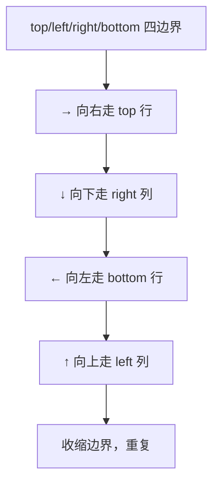

# 54. 螺旋矩阵

## 📌 题目

给你一个 `m` 行 `n` 列的矩阵 `matrix` ，请按照 **顺时针螺旋顺序** ，返回矩阵中的所有元素。

示例：


```
输入：matrix = [[1,2,3],[4,5,6],[7,8,9]]
输出：[1,2,3,6,9,8,7,4,5]
```

🔗 [LeetCode 54](https://leetcode.cn/problems/spiral-matrix/description/?envType=study-plan-v2&envId=top-100-liked)

## 🛒 人话理解 & 🧠 思路演进



### 生活中的螺旋
你有没有注意过，生活中螺旋的形状随处可见？比如蜗牛壳的螺旋纹路、向日葵中心的螺旋排列、甚至是停车场的螺旋坡道。这种由外向内（或由内向外）的螺旋路径，不仅是大自然的奇妙设计，也启发了我们解决一些编程问题。

### 问题描述
LeetCode第54题"螺旋矩阵"是这样描述的：给你一个 m x n 的矩阵，请按照顺时针螺旋顺序，返回矩阵中的所有元素。

例如：
```
输入：matrix = [[1,2,3],
                [4,5,6],
                [7,8,9]]
输出：[1,2,3,6,9,8,7,4,5]
```

想象你在逛一个方形的购物中心，从正门开始，按顺时针方向走完每条走廊，最终到达中心的休息区。这就是一个完美的螺旋路径！

### 最直观的解法：模拟螺旋过程
就像我们在购物中心逛街一样，最直观的方法是：按照右、下、左、上的顺序，一步步"走"过矩阵的每个元素。

让我们用一个简单的3×3矩阵来理解：
```
1 2 3     →→→     第一步：向右走到底
4 5 6     ↓       第二步：向下走到底
7 8 9     ←←←     第三步：向左走到底
          ↑       第四步：向上走到顶
```

### 优化解法：边界收缩
仔细观察，我们其实是在不断缩小遍历的范围。就像削苹果皮，从外面一圈圈向内削去。我们可以维护四个边界（上、下、左、右），每走完一个方向就收缩对应的边界。

### 边界收缩的原理
想象你在玩一个迷宫游戏：
1. 一开始，你可以在整个迷宫中移动
2. 走完一条路径后，那条路就会消失（边界收缩）
3. 在剩余的空间中继续移动
4. 直到走完所有路径

### 示例运行
用一个3×3的例子来说明：
```
初始状态：
上边界(top)=0, 下边界(bottom)=2
左边界(left)=0, 右边界(right)=2

第一圈：
1. 向右：(0,0)->(0,2) [1,2,3]
   上边界+1
2. 向下：(0,2)->(2,2) [6,9]
   右边界-1
3. 向左：(2,2)->(2,0) [8,7]
   下边界-1
4. 向上：(2,0)->(1,0) [4]
   左边界+1

第二圈：
只剩中间的5，直接添加
```

### 代码实现

> 👉 代码实现见下方「🐍 Python 代码」

### 实用技巧总结
解决螺旋矩阵问题的关键点：
1. 明确移动方向的顺序（右->下->左->上）
2. 正确维护和更新边界
3. 注意边界条件的判断
4. 处理特殊情况（如只有一行或一列）

类似的问题还有：
- 生成螺旋矩阵
- 对角线遍历
- 顺时针打印矩阵

### 小结
通过螺旋矩阵这道题，我们学会了如何用编程来模拟现实生活中的螺旋路径。这种思维方式不仅能解决算法题，在处理图像处理、游戏开发等实际问题时也很有用。记住，当遇到需要特定顺序遍历矩阵的问题时，可以考虑使用边界收缩的方法，让代码更加清晰和高效！

## 🐍 Python 代码

```python
class Solution:
    def spiralOrder(self, matrix: List[List[int]]) -> List[int]:
        if not matrix or not matrix[0]:
            return []
        
        m, n = len(matrix), len(matrix[0])
        top, bottom, left, right = 0, m - 1, 0, n - 1
        result = []
        
        while top <= bottom and left <= right:
            # 从左到右遍历顶部行
            for i in range(left, right + 1):
                result.append(matrix[top][i])
            top += 1  # 顶部行已遍历，下移一行
            
            # 从上到下遍历右侧列
            for i in range(top, bottom + 1):
                result.append(matrix[i][right])
            right -= 1  # 右侧列已遍历，左移一列
            
            # 检查是否还有剩余的行和列
            if top <= bottom:
                # 从右到左遍历底部行
                for i in range(right, left - 1, -1):
                    result.append(matrix[bottom][i])
                bottom -= 1  # 底部行已遍历，上移一行
            
            if left <= right:
                # 从下到上遍历左侧列
                for i in range(bottom, top - 1, -1):
                    result.append(matrix[i][left])
                left += 1  # 左侧列已遍历，右移一列
        
        return result
```
