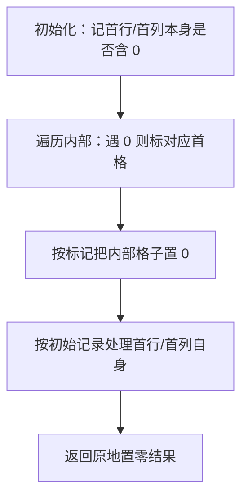

# 73. 矩阵置零

## 📌 题目

给定一个 m×n 的矩阵，如果一个元素为 **0** ，则将其所在行和列的所有元素都设为 **0** 。请使用原地算法。

示例：


```
输入：matrix = [[1,1,1],[1,0,1],[1,1,1]]
输出：[[1,0,1],[0,0,0],[1,0,1]]
```

🔗 [LeetCode 73](https://leetcode.cn/problems/set-matrix-zeroes/description/?envType=study-plan-v2&envId=top-100-liked)

## 🛒 人话理解 & 🧠 思路演进



**总体一句话**：借矩阵自己的首行首列当标记板——先记下首行首列本身是否含 0，再把内部每个 0 的「行号、列号」回写到首列、首行对应格；最后按标记统一置 0，并用最初记的标志决定首行首列自身是否整行整列清零，全程只用 O(1) 额外空间。

### 🔬 逐步推演（动画式）

以 `matrix = [[1,2,3],[4,0,6],[7,8,9]]` 为例——从左到右就是算法的时间线：**每个节点是一次状态快照（标记板与内部矩阵形态），箭头上写这一步遇到谁、做了什么决策**：


### 生活中的算法
想象你在玩扫雷游戏，当你点到一个地雷时，不仅这个格子会被标记，与它同行同列的格子也都会受到影响。或者想象一个办公室的座位表，如果某个位置发现了感染者，为了安全起见，需要将该员工所在的整行（同排同事）和整列（对面同事）都标记为密切接触者需要检测。

这种"一点触发，全行全列响应"的场景在生活中很常见：
- 学校课程表中，如果某个老师请假，那一整行的课程都需要调整
- 表格处理软件中，调整某个单元格的格式，可以统一设置整行整列
- 影院选座系统中，如果一个座位损坏，可能需要锁定那一排和那一列的预订功能

### 问题描述
LeetCode第73题"矩阵置零"是这样描述的：给定一个 m x n 的矩阵，如果一个元素为 0，则将其所在行和列的所有元素都设为 0。请使用原地算法。

例如：
```
输入：matrix = [
  [1,1,1],
  [1,0,1],
  [1,1,1]
]
输出：[
  [1,0,1],
  [0,0,0],
  [1,0,1]
]
```

### 最直观的解法：额外空间标记
就像在处理办公室防疫时，先用一张新表记录下所有需要检测的位置，然后统一处理。

让我们用一个简单的例子来理解：
```
原矩阵：
[1,2,0]
[3,4,5]

1. 记录0所在的位置：
   - 第0行，第2列有个0

2. 标记需要置零的行和列：
   - 需要置零的行：[0]
   - 需要置零的列：[2]

3. 根据记录修改矩阵：
   [0,0,0]  // 第0行全置零
   [3,4,0]  // 第2列置零
```

### 优化解法：原地标记
仔细思考会发现，我们可以用矩阵的第一行和第一列来记录标记信息，就像用办公室的墙上的记事板来标记需要处理的区域。这样就不需要额外的空间了。

### 原地标记的原理
1. 先记录第一行和第一列是否原本包含0
2. 用第一行和第一列作为标记板
3. 处理剩余的矩阵
4. 最后根据第一步的记录处理第一行和第一列

### 示例演示
用下面的矩阵来说明：
```
[1,2,3]
[4,0,6]
[7,8,9]

1. 记录第一行和第一列的状态：
   - 第一行没有0
   - 第一列没有0

2. 用第一行和第一列标记：
   - 因为matrix[1][1]=0，所以：
     - 标记第一行：matrix[0][1]=0
     - 标记第一列：matrix[1][0]=0

3. 根据标记处理矩阵主体：
   [1,0,3]
   [0,0,0]
   [7,0,9]

4. 最后根据第一步的记录处理第一行第一列
```

### 代码实现

> 👉 代码实现见下方「🐍 Python 代码」

### 解法比较
让我们比较这两种方法：

额外空间标记：
- 时间复杂度：O(m×n)
- 空间复杂度：O(m+n)
- 优点：思路清晰，实现简单
- 缺点：需要额外空间

原地标记：
- 时间复杂度：O(m×n)
- 空间复杂度：O(1)
- 优点：不需要额外空间
- 缺点：实现稍复杂，需要额外记录第一行列的状态

### 解题技巧总结
这道题给我们的启发：
1. 矩阵问题中，往往可以利用矩阵本身来存储信息
2. 处理特殊情况（如第一行列）时，可以单独考虑
3. 分步骤处理复杂问题可以让思路更清晰
4. 在修改数据时，注意保护原始信息

类似的问题还有：
- 生命游戏
- 旋转图像
- 岛屿数量

### 小结
通过矩阵置零这道题，我们学会了如何巧妙地利用矩阵本身来存储信息，避免使用额外空间。这种思维方式不仅适用于本题，在处理需要原地修改数据的矩阵问题时都很有启发。记住，当遇到需要在矩阵中标记信息的问题时，考虑能否利用矩阵本身的某些位置来存储标记！

## 🐍 Python 代码

### 🥊 暴力解（朴素对照）

最直观的做法：先用两个集合把「哪些行、哪些列含 0」记下来，再遍历一遍矩阵按记录置零。思路清晰，但额外用了 O(m+n) 空间。

```python
from typing import List

class Solution:
    def setZeroes(self, matrix: List[List[int]]) -> None:
        m, n = len(matrix), len(matrix[0])
        zero_rows, zero_cols = set(), set()
        # 第一遍：记录所有含 0 的行和列
        for i in range(m):
            for j in range(n):
                if matrix[i][j] == 0:
                    zero_rows.add(i)
                    zero_cols.add(j)
        # 第二遍：按记录置零
        for i in range(m):
            for j in range(n):
                if i in zero_rows or j in zero_cols:
                    matrix[i][j] = 0
```

- 时间复杂度：`O(m×n)`，遍历两遍矩阵
- 空间复杂度：`O(m+n)`，两个标记集合
- ⚠️ 额外开了 O(m+n) 标记空间。观察到可以「借用矩阵自己的首行首列当标记板」→ 演进到下方 O(1) 额外空间的原地最优解。

### ⚡ 最优解

```python
class Solution:
    def setZeroes(self, matrix: List[List[int]]) -> None:
        m, n = len(matrix), len(matrix[0])
        
        # 检查第一行是否有0
        first_row_has_zero = any(matrix[0][j] == 0 for j in range(n))
        # 检查第一列是否有0
        first_col_has_zero = any(matrix[i][0] == 0 for i in range(m))
        
        # 用「首行/首列」当标记板：内部(1..m,1..n)遇到 0，就把对应首行/首列格子置 0。
        # 必须从 (1,1) 开始——首行首列自己的原始状态已在上面单独记下，否则会被标记污染。
        for i in range(1, m):
            for j in range(1, n):
                if matrix[i][j] == 0:
                    matrix[i][0] = 0  # 借首列标记：第 i 行需置 0
                    matrix[0][j] = 0  # 借首行标记：第 j 列需置 0
        
        # 根据标记设置0
        for i in range(1, m):
            for j in range(1, n):
                if matrix[i][0] == 0 or matrix[0][j] == 0:
                    matrix[i][j] = 0
        
        # 首行/首列必须「最后」处理：因为它们此刻还存着上面用到的标记，
        # 提前置 0 会毁掉标记。这里靠最开始记下的标志决定是否整行/整列置 0。
        if first_row_has_zero:   # 原始首行含 0 → 整个首行置 0
            for j in range(n):
                matrix[0][j] = 0
        
        # 处理第一列，如果第一列原来存在0，则将第一列全部变为0
        if first_col_has_zero:
            for i in range(m):
                matrix[i][0] = 0
```
