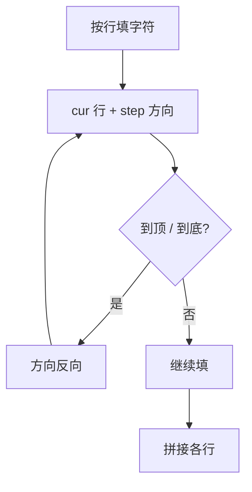

# 6. Z 字形变换

## 🛒 人话理解

🔗 [LeetCode 6](https://leetcode.cn/problems/zigzag-conversion/description/?envType=study-plan-v2&envId=top-100-liked)



**模拟法**：字符按 Z 字形（竖着往下、斜着往上）逐个填入 `numRows` 行。维护**当前行 `cur`** 与**方向 `step`**：到第 0 行就向下（+1），到最后一行就向上（-1），来回反弹。最后把各行顺序拼起。

## 🐍 Python 代码

```python
class Solution:
    def convert(self, s: str, numRows: int) -> str:
        if numRows == 1 or numRows >= len(s):
            return s
        rows = [""] * numRows
        cur, step = 0, 1
        for c in s:
            rows[cur] += c
            if cur == 0:
                step = 1
            elif cur == numRows - 1:
                step = -1
            cur += step
        return "".join(rows)
```
