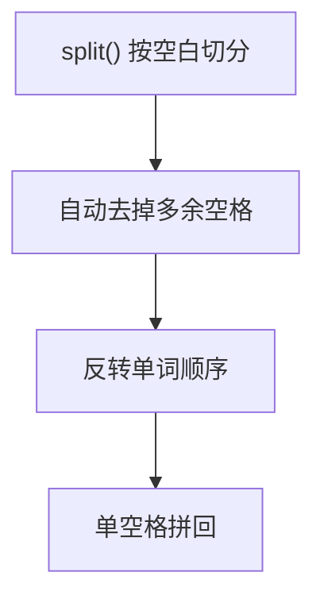

# 151. 反转字符串中的单词

## 🛒 人话理解



**目标**：反转单词顺序，单词内部不变，并去掉多余空格。Python 一行流最直观：`split()` 无参会自动按任意空白切分并去多余空格，反转后单空格拼回。手写版思路是「整体反转 → 逐词反转 → 压缩空格」。

## 🐍 Python 代码

```python
class Solution:
    def reverseWords(self, s: str) -> str:
        return " ".join(s.split()[::-1])
```
