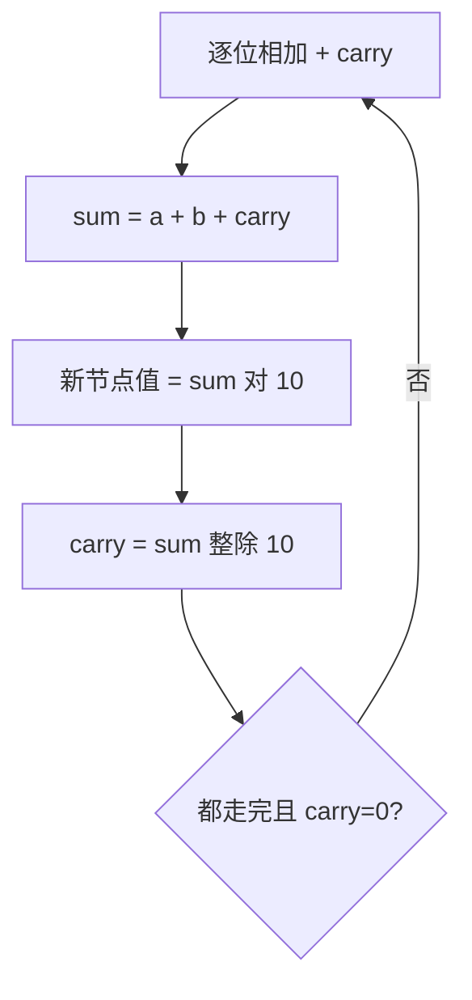

# 2. 两数相加

## 📌 题目

给你两个 **非空** 的链表，表示两个非负的整数。它们每位数字都是按照 **逆序** 的方式存储的，并且每个节点只能存储 **一位** 数字。

请你将两个数相加，并以相同形式返回一个表示和的链表。

你可以假设除了数字 0 之外，这两个数都不会以 0 开头。

示例：


```
输入：l1 = [2,4,3], l2 = [5,6,4]
输出：[7,0,8]
解释：342 + 465 = 807
```

🔗 [LeetCode 2](https://leetcode.cn/problems/add-two-numbers/description/?envType=study-plan-v2&envId=top-100-liked)

## 🛒 人话理解 & 🧠 思路演进



### 从超市收银说起
想象你是一个超市收银员，正在计算两位顾客的购物总和。每位顾客的商品都按照从个位到高位的顺序摆放（比如54元就是先放4元商品，再放50元商品）。你需要一个一个地加起来，遇到超过10元的就进位。这个场景，恰恰就是我们今天要解决的链表两数相加问题的真实写照。

### 问题描述
LeetCode第2题"两数相加"要求：给你两个非空的链表，表示两个非负的整数。它们每个节点存储一个数字，并且是按照逆序方式存储的。请你将这两个数相加，并以相同形式返回一个表示和的链表。

例如：
```
输入：2 → 4 → 3, 5 → 6 → 4
解释：342 + 465 = 807
输出：7 → 0 → 8

输入：9 → 9 → 9, 1
解释：999 + 1 = 1000
输出：0 → 0 → 0 → 1

输入：0, 0
输出：0
```

### 思路分析：模拟手算加法
就像我们在纸上做加法一样：
1. 从最低位开始，两个数字相加
2. 如果和超过10，需要进位
3. 进位的1要加到下一位的计算中

这个过程完美映射到链表遍历上：从头节点（个位）开始，同时遍历两个链表，处理好进位关系。

### 代码实现与详解

> 👉 代码实现见下方「🐍 Python 代码」

### 图解过程
```
例子：342 + 465 = 807
1) 初始状态：
l1: 2 → 4 → 3
l2: 5 → 6 → 4
sum: dummy →

2) 处理个位：2 + 5 = 7
l1: 4 → 3
l2: 6 → 4
sum: dummy → 7 →

3) 处理十位：4 + 6 = 10
l1: 3
l2: 4
sum: dummy → 7 → 0 → (carry=1)

4) 处理百位：3 + 4 + 1(进位) = 8
sum: dummy → 7 → 0 → 8
```

### 特殊情况处理
这个解法优雅地处理了所有特殊情况：
1. 两个链表长度不同
   - while条件包含了两个链表的检查
   - 短链表用0补齐
   
2. 最高位进位
   - carry > 0 保证了最后的进位会被处理
   - 如：999 + 1 = 1000

3. 空链表
   - 初始的哨兵节点确保了结果链表始终有效

### 实现细节与优化
1. 时间复杂度：O(max(N, M))
   - N和M是两个链表的长度
   - 只需要遍历一次最长的链表

2. 空间复杂度：O(max(N, M))
   - 需要存储结果链表
   - 结果的长度最多比最长的输入多1位（进位导致）

3. 代码优化技巧：
   - 使用哨兵节点简化头节点处理
   - 统一处理进位和数字相加
   - 优雅处理长度不同的情况

### 实际应用思考
这个算法的思想在很多场景中都有应用：
1. 大数计算
   - 处理超过语言内置数据类型范围的数字
   - 金融系统中的精确计算

2. 数据流处理
   - 流式处理大量数据
   - 实时计算系统

3. 进制转换
   - 模拟进位的思想可用于进制转换
   - 处理不同进制数的运算

### 扩展与提升
1. 如何处理负数？
   - 可以增加符号位
   - 需要考虑不同符号数字的相加

2. 如何处理正序存储的数字？
   - 可以先反转链表
   - 或者使用栈暂存节点

### 小结
链表两数相加的问题告诉我们：
1. 复杂问题可以通过模拟人工解决方式来简化
2. 良好的代码结构可以优雅处理各种边界情况
3. 数据结构的选择会影响问题的解决方案

温馨提示：在处理类似问题时，先想想人是如何解决的，再将这个过程转换为代码，往往能得到更清晰的思路。

## 🐍 Python 代码

```python
class Solution:
    def addTwoNumbers(self, l1: Optional[ListNode], l2: Optional[ListNode]) -> Optional[ListNode]:
        # 创建虚拟头节点，用于简化链表操作
        dummy = ListNode(0)
        current = dummy
        carry = 0

        # 遍历两个链表，直到两者都为空
        while l1 or l2:
            # 计算当前位的和，考虑进位
            sum_val = (l1.val if l1 else 0) + (l2.val if l2 else 0) + carry
            carry = sum_val // 10  # 更新进位
            current.next = ListNode(sum_val % 10)  # 创建新节点，存储当前位的值
            current = current.next  # 移动 current 指针到新节点

            # 移动 l1 和 l2 指针到下一个节点
            if l1:
                l1 = l1.next
            if l2:
                l2 = l2.next

        # 如果最后有进位，需要在结果链表的末尾新增一个节点
        if carry > 0:
            current.next = ListNode(carry)

        # 返回结果链表的头节点，即虚拟头节点的下一个节点
        return dummy.next
```
