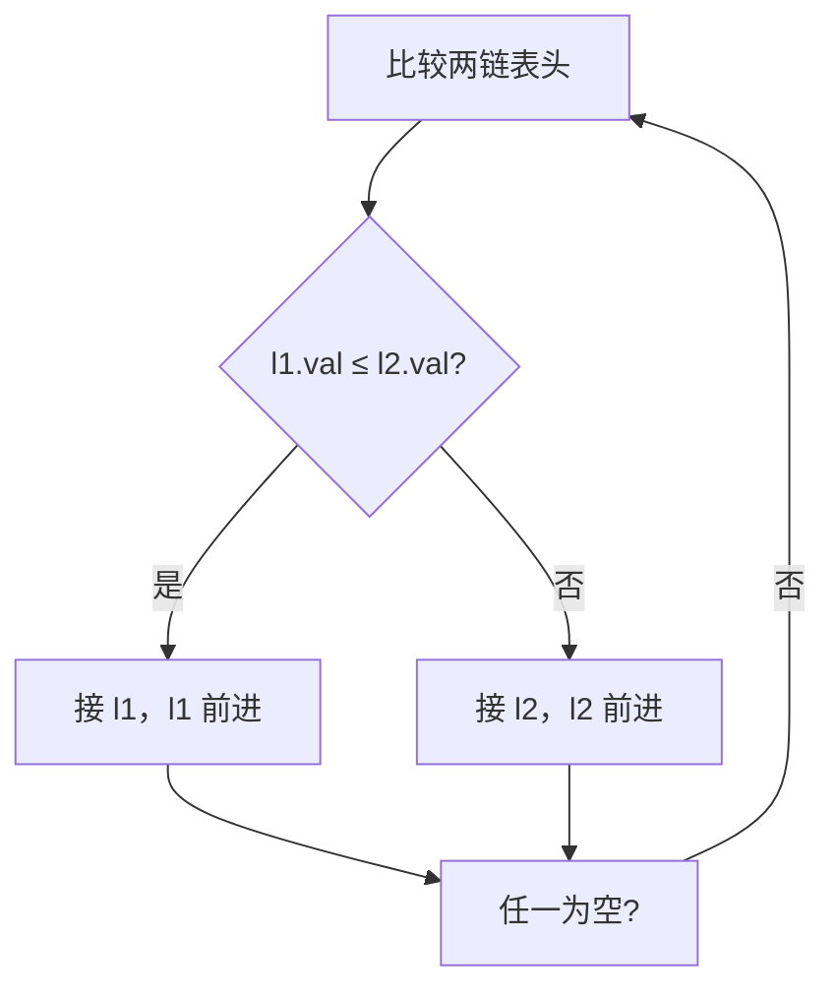

# 21. 合并两个有序链表 ✅

## 📌 题目

将两个升序链表合并为一个新的 **升序** 链表并返回。新链表是通过拼接给定的两个链表的所有节点组成的。 

示例：


```
输入：l1 = [1,2,4], l2 = [1,3,4]
输出：[1,1,2,3,4,4]
```

🔗 [LeetCode 21](https://leetcode.cn/problems/merge-two-sorted-lists/description/?envType=study-plan-v2&envId=top-100-liked)

## 🛒 人话理解 & 🧠 思路演进



### 生活中的合并
想象你正在整理两叠按日期排好序的收据。最自然的方式就是：拿起两叠收据，每次比较最上面的日期，选择日期较早的那张放入新的一叠中。这个简单的日常操作，恰恰就是我们今天要讨论的有序链表合并问题的真实写照。

### 问题描述
LeetCode第21题"合并两个有序链表"要求：将两个升序链表合并为一个新的升序链表并返回。新链表是通过拼接给定的两个链表的所有节点组成的。

例如：
```
输入：1 → 2 → 4, 1 → 3 → 4
输出：1 → 1 → 2 → 3 → 4 → 4

输入：空链表, 0
输出：0

输入：空链表, 空链表
输出：空链表
```

### 暴力解法：转换为数组排序
最直观的想法可能是：把两个链表的值都放到一个数组里，排序后再创建新链表。这种方法虽然不够优雅，但对于理解问题很有帮助。

### 暴力解法实现

> 👉 代码实现见下方「🐍 Python 代码」

### 优化解法：双指针遍历
既然输入的链表已经排好序，我们完全可以模拟整理收据的过程：同时遍历两个链表，每次选择较小的节点连接到结果链表中。这就像拉链一样，将两个有序序列合并成一个。

### 代码实现与详解

> 👉 代码实现见下方「🐍 Python 代码」

### 图解过程
```
1) 初始状态：
list1: 1 → 2 → 4
list2: 1 → 3 → 4
result: dummy →

2) 第一次比较后：
list1: 2 → 4
list2: 1 → 3 → 4
result: dummy → 1 →

3) 第二次比较后：
list1: 2 → 4
list2: 3 → 4
result: dummy → 1 → 1 →

4) 最终结果：
result: dummy → 1 → 1 → 2 → 3 → 4 → 4
```

### 复杂度比较
暴力解法：
- 时间复杂度：O(nlogn)，主要来自排序过程
- 空间复杂度：O(n)，需要额外数组存储所有节点
- 缺点：没有利用链表已排序的特性

双指针解法：
- 时间复杂度：O(n)，只需要遍历一次
- 空间复杂度：O(1)，只需要几个指针
- 优点：充分利用了输入链表已排序的特性

### 技巧与思考
1. 哨兵节点的妙用
   - 使用哨兵节点可以统一边界情况处理
   - 避免了对头节点的特殊处理

2. 就地合并的思想
   - 不需要创建新节点
   - 通过改变指针指向来实现合并

3. 处理剩余节点
   - 直接连接剩余链表
   - 避免了继续遍历剩余节点

### 实际应用延伸
合并有序链表的思想在实际开发中很常见：
1. 数据库中的有序结果集合并
2. 文件系统中有序文件的合并
3. 日志系统中按时间戳排序的日志合并

### 小结
合并有序链表看似简单，实则蕴含着重要的算法思想：
1. 如何高效处理有序数据
2. 指针操作的技巧
3. 如何简化边界条件处理

记住：当遇到类似的合并问题时，先考虑数据是否有序，如果有序，往往可以设计出更优雅高效的解法。

## 🐍 Python 代码

### 🥊 暴力解（朴素对照）

把两个链表的值全收进数组，排序后再逐个重建链表——无视「已有序」的特性，最直白。

```python
class Solution:
    def mergeTwoLists(self, list1: Optional[ListNode], list2: Optional[ListNode]) -> Optional[ListNode]:
        # 1) 收集两个链表的所有值
        vals = []
        for node in (list1, list2):
            cur = node
            while cur:
                vals.append(cur.val)
                cur = cur.next

        # 2) 排序后重建链表
        vals.sort()
        dummy = cur = ListNode(0)
        for v in vals:
            cur.next = ListNode(v)
            cur = cur.next
        return dummy.next
```

- 时间复杂度：`O(n log n)`，排序是瓶颈
- 空间复杂度：`O(n)`，额外数组 + 重建的新节点
- ⚠️ 没利用「两个输入本身就有序」的性质，多花了一次排序。改用双指针逐位比较即可 `O(n)` 一次扫完，见下方最优解。

### ⚡ 最优解

```python
class Solution:
    def mergeTwoLists(self, list1: Optional[ListNode], list2: Optional[ListNode]) -> Optional[ListNode]:
        # 创建一个哑节点作为合并后链表的头节点的前驱节点
        dummy = ListNode(-1)
        current = dummy
        
        # 当两个链表都不为空时，进行迭代合并
        while list1 and list2:
            if list1.val <= list2.val:
                # 如果list1的值较小或相等，将其节点接入合并链表
                current.next = list1
                list1 = list1.next
            else:
                # 如果list2的值较小，将其节点接入合并链表
                current.next = list2
                list2 = list2.next
            # 移动当前指针到合并链表的最后一个节点
            current = current.next
        
        # 将未遍历完的链表直接接入合并链表的末尾
        current.next = list1 if list1 else list2
        
        # 返回合并后的链表头节点
        return dummy.next
```

## 📝 你的笔记（飞书）

你已在飞书《001-链表基础详解》完成。
