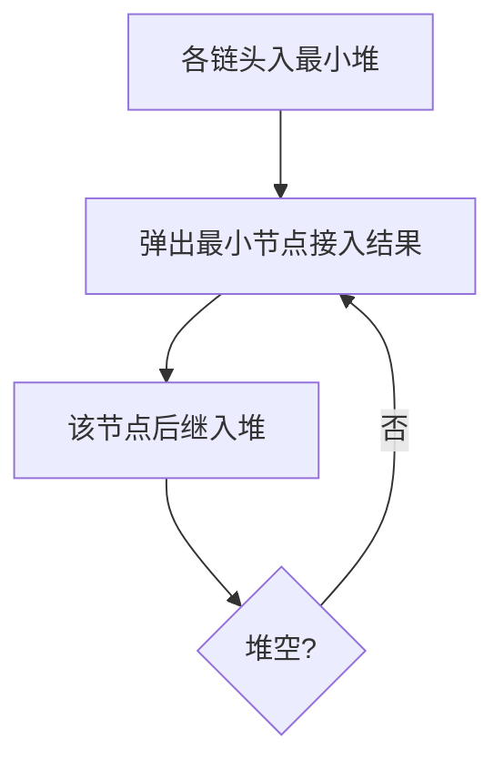

# 23. 合并 K 个升序链表

## 🛒 人话理解 & 🧠 思路演进



### 生活中的多路合并
想象你是一个大学食堂的管理员。食堂有k个打饭窗口，每个窗口前都排着一队按身高从矮到高的学生（就像我们的有序链表）。你的任务是将所有学生重新排成一个队，依然要保持按身高从矮到高的顺序。这就是我们今天要讨论的合并k个升序链表问题的生动写照。

### 问题的本质与挑战
LeetCode第23题"合并K个升序链表"要求我们将K个有序链表合并成一个新的有序链表。这个问题乍看简单，实则暗藏玄机：如何在保证结果有序的同时，又能达到最优的时间复杂度？

例如：
```
输入：
[
  1→4→5,
  1→3→4,
  2→6
]
输出：1→1→2→3→4→4→5→6
```

### 解题思路的进化

### 方法一：逐个合并法
就像食堂管理员最直观的想法：先合并前两队，再把结果和第三队合并，以此类推。这种方法简单但效率不高，因为前面的元素会被重复比较多次。

### 方法二：分治合并法
更聪明的方式是采用分治思想：先把k个队伍分成两半，各自合并后再合并到一起。就像举办体育比赛的淘汰赛制一样，这样可以显著减少比较次数。

### 方法三：优先队列法
最优雅的解法是利用优先队列：每个打饭窗口派出当前队伍的第一个学生到一个中心区域（优先队列），始终从中选出最矮的学生，然后该学生所在的窗口再派出下一个学生。这样我们可以始终保证选出的是当前最小的元素。

### 详细代码实现

让我们先来看最优雅的优先队列解法：

> 👉 代码实现见下方「🐍 Python 代码」

再来看分治合并法的实现：

> 👉 代码实现见下方「🐍 Python 代码」

### 复杂度分析与比较

优先队列法：
- 时间复杂度：O(N logK)，N是所有节点总数，K是链表个数
- 空间复杂度：O(K)，优先队列中最多K个节点
- 优点：实现优雅，处理过程清晰
- 缺点：需要额外的数据结构

分治合并法：
- 时间复杂度：O(N logK)
- 空间复杂度：O(logK)，递归调用栈的深度
- 优点：不需要额外的数据结构
- 缺点：实现稍复杂，递归调用有开销

逐个合并法：
- 时间复杂度：O(NK)
- 空间复杂度：O(1)
- 优点：实现最简单
- 缺点：效率较低，重复比较次数多

### 实战技巧总结

1. **优先队列的初始化技巧**：把Lambda表达式用于比较器定义使代码更简洁
2. **虚拟头节点的使用**：简化边界情况的处理
3. **分治时计算中点**：使用 left + (right - left) / 2 避免整数溢出
4. **合并过程的细节**：注意指针更新的顺序，防止断链

### 应用场景延伸
K路归并的思想在实际开发中非常常见：
- 多路文件合并
- 数据库的多路归并
- 分布式系统的结果聚合
- 实时数据流的合并排序

### 小结
合并K个升序链表的问题教会我们：
1. 如何将简单问题（合并两个有序链表）扩展到复杂场景
2. 不同解法之间的权衡取舍
3. 数据结构（优先队列）在算法优化中的重要作用
4. 分治思想的实际应用

记住：解决复杂问题如同管理食堂打饭，找到合适的策略才能实现最优效率！

补充思考：
- 如果链表数量K很大，如何优化内存使用？
- 如果是流式数据，如何调整算法？
- 如何处理链表长度相差很大的情况？

## 🐍 Python 代码

```python
import heapq

class Solution:
    def mergeKLists(self, lists: List[Optional[ListNode]]):
        heap = []
        for i, node in enumerate(lists):        # 各链表头入堆
            if node:
                heapq.heappush(heap, (node.val, i, node))
        dummy = tail = ListNode(0)
        while heap:
            val, i, node = heapq.heappop(heap)  # 每次取最小
            tail.next = node
            tail = tail.next
            if node.next:                        # 该链表后继入堆
                heapq.heappush(heap, (node.next.val, i, node.next))
        return dummy.next
```
