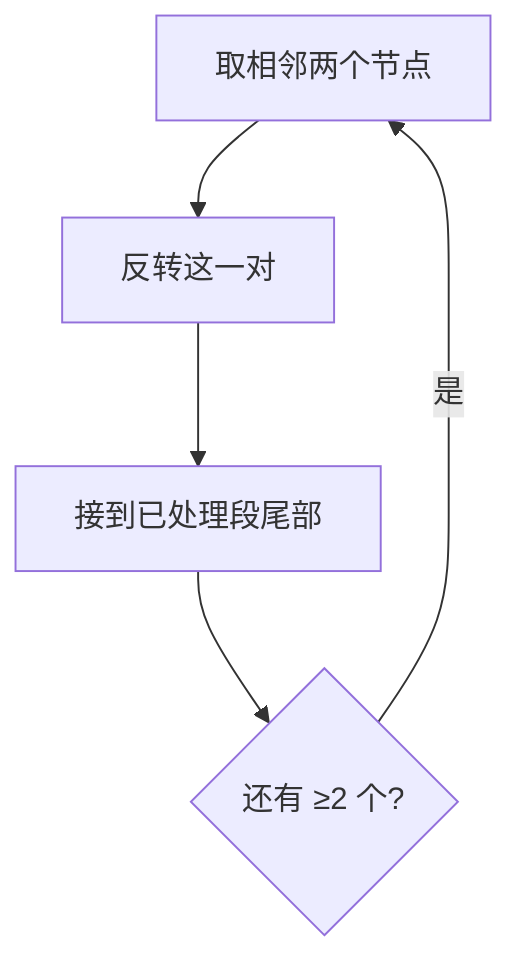

# 24. 两两交换链表中的节点

## 📌 题目

给你一个链表，两两交换其中相邻的节点，并返回交换后链表的头节点。你必须在不修改节点内部的值的情况下完成本题（即，只能进行节点交换）。

示例：


```
输入：head = [1,2,3,4]
输出：[2,1,4,3]
```

🔗 [LeetCode 24](https://leetcode.cn/problems/swap-nodes-in-pairs/description/?envType=study-plan-v2&envId=top-100-liked)

## 🛒 人话理解 & 🧠 思路演进



### 生活中的配对交换
想象一下排队买奶茶的场景：情侣们总喜欢两个人站在一起。如果队伍里的人想要实现"情侣相邻"，最简单的方法就是相邻两个人互换位置，直到所有人都找到适合的搭档。这就是我们今天要讨论的链表节点两两交换问题的现实映射。

### 问题描述
LeetCode第24题"两两交换链表中的节点"要求：给你一个链表，两两交换其中相邻的节点，并返回交换后链表的头节点。注意：你必须在不修改节点内部的值的情况下完成本题（即，只能进行节点交换）。

例如：
```
输入：1 → 2 → 3 → 4
输出：2 → 1 → 4 → 3

输入：1 → 2 → 3
输出：2 → 1 → 3

输入：1
输出：1
```

### 递归解法：优雅的节点交换
就像跳华尔兹舞时，每对舞伴都遵循同样的舞步，我们可以用递归的方式让每一对节点完成交换的舞蹈。

### 递归原理解析
递归的精髓在于：
1. 确定基本情况：当没有节点或只有一个节点时，无需交换
2. 找到重复模式：每次处理两个节点的交换
3. 链接新的关系：将交换后的部分与后续交换好的部分相连

### 递归实现

> 👉 代码实现见下方「🐍 Python 代码」

### 复杂度分析
- 时间复杂度：O(n)，每个节点只被访问一次
- 空间复杂度：O(n)，递归调用栈的深度

### 迭代解法：舞伴交换的流水线
想象一个舞蹈教室，教练在指导多对舞伴依次交换位置。迭代解法就像是这个教练，一步步指导相邻节点完成交换。

### 迭代实现

> 👉 代码实现见下方「🐍 Python 代码」

### 图解过程
以链表 1→2→3→4 为例：
```
1) 初始状态：
dummy → 1 → 2 → 3 → 4
  ↑
prev

2) 第一次交换后：
dummy → 2 → 1 → 3 → 4
          ↑
         prev

3) 第二次交换后：
dummy → 2 → 1 → 4 → 3
                ↑
               prev
```

### 两种解法的比较
递归解法：
- 优点：代码简洁优雅，思路清晰
- 缺点：需要额外的栈空间，对于长链表可能导致栈溢出
- 适用场景：链表较短，代码可读性要求高

迭代解法：
- 优点：空间效率高，适用于长链表
- 缺点：代码稍显复杂，需要维护多个指针
- 适用场景：对空间效率有要求，链表较长

### 编程技巧总结
1. 使用虚拟头节点简化边界处理
2. 画图理清指针变化顺序
3. 先确保局部交换正确，再考虑整体链接
4. 细心处理空指针情况

### 实际应用思考
这种两两交换的思想在实际编程中很有用：
- 数据压缩时的字节配对
- 网络通信中的数据包配对处理
- 并行计算中的任务配对

### 小结
两两交换链表节点的问题教会我们：
1. 如何优雅地处理链表节点的指针操作
2. 递归和迭代两种思维方式的应用场景
3. 在复杂操作中保持代码的清晰和健壮
4. 如何通过生活场景理解抽象的算法问题

建议：多思考类似的节点操作问题，它们都可以通过类似的思维方式解决：
- 链表反转
- K个一组反转链表
- 合并有序链表

记住：写代码如跳舞，优雅的节奏往往能带来最好的解决方案！

## 🐍 Python 代码

### 🥊 暴力解（朴素对照）

先把链表读进数组，按下标两两交换相邻节点，再重新串成链表——思路最直白，不碰指针。

```python
class Solution:
    def swapPairs(self, head: Optional[ListNode]) -> Optional[ListNode]:
        # 1) 读进节点数组
        nodes = []
        cur = head
        while cur:
            nodes.append(cur)
            cur = cur.next

        # 2) 两两交换相邻节点（按下标 i 与 i+1）
        for i in range(0, len(nodes) - 1, 2):
            nodes[i], nodes[i + 1] = nodes[i + 1], nodes[i]

        # 3) 重新串起来
        dummy = ListNode(0)
        cur = dummy
        for node in nodes:
            cur.next = node
            cur = cur.next
        cur.next = None          # 收尾，防止成环
        return dummy.next
```

- 时间复杂度：`O(n)`，遍历链表 + 重组
- 空间复杂度：`O(n)`，额外节点数组
- ⚠️ 多吃了 `O(n)` 辅助空间。其实原地用几个临时指针就能完成交换，省掉数组，见下方最优解。

### ⚡ 最优解

```python
class Solution:
    def swapPairs(self, head: Optional[ListNode]) -> Optional[ListNode]:
        # 创建虚拟头节点，方便处理链表头部的交换
        dummy = ListNode(0)
        dummy.next = head
        prev = dummy
        
        while head and head.next:
            # 定义需要交换的两个节点
            first = head
            second = head.next
            
            # 交换节点
            # 1. 将 prev 的 next 指向 second
            prev.next = second
            # 2. 将 first 的 next 指向 second 的 next
            first.next = second.next
            # 3. 将 second 的 next 指向 first
            second.next = first
            
            # 更新指针，准备处理下一对节点
            prev = first
            head = first.next
        
        # 返回新的链表头节点
        return dummy.next
```
