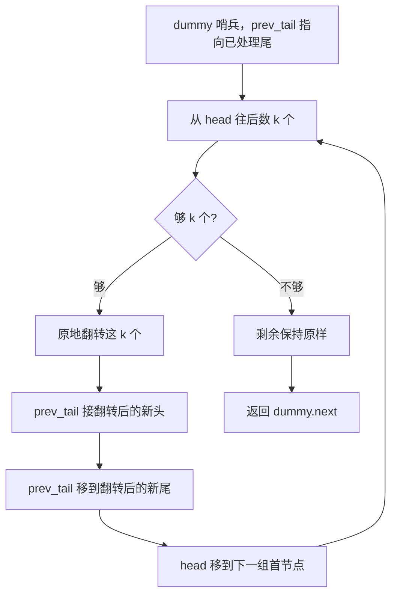
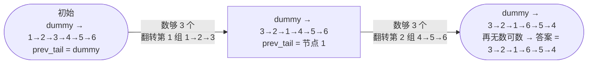

# 25. K 个一组翻转链表

## 🛒 人话理解 & 🧠 思路演进



**总体一句话**：每组先数够 `k` 个再原地翻转、接回前段尾部；不足 `k` 个的尾巴按题意保持原样不动——核心是「先验证够不够、够才翻转」。

### 🔬 逐步推演（动画式）

以 `head = 1→2→3→4→5→6`，`k = 3` 为例——从左到右就是算法的时间线：**每个节点是一次状态快照（翻转后的整条链表与 prev_tail 落点），箭头上写这一步翻转了哪一组**：



读图：第 ① 组 1→2→3 翻成 3→2→1 并接在 dummy 后，`prev_tail` 落到新尾 1；第 ② 组 4→5→6 翻成 6→5→4，接在 1 后面。之后再无数可数，结束。答案 **3→2→1→6→5→4**。

> 若链表是 `1→2→3→4→5`、`k = 3`，则第 ② 组只有 4→5 不足 3 个，保持原样，答案为 **3→2→1→4→5**。

### 生活中的分组管理
想象一个大型项目的场景：项目经理需要将100名员工分成每组10人的小组，每个小组负责不同的模块，而每个小组内部还要重新调整座位安排。这就像我们今天要讨论的K个一组翻转链表问题：我们需要将链表节点分成固定大小的组，并在每组内部进行翻转重组。

### 问题描述

🔗 [LeetCode 25](https://leetcode.cn/problems/reverse-nodes-in-k-group/description/?envType=study-plan-v2&envId=top-100-liked)

LeetCode第25题"K个一组翻转链表"要求：给你一个链表，每 k 个节点一组进行翻转，请你返回翻转后的链表。k 是一个正整数，它的值小于或等于链表的长度。如果节点总数不是 k 的整数倍，那么请将最后剩余的节点保持原有顺序。

例如：
```
输入：1 → 2 → 3 → 4 → 5，k = 2
输出：2 → 1 → 4 → 3 → 5

输入：1 → 2 → 3 → 4 → 5，k = 3
输出：3 → 2 → 1 → 4 → 5

输入：1 → 2 → 3 → 4 → 5，k = 1
输出：1 → 2 → 3 → 4 → 5
```

### 递归解法：项目分配的艺术
就像一个睿智的项目经理，递归解法的优雅之处在于：我们只需要关注当前这一组的翻转，至于后面的组怎么翻转，交给"下属"（递归）去处理就好。等下属完成任务后，我们再将当前组和后续结果整合起来。

### 递归思路解析
就像项目分配一样：
1. 先检查手上有没有足够的人手（节点）可以组成一组
2. 如果够一组，就处理这一组的内部调整（翻转）
3. 将剩下的人交给下属继续分组处理
4. 等下属处理完，再把当前组和下属处理好的结果连接起来

### 递归实现

> 👉 代码实现见下方「🐍 Python 代码」

### 复杂度分析
- 时间复杂度：O(n)，每个节点只处理一次
- 空间复杂度：O(n/k)，递归栈的深度

### 迭代解法：流水线作业
如果说递归像是项目分配，那么迭代就像是流水线作业：我们站在生产线旁，一组一组地处理节点，每处理完一组就移动到下一组，直到处理完所有节点。

### 迭代实现

> 👉 代码实现见下方「🐍 Python 代码」

### 图解过程
以链表 1→2→3→4→5→6，k=3 为例：
```
1) 初始状态：
dummy → 1 → 2 → 3 → 4 → 5 → 6
  ↑
prevGroupTail

2) 第一组翻转后：
dummy → 3 → 2 → 1 → 4 → 5 → 6
              ↑
         prevGroupTail

3) 第二组翻转后：
dummy → 3 → 2 → 1 → 6 → 5 → 4
                          ↑
                     prevGroupTail
```

### 两种解法的深度对比
递归解法（项目分配型）：
- 优点：思路清晰，代码结构优雅
- 缺点：需要额外栈空间，不适合大规模数据
- 特点：自顶向下的处理方式，像层层分派任务

迭代解法（流水线型）：
- 优点：空间效率高，适合处理大规模数据
- 缺点：需要维护多个指针，逻辑较复杂
- 特点：自底向上的处理方式，像流水线作业

### 实现技巧总结
1. 使用虚拟头节点简化边界处理
2. 先验证组内节点数量，再进行翻转
3. 保存关键节点引用，便于后续连接
4. 画图理清指针变化过程

### 难点剖析
本题的主要难点在于：
1. 如何准确判断剩余节点是否够一组
2. 如何正确处理组间的连接
3. 如何优雅地保持最后不足k个节点的原有顺序
4. 如何在复杂的指针操作中避免断链

### 实际应用延伸
这种分组处理的思想在实际开发中很常见：
- 批量数据处理
- 分布式计算任务划分
- 内存页面置换算法
- 消息队列的批量处理

### 小结
K个一组翻转链表的问题教会我们：
1. 如何将复杂问题分解为可管理的小问题
2. 递归和迭代两种思维方式的优劣
3. 在复杂的指针操作中保持逻辑清晰
4. 如何通过实际场景理解抽象算法

这道题是链表操作的集大成者，它包含了：
- 链表翻转的基本技巧
- 分组处理的思想
- 递归与迭代的权衡
- 复杂场景下的边界处理

记住：解决复杂问题如同管理大型项目，关键在于合理的分解和清晰的思路！

## 🐍 Python 代码

### 🥊 暴力解（朴素对照）

先把链表读进数组，每 k 个一组翻转切片，再重新串成链表——用数组下标规避了指针操作的复杂度。

```python
class Solution:
    def reverseKGroup(self, head: Optional[ListNode], k: int) -> Optional[ListNode]:
        # 1) 读进节点数组
        nodes = []
        cur = head
        while cur:
            nodes.append(cur)
            cur = cur.next

        # 2) 每 k 个一组翻转切片（最后一组不足 k 保持原样）
        for start in range(0, len(nodes), k):
            end = start + k
            if end > len(nodes):    # 不足一组，保持原样
                break
            nodes[start:end] = nodes[start:end][::-1]

        # 3) 重新串起来
        dummy = ListNode(0)
        cur = dummy
        for node in nodes:
            cur.next = node
            cur = cur.next
        cur.next = None             # 收尾，防止成环
        return dummy.next
```

- 时间复杂度：`O(n)`，遍历 + 分组翻转（每组翻转求和仍是 O(n)）
- 空间复杂度：`O(n)`，额外节点数组
- ⚠️ 多吃了 `O(n)` 辅助空间，且依赖切片。用「先数够 k 个、原地指针翻转」即可做到 `O(1)` 额外空间，见下方最优解。

### ⚡ 最优解

```python
class Solution:
    def reverseKGroup(self, head, k: int):
        dummy = ListNode(0, head)
        prev_tail = dummy
        while head:
            # 1) 先数够 k 个；数完 tail 会停在"下一组的首个节点"
            tail, cnt = head, 0
            while cnt < k and tail:
                tail, cnt = tail.next, cnt + 1
            if cnt < k:          # 剩余不足 k 个，按题意保持原样，结束
                break
            # 2) 翻转这 k 个：tail 现在指向"下一组的头"(数的时候多走了一步)
            curr, prev = head, tail
            for _ in range(k):
                # 同步赋值：右边先用旧值算好再整体赋给左边，等价于 reverseList 的"存 next→掉头→后移"
                curr.next, curr, prev = prev, curr.next, curr
            # 3) 接回主链：翻转后 prev 是这组新头、head 变成这组新尾
            prev_tail.next = prev
            prev_tail = head
            head = tail          # 下一组从 tail(下一组首个)开始
        return dummy.next
```
