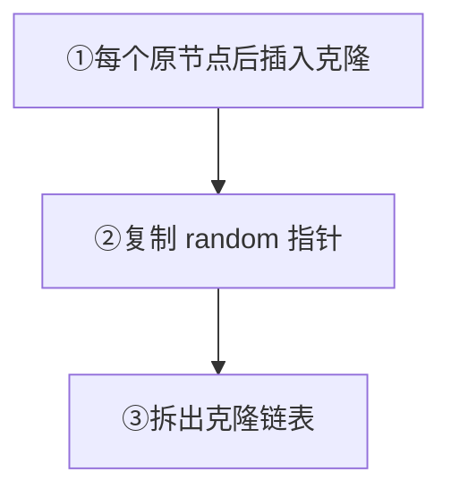

# 138. 随机链表的复制

## 📌 题目

给你一个长度为 `n` 的链表，每个节点包含一个额外增加的随机指针 `random` ，该指针可以指向链表中的任何节点或空节点。

构造这个链表的 **[深拷贝](https://baike.baidu.com/item/%E6%B7%B1%E6%8B%B7%E8%B4%9D/22785317?fr=aladdin)**。 深拷贝应该正好由 `n` 个 **全新** 节点组成，其中每个新节点的值都设为其对应的原节点的值。新节点的 `next` 指针和 `random` 指针也都应指向复制链表中的新节点，并使原链表和复制链表中的这些指针能够表示相同的链表状态。**复制链表中的指针都不应指向原链表中的节点** 。

例如，如果原链表中有 `X` 和 `Y` 两个节点，其中 `X.random --> Y` 。那么在复制链表中对应的两个节点 `x` 和 `y` ，同样有 `x.random --> y` 。

返回复制链表的头节点。

用一个由 `n` 个节点组成的链表来表示输入/输出中的链表。每个节点用一个 `[val, random_index]` 表示：

- `val`：一个表示 `Node.val` 的整数。
- `random_index`：随机指针指向的节点索引（范围从 `0` 到 `n-1`）；如果不指向任何节点，则为  `null` 。

你的代码 **只** 接受原链表的头节点 `head` 作为传入参数。

示例：

```
输入：head = [[7,null],[13,0],[11,4],[10,2],[1,0]]
输出：[[7,null],[13,0],[11,4],[10,2],[1,0]]
```

🔗 [LeetCode 138](https://leetcode.cn/problems/copy-list-with-random-pointer/description/?envType=study-plan-v2&envId=top-100-liked)

## 🛒 人话理解 & 🧠 思路演进



### 现实中的复制难题
想象你在一个派对上负责给每位宾客发派对礼物。每位宾客除了认识自己前后的人（就像链表的next指针），还认识派对上的某个"神秘朋友"（就像random指针）。现在你需要在隔壁房间布置一个一模一样的派对，让每个人都有一个"分身"，并确保这些分身之间的所有社交关系都和原派对一样。这就是我们今天要解决的随机链表复制问题的真实写照。

### 问题定义与难点分析
LeetCode 第138题"复制带随机指针的链表"要求我们对一个特殊的链表进行深拷贝。这个链表的每个节点除了包含指向下一个节点的next指针，还包含一个random指针，可以指向链表中的任意节点或null。

```
// 节点定义
class Node {
    int val;
    Node next;
    Node random;
}
```

### 为什么这题不简单？
让我们先深入理解问题的难点：
1. **循环依赖问题**：就像派对上的人际关系一样，如果A的神秘朋友是B，B的神秘朋友是C，C的神秘朋友是A，这种循环依赖关系让我们无法简单地"一次性"完成复制。

2. **节点映射难题**：当我们复制节点A'时，如果它的random指针指向节点B，而B还没有被复制，我们就陷入了"先有鸡还是先有蛋"的困境。

3. **空间效率考虑**：如何在不使用额外空间的情况下，记住原节点和复制节点之间的对应关系？

### 解决思路的演进
让我们像解开一团缠绕的毛线一样，一步步理清解决方案：

### 方案一：哈希表映射法
就像在派对上给每个人发一个编号，然后在隔壁房间按编号复制人际关系。

**具体步骤：**
1. 第一遍遍历：创建所有节点的复制，并用哈希表记录原节点到新节点的映射关系
2. 第二遍遍历：根据哈希表中的映射关系，设置所有新节点的next和random指针

这种方法简单直观，但需要额外的存储空间。

### 方案二：节点交织法
这是一个巧妙的思路，就像让每个人的分身直接站在他们身后，这样就能轻松找到对应关系。

**具体步骤：**
1. 第一遍遍历：在每个原节点后面创建它的复制节点
2. 第二遍遍历：设置所有复制节点的random指针
3. 第三遍遍历：分离原始链表和复制链表

这种方法不需要额外空间，但需要三次遍历。

### 方案三：优化的节点标记法（一种特殊情况下的思路）
如果节点值的范围允许，我们可以用一些特殊的标记方式来记录节点间的对应关系。
但这种方法依赖于具体的数值范围限制，不是通用解法。

### 详细代码实现
让我们先来看哈希表映射法的实现，它最容易理解：

> 👉 代码实现见下方「🐍 Python 代码」

再来看空间优化的节点交织法：

> 👉 代码实现见下方「🐍 Python 代码」

### 复杂度分析与比较
哈希表映射法：
- 时间复杂度：O(n)，需要两次遍历
- 空间复杂度：O(n)，需要哈希表存储映射关系
- 优点：实现简单，思路清晰
- 缺点：需要额外空间

节点交织法：
- 时间复杂度：O(n)，需要三次遍历
- 空间复杂度：O(1)，不需要额外空间
- 优点：空间效率高
- 缺点：需要修改原链表结构（虽然最后会恢复）

### 实际应用思考
这种深拷贝问题在实际开发中非常常见：
- 对象的深拷贝
- 图结构的复制
- 系统快照的创建
- 游戏存档的复制

### 核心技巧总结
1. 复杂问题分解：将问题分成创建节点和建立关联两个子问题
2. 空间换时间：用哈希表简化实现
3. 就地修改：通过调整链表结构省略额外空间
4. 分步骤处理：避免处理循环依赖导致的复杂性

### 小结
随机链表的复制问题教会我们：
1. 如何处理带有复杂引用关系的数据结构
2. 空间和时间效率的权衡思想
3. 通过临时修改数据结构解决复杂问题
4. 如何优雅地处理循环依赖问题

这道题是链表、哈希表和深拷贝概念的完美结合，它启发我们：
- 在处理复杂数据结构时，可以考虑分步骤进行
- 临时的数据结构修改有时能带来意想不到的便利
- 空间与时间的权衡是算法设计中永恒的主题

记住：解决复杂问题如同复制一场精心安排的派对，关键在于理清依赖关系，合理安排执行顺序！

## 🐍 Python 代码

```python
class Solution:
    def copyRandomList(self, head: 'Optional[Node]') -> 'Optional[Node]':
        if not head:
            return None

        # Step 1: 创建新节点并插入到原节点后面
        curr = head
        while curr:
            # 创建新节点，并将其值设为当前节点的值
            new_node = Node(curr.val, curr.next, None)
            # 将新节点插入到当前节点和下一个节点之间
            curr.next = new_node
            # 移动到下一个原节点
            curr = new_node.next

        # Step 2: 设置新节点的随机指针
        curr = head
        while curr:
            # 如果当前节点有随机指针
            if curr.random:
                # 新节点的随机指针应该指向原节点随机指针对应的新节点
                curr.next.random = curr.random.next
            # 移动到下一个原节点
            curr = curr.next.next

        # Step 3: 分离两个链表
        old_head = head
        new_head = head.next
        curr_old = old_head
        curr_new = new_head

        while curr_old:
            # 恢复原链表的结构
            curr_old.next = curr_old.next.next if curr_old.next else None
            # 构建新链表的结构
            curr_new.next = curr_new.next.next if curr_new.next else None
            # 移动到下一个原节点
            curr_old = curr_old.next
            # 移动到新链表的下一个新节点
            curr_new = curr_new.next

        return new_head
```
