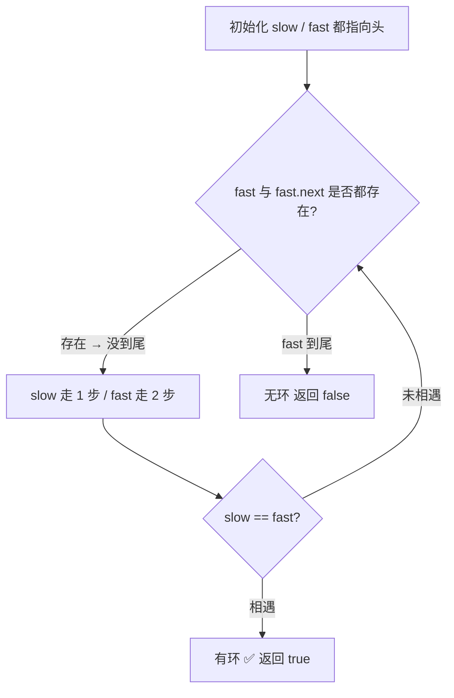
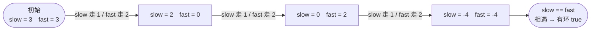

# 141. 环形链表 ✅

## 📌 题目

给你一个链表的头节点 `head` ，判断链表中是否有环。

如果链表中有某个节点，可以通过连续跟踪 `next` 指针再次到达，则链表中存在环。 为了表示给定链表中的环，评测系统内部使用整数 `pos` 来表示链表尾连接到链表中的位置（索引从 0 开始）。**注意：`pos` 不作为参数进行传递** 。仅仅是为了标识链表的实际情况。

_如果链表中存在环_ ，则返回 `true` 。 否则，返回 `false` 。

示例：


```
输入：head = [3,2,0,-4], pos = 1
输出：true
解释：链表中有一个环，其尾部连接到第二个节点。
```

🔗 [LeetCode 141](https://leetcode.cn/problems/linked-list-cycle/description/?envType=study-plan-v2&envId=top-100-liked)

## 🛒 人话理解 & 🧠 思路演进



**总体一句话**：派一慢一快两个指针同从头出发，慢的每步走 1 格、快的每步走 2 格——若有环，快指针一定会在环里追上慢指针（相遇即有环）；若无环，快指针会先跑到链表尾部。

### 🔬 逐步推演（动画式）

以 `head = 3→2→0→-4`，`-4` 又指回 `2`（即 `pos = 1`）为例——从左到右就是算法的时间线：**每个节点是一次状态快照（slow / fast 落点），箭头上写这一步谁走了、是否相遇**：



### 生活中的环形
想象两个人在环形跑道上跑步，一个跑得快，一个跑得慢。如果他们一直跑下去，快的跑者一定会从后面追上慢的跑者。这就是我们今天要讨论的环形链表问题的现实映射。在跑道上，两个速度不同的跑者相遇就说明跑道是环形的；同样在链表中，如果两个速度不同的指针相遇，就说明链表中存在环。

### 问题描述
LeetCode第141题"环形链表"要求：给你一个链表的头节点 head，判断链表中是否有环。如果链表中有某个节点，可以通过连续跟踪 next 指针再次到达，则链表中存在环。

例如：
```
输入：3 → 2 → 0 → -4
         ↑___________|
输出：true
解释：链表中存在一个环，尾节点连接到第二个节点

输入：1 → 2
     ↑___|
输出：true
解释：链表中存在一个环，尾节点连接到第一个节点

输入：1 → 2 → 3 → 4
输出：false
解释：链表中不存在环
```

### 简单解法：哈希表记录
最直观的想法是用一个哈希表记录每个走过的节点。就像在跑道上撒面包屑，如果遇到已经撒过面包屑的地方，说明路径形成了环。

### 哈希表解法实现

> 👉 代码实现见下方「🐍 Python 代码」

### 优化解法：快慢指针（Floyd判圈算法）
这个经典算法也被称为"龟兔赛跑算法"，就像我们开始说的跑步场景：让一快一慢两个指针在链表上移动，如果存在环，快指针最终一定会追上慢指针。

### 为什么快慢指针一定会相遇？
想象在环形跑道上：
1. 快指针每次走2步，慢指针每次走1步
2. 相对来说，快指针每次都在追赶慢指针1步
3. 如果有环，这就像在操场上追赶，快指针一定会追上慢指针
4. 如果无环，快指针会先到达终点

### 代码实现与详解

> 👉 代码实现见下方「🐍 Python 代码」

### 图解过程
以一个有环链表为例：
```
1) 初始状态：
3 → 2 → 0 → 4
    ↑_________|
S,F
(S=slow, F=fast)

2) 第一次移动后：
3 → 2 → 0 → 4
    ↑_________|
    S   F

3) 第二次移动后：
3 → 2 → 0 → 4
    ↑_________|
        S   F

4) 最终相遇：
3 → 2 → 0 → 4
    ↑_________|
        S,F
```

### 复杂度比较
哈希表解法：
- 时间复杂度：O(n)
- 空间复杂度：O(n)，需要存储已访问节点
- 优点：思路直观，容易实现
- 缺点：需要额外空间

快慢指针解法：
- 时间复杂度：O(n)
- 空间复杂度：O(1)，只需要两个指针
- 优点：空间效率高，实现优雅
- 缺点：需要理解快慢指针的数学原理

### 核心原理解析

### 1. 数学证明
为什么快慢指针一定会相遇？
- 假设环长为K，入环前长度为N
- 慢指针走S步时，快指针走2S步
- 快指针多走的S步一定是环长K的整数倍
- 因此快慢指针一定会在入环后的K-N步内相遇

### 2. 临界情况分析
- 空链表
- 单节点链表
- 环的长度为1（自环）
- 入环点在开头或结尾

### 实用技巧总结
解决环形问题的关键点：
1. 掌握快慢指针技巧
2. 理解环形结构的特性
3. 考虑边界情况
4. 注意指针移动的顺序

相关的环形问题：
- 找到环的入口点
- 计算环的长度
- 找到环中的特定节点

### 小结
环形链表的检测问题是链表操作中的一个经典问题。它教会我们：
1. 如何用最小的空间解决复杂问题
2. 快慢指针这个强大的算法技巧
3. 如何将现实问题映射到算法思维
4. 优雅解法往往来自于深刻的数学原理

建议：多思考快慢指针的应用场景，它不仅用于检测环，还可以：
- 找到链表中点
- 判断链表是否为回文
- 找到倒数第K个节点

这些问题都可以用类似的思维方式来解决！

## 🐍 Python 代码

### 🥊 暴力解（朴素对照）

用一个集合记录所有走过的节点，再走到「已见过的节点」就说明有环——思路最直白。

```python
from typing import Optional

class Solution:
    def hasCycle(self, head: Optional[ListNode]) -> bool:
        seen = set()                 # 记录访问过的节点引用
        cur = head
        while cur:
            if cur in seen:          # 再次撞见，说明成环
                return True
            seen.add(cur)
            cur = cur.next
        return False                 # 走到尾也没撞见，无环
```

- 时间复杂度：`O(n)`
- 空间复杂度：`O(n)`，需要额外哈希集合存所有节点
- ⚠️ 多了 `O(n)` 空间。用「快慢双指针」可在 `O(1)` 空间内判环 → 演进到下方 Floyd 判圈算法。

### ⚡ 最优解

```python
class Solution:
    def hasCycle(self, head: Optional[ListNode]) -> bool:
        if not head:
            return False
        slow, fast = head, head           # 快慢指针都从头出发
        # fast 一次走 2 步，所以要同时保证 fast、fast.next 都在，否则 fast.next.next 会报错
        while slow and fast and fast.next:
            slow, fast = slow.next, fast.next.next   # 慢走 1 步、快走 2 步
            if slow==fast:
                return True    
        return False
```

## 📝 你的笔记（飞书）

你已在飞书《001-链表基础详解》完成。
