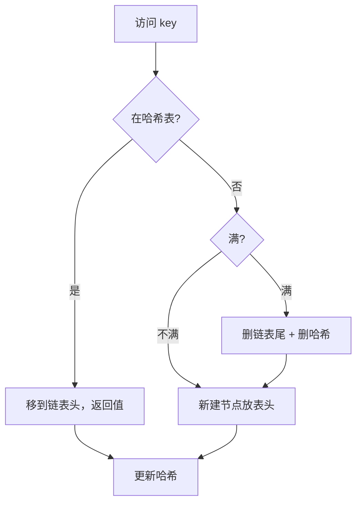

# 146. LRU 缓存

## 📌 题目

请你设计并实现一个满足  [LRU (最近最少使用) 缓存](https://baike.baidu.com/item/LRU) 约束的数据结构。

实现 `LRUCache` 类：

- `LRUCache(int capacity)` 以 **正整数** 作为容量 `capacity` 初始化 LRU 缓存
- `int get(int key)` 如果关键字 `key` 存在于缓存中，则返回关键字的值，否则返回 `-1` 。
- `void put(int key, int value)` 如果关键字 `key` 已经存在，则变更其数据值 `value` ；如果不存在，则向缓存中插入该组 `key-value` 。如果插入操作导致关键字数量超过 `capacity` ，则应该 **逐出** 最久未使用的关键字。

函数 `get` 和 `put` 必须以 `O(1)` 的平均时间复杂度运行。

示例：

```
输入
["LRUCache", "put", "put", "get", "put", "get", "put", "get", "get", "get"]
[[2], [1, 1], [2, 2], [1], [3, 3], [2], [4, 4], [1], [3], [4]]

输出
[null, null, null, 1, null, -1, null, -1, 3, 4]

解释
LRUCache lRUCache = new LRUCache(2);
lRUCache.put(1, 1); // 缓存是 {1=1}
lRUCache.put(2, 2); // 缓存是 {1=1, 2=2}
lRUCache.get(1);    // 返回 1
lRUCache.put(3, 3); // 该操作会使得关键字 2 作废，缓存是 {1=1, 3=3}
lRUCache.get(2);    // 返回 -1 (未找到)
lRUCache.put(4, 4); // 该操作会使得关键字 1 作废，缓存是 {4=4, 3=3}
lRUCache.get(1);    // 返回 -1 (未找到)
lRUCache.get(3);    // 返回 3
lRUCache.get(4);    // 返回 4
```

🔗 [LeetCode 146](https://leetcode.cn/problems/lru-cache/description/?envType=study-plan-v2&envId=top-100-liked)

## 🛒 人话理解 & 🧠 思路演进



### 从生活中理解LRU
想象你有一个小书架，上面只能放5本书。每当你需要看一本新书时，都会把它放在最容易拿到的位置（书架最前面）。当书架满了，你需要拿新书时，就会把最久没看（书架最后面）的那本书拿走。这就是LRU（Least Recently Used，最近最少使用）缓存的核心思想。

### 渐进式思考
让我们一步步深入理解这个问题：

### 第一步：我们需要什么基本功能？
1. 快速查找：能够迅速找到我们要的数据
2. 快速插入：能够迅速放入新数据
3. 快速删除：能够迅速删除最久未使用的数据
4. 更新访问顺序：每次访问数据时，都要把它标记为"最近使用"

### 第二步：单一数据结构能解决吗？
- 数组：查找慢(O(n))
- 链表：查找慢(O(n))，但更新顺序快(O(1))
- 哈希表：查找快(O(1))，但无法维护顺序

### 第三步：组合数据结构的妙用
如果我们把哈希表和双向链表组合使用：
- 哈希表负责快速查找
- 双向链表负责维护访问顺序
这就是LRU缓存的经典实现方式！

### 问题描述
LeetCode第146题"LRU缓存"要求我们实现这样一个数据结构：
1. 初始化一个固定大小的缓存
2. get(key)：如果key存在则返回value，否则返回-1
3. put(key, value)：插入或更新键值对
4. 所有操作的时间复杂度都必须是O(1)

### 详细设计
首先，我们需要一个双向链表节点：

> 👉 代码实现见下方「🐍 Python 代码」

然后是LRU缓存的完整实现：

> 👉 代码实现见下方「🐍 Python 代码」

### 图解过程
让我们看一个具体例子，假设缓存容量为3：

```
1) 初始状态：
head ⇔ tail

2) put(1,1):
head ⇔ 1 ⇔ tail

3) put(2,2):
head ⇔ 2 ⇔ 1 ⇔ tail

4) get(1):  // 1被访问，移到头部
head ⇔ 1 ⇔ 2 ⇔ tail

5) put(3,3):
head ⇔ 3 ⇔ 1 ⇔ 2 ⇔ tail

6) put(4,4):  // 超出容量，删除最久未使用的2
head ⇔ 4 ⇔ 3 ⇔ 1 ⇔ tail
```

### 性能分析
- 时间复杂度：所有操作都是O(1)
  - get操作：哈希表查找O(1)，移动节点O(1)
  - put操作：哈希表操作O(1)，链表操作O(1)
- 空间复杂度：O(capacity)
  - 哈希表和双向链表各存储最多capacity个元素

### 实现技巧
1. 使用虚拟头尾节点简化边界处理
2. 双向链表便于节点的删除
3. 哈希表存储key到节点的映射
4. 抽取常用操作为辅助方法

### 实际应用场景
LRU缓存在实际开发中应用广泛：
1. 浏览器的前进/后退功能
2. 数据库的缓存层
3. 操作系统的页面置换
4. Redis的缓存淘汰策略

### 进阶思考
1. 如何实现并发安全的LRU缓存？
2. 如何处理超大数据量的情况？
3. 如何实现基于时间的过期策略？
4. 其他缓存置换策略（LFU、FIFO等）的优劣对比？

### 小结
LRU缓存的设计教会我们：
1. 如何组合数据结构实现复杂功能
2. 空间和时间的权衡思想
3. 接口设计和代码组织的技巧
4. 实际问题的抽象建模能力

记住：设计数据结构就像设计一个高效的图书管理系统，关键是在各种需求之间找到最佳平衡点！

## 🐍 Python 代码

### 🥊 暴力解（朴素对照）

用一个普通列表维护「最近访问顺序」+ 字典存值：每次访问都线性把 key 移到队尾、淘汰时弹出队首。思路最直白，但代价是 `O(n)`。

```python
class LRUCache:
    def __init__(self, capacity: int):
        self.cap = capacity
        self.cache = {}              # key -> value
        self.order = []              # 队尾为最近使用，队首为最久未使用

    def _touch(self, key: int) -> None:
        """把 key 移到队尾（标记为最近使用）。"""
        self.order.remove(key)       # O(n) 线性查找删除
        self.order.append(key)

    def get(self, key: int) -> int:
        if key not in self.cache:
            return -1
        self._touch(key)
        return self.cache[key]

    def put(self, key: int, value: int) -> None:
        if key in self.cache:
            self.cache[key] = value
            self._touch(key)
            return
        # 新增：若已满先淘汰队首（最久未使用）
        if len(self.cache) >= self.cap:
            oldest = self.order.pop(0)
            del self.cache[oldest]
        self.cache[key] = value
        self.order.append(key)
```

- 时间复杂度：`O(n)`，`get` / `put` 都需 `_touch` 里的线性 `remove`
- 空间复杂度：`O(capacity)`
- ⚠️ 不满足题目「`get` / `put` 必须 `O(1)`」的复杂度要求，仅作思路对照。改用「哈希表 + 双向链表」（或 `OrderedDict`）即可把两个操作都压到 `O(1)` → 见下方最优解。

### ⚡ 最优解

```python
class LRUCache:
    def __init__(self, capacity: int):
        # 使用 OrderedDict 来维护键值对的顺序
        self.data = OrderedDict()
        # 初始化缓存的容量
        self.capacity = capacity

    def get(self, key: int) -> int:
        # 如果键存在于缓存中
        if key in self.data:
            # 将该键值对移动到有序字典的末尾（表示最近使用）
            self.data.move_to_end(key)
            # 返回对应的值
            return self.data[key]
        # 如果键不存在于缓存中，返回 -1
        return -1

    def put(self, key: int, value: int) -> None:
        # 如果键已经存在于缓存中
        if key in self.data:
            # 更新该键的值
            self.data[key] = value
        else:
            # 如果缓存已满
            if len(self.data) >= self.capacity:
                # 移除最久未使用的键值对（有序字典的头部）
                self.data.popitem(last=False)
            # 插入新的键值对
            self.data[key] = value
        # 将该键值对移动到有序字典的末尾（表示最近使用）
        self.data.move_to_end(key)
```
