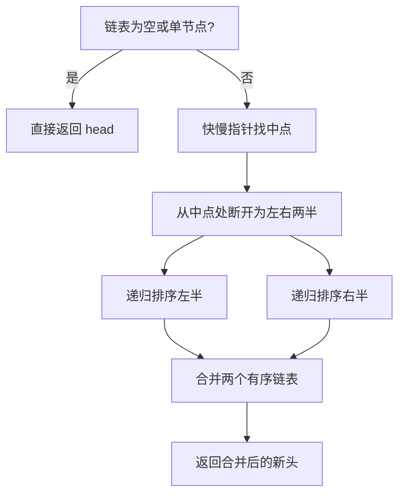
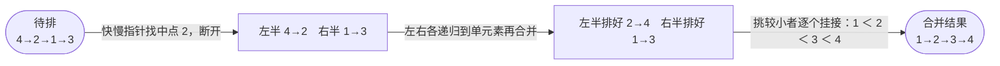

# 148. 排序链表

## 📌 题目

给你链表的头结点 `head` ，请将其按 **升序** 排列并返回 **排序后的链表** 。

示例：

```
输入：head = [4,2,1,3]
输出：[1,2,3,4]
```

🔗 [LeetCode 148](https://leetcode.cn/problems/sort-list/description/?envType=study-plan-v2&envId=top-100-liked)

## 🛒 人话理解 & 🧠 思路演进



**总体一句话**：归并排序套在链表上——先用快慢指针一刀切两半，各自递归排序，再把两个有序子链表按值合并（每轮挑较小者挂到结果链尾）。

### 🔬 逐步推演（动画式）

以 `head = 4→2→1→3` 为例——从左到右就是归并排序的时间线：**每个节点是一次状态快照（某一层的分解或合并结果），箭头上写这一步做了什么（从中点断开 / 两半合并）**：



### 从现实场景说起
想象你是一个图书管理员，面前有一排待整理的图书。这些书连成一条长龙，每本书都链接着下一本书的位置信息。如何高效地将这些书按顺序排列？一个聪明的方法是将书架分成几个小区域，分别整理后再合并 —— 这就是归并排序的思想，也是我们今天要探讨的排序链表问题的核心。

### 问题的本质
LeetCode第148题"排序链表"要求我们对链表进行排序，要求时间复杂度为O(n log n)，空间复杂度为O(1)。这个要求让我们不能使用转换为数组等简单方法，而必须在链表结构上直接操作。

```
输入：4 → 2 → 1 → 3
输出：1 → 2 → 3 → 4

输入：-1 → 5 → 3 → 4 → 0
输出：-1 → 0 → 3 → 4 → 5
```

### 思路解析：自顶向下的归并排序
就像整理图书一样，我们可以采用"分而治之"的策略：
1. **分解**：将书架分成大小相近的两半
2. **递归**：分别整理两半的书
3. **合并**：将两组整理好的书按顺序合并

这种方法的优雅之处在于：我们不需要关心子问题是如何被解决的，只需要专注于如何将两个有序的部分合并起来。

### 找中点的艺术
在实现分解步骤时，我们需要一个找中点的巧妙方法 —— 快慢指针。想象两个图书管理员：
- 一个每次移动两个位置（快指针）
- 一个每次移动一个位置（慢指针）
当快指针到达终点时，慢指针正好在中间位置。

### 分治排序的实现

> 👉 代码实现见下方「🐍 Python 代码」

### 空间优化：自底向上的归并排序
虽然上面的解法已经很优雅，但它使用了递归，空间复杂度为O(log n)。如果要严格满足O(1)空间复杂度的要求，我们需要改用自底向上的方法。

这就像图书整理时采用的另一种策略：
1. 先两本两本地排序
2. 再四本四本地合并
3. 然后八本八本地合并
4. 直到整个书架都排好序

### 迭代归并排序实现

> 👉 代码实现见下方「🐍 Python 代码」

### 复杂度分析与比较
自顶向下的归并排序：
- 时间复杂度：O(n log n)
- 空间复杂度：O(log n)，递归调用栈
- 优点：代码简洁，思路清晰
- 缺点：不满足O(1)空间复杂度要求

自底向上的归并排序：
- 时间复杂度：O(n log n)
- 空间复杂度：O(1)
- 优点：符合题目空间要求
- 缺点：实现较复杂，不够直观

### 技巧总结
1. 快慢指针找中点的技巧
2. 分治思想的应用
3. 断开链表时的细节处理
4. 合并有序链表的技巧

### 实际应用延伸
链表排序的思想可以应用于：
- 大文件排序
- 分布式系统的数据排序
- 外部排序
- 流式数据处理

### 小结
排序链表的问题教会我们：
1. 如何将经典排序算法应用到特定数据结构
2. 空间优化的重要性和方法
3. 处理链表时的常用技巧
4. 分治思想在实际问题中的运用

这道题的启示：
- 经典算法可以根据具体场景灵活调整
- 空间复杂度的优化往往需要另辟蹊径
- 链表操作中的指针处理需要特别小心

记住：解决复杂问题如同整理一个大书架，关键在于找到合适的分解方式和合并策略！

## 🐍 Python 代码

### 🥊 暴力解（朴素对照）

把链表节点值读进列表，直接用内置排序，再依序重建链表——最朴素，但空间 `O(n)` 且不符 `O(1)` 空间进阶要求。

```python
from typing import Optional, List

class Solution:
    def sortList(self, head: Optional[ListNode]) -> Optional[ListNode]:
        if not head:
            return None
        # 1. 收集所有节点值
        vals: List[int] = []
        cur = head
        while cur:
            vals.append(cur.val)
            cur = cur.next
        # 2. 内置排序 O(n log n)
        vals.sort()
        # 3. 依序覆写回原链表（不破坏结构）
        cur = head
        for v in vals:
            cur.val = v
            cur = cur.next
        return head
```

- 时间复杂度：`O(n log n)`，瓶颈在排序
- 空间复杂度：`O(n)`，需额外数组存所有值
- ⚠️ 借助了 `O(n)` 辅助数组，不满足进阶「`O(1)` 空间」要求。改为在链表上原地「归并排序」即可省去数组 → 见下方最优解。

### ⚡ 最优解

```python
class Solution:
    def sortList(self, head: Optional[ListNode]) -> Optional[ListNode]:
        if not head or not head.next:
            return head
        
        # 找到链表的中间节点
        def find_mid(head: ListNode) -> ListNode:
            # fast 从 head.next 出发：偶数长度时 slow 落在"左中点"，
            # 这样从 slow 处切开能让左右两半尽量均等(避免递归一侧不收缩导致栈溢出)
            slow, fast = head, head.next
            while fast and fast.next:
                slow = slow.next
                fast = fast.next.next
            return slow
        
        # 合并两个有序链表
        def merge(l1: ListNode, l2: ListNode) -> ListNode:
            dummy = ListNode()
            current = dummy
            while l1 and l2:
                if l1.val < l2.val:
                    current.next = l1
                    l1 = l1.next
                else:
                    current.next = l2
                    l2 = l2.next
                current = current.next
            if l1:
                current.next = l1
            if l2:
                current.next = l2
            return dummy.next
        
        # 找到中间节点并分割链表
        mid = find_mid(head)
        right = mid.next
        mid.next = None
        left = head
        
        # 递归排序
        left = self.sortList(left)
        right = self.sortList(right)
        
        # 合并排序后的子链表
        return merge(left, right)
```
