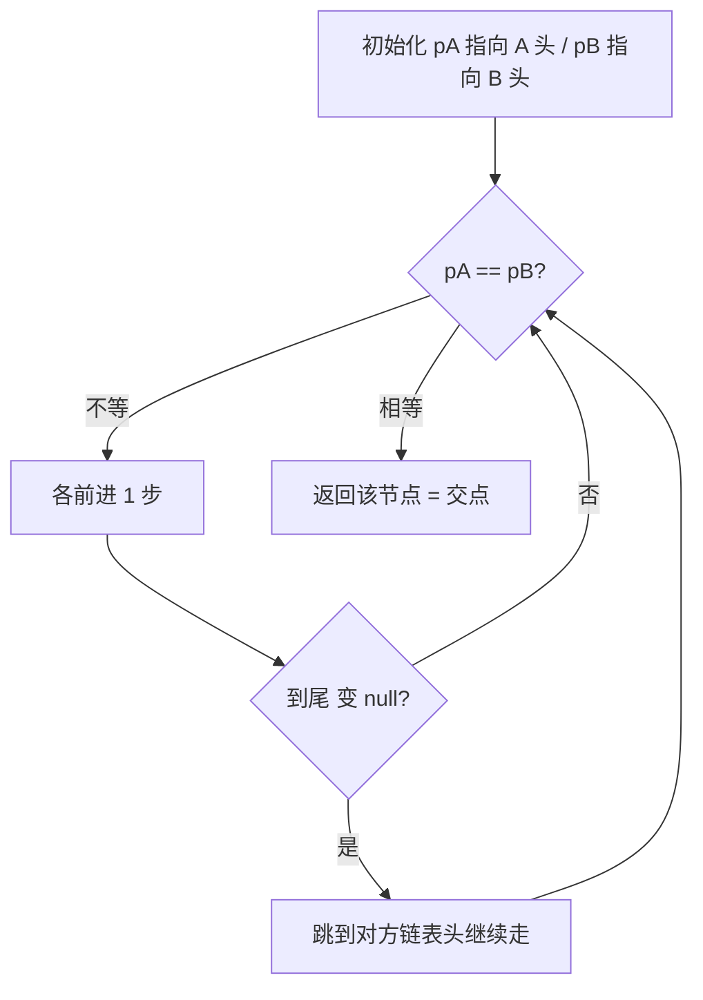
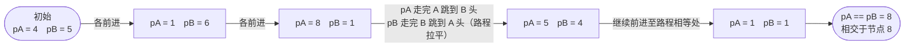

# 160. 相交链表 ✅

## 📌 题目

给你两个单链表的头节点 `headA` 和 `headB` ，请你找出并返回两个单链表相交的起始节点。如果两个链表不存在相交节点，返回 `null` 。
图示两个链表在节点 `c1` 开始相交，题目数据 **保证** 整个链式结构中不存在环。


**注意**，函数返回结果后，链表必须 **保持其原始结构** 。

示例：


```
输入：intersectVal = 8, listA = [4,1,8,4,5], listB = [5,6,1,8,4,5], skipA = 2, skipB = 3
输出：Intersected at '8'
解释：相交节点的值为8（注意，如果两个链表相交则不能为0）。
从各自的表头开始算起，链表 A 为 [4,1,8,4,5]，链表 B 为 [5,6,1,8,4,5]。
在 A 中，相交节点前有 2 个节点；在 B 中，相交节点前有 3 个节点。
请注意相交节点的值不为 1，因为在链表 A 和链表 B 之中值为 1 的节点 (A 中第二个节点和 B 中第三个节点) 是不同的节点。换句话说，它们在内存中指向两个不同的位置，而链表 A 和链表 B 中值为 8 的节点 (A 中第三个节点，B 中第四个节点) 在内存中指向相同的位置。
```

🔗 [LeetCode 160](https://leetcode.cn/problems/intersection-of-two-linked-lists/description/?envType=study-plan-v2&envId=top-100-liked)

## 🛒 人话理解 & 🧠 思路演进



**总体一句话**：两指针各自走完自己的链表后跳到对方链表头继续走——因两指针走过的总路程都是「A长 + B长」，若相交必在交点撞上；若不相交则同时变成 null 退出。

### 🔬 逐步推演（动画式）

以 `A = 4→1→8→4→5`、`B = 5→6→1→8→4→5`、在 `8` 处相交为例——从左到右就是算法的时间线：**每个节点是一次状态快照（pA / pB 落点），箭头上写这一步走到哪、是否跳到对方链**：



### 生活中的相遇问题
想象两个人从不同的地方出发，最后在一个十字路口相遇。他们可能走过不同长度的路程，但最终会在同一个点汇合。这就很像我们今天要讨论的相交链表问题：两个链表从不同的起点出发，在某个节点相交，然后共享后续的路径。

### 问题描述
LeetCode第160题"相交链表"是这样描述的：给你两个单链表的头节点 headA 和 headB，请你找出并返回两个单链表相交的起始节点。如果两个链表不存在相交节点，返回 null。

例如：
```
A链表：      a1 → a2
                    ↘
                      c1 → c2 → c3
                    ↗            
B链表： b1 → b2 → b3

输出：返回节点c1
```

### 最直观的解法：哈希表记录
就像在一个城市里标记每个人走过的地方，最简单的方法是用一个哈希表记录第一个人走过的所有位置，然后看第二个人的路径中是否有重复的地方。

### 哈希表方法的实现

> 👉 代码实现见下方「🐍 Python 代码」

### 优化解法：双指针技巧
仔细思考，我们发现一个有趣的现象：如果两个人分别走对方的路，他们最终一定会相遇！这就是双指针解法的灵感来源。

### 双指针方法的原理
想象两个人在散步：
1. A从链表A出发，走完后转到链表B继续走
2. B从链表B出发，走完后转到链表A继续走
3. 如果链表相交，他们一定会在相交点相遇
   - 因为他们走过的总路程是相同的：链表A长度 + 链表B长度

### 示例运行
假设链表A：1→2→3→4，链表B：5→6→3→4（3是相交点）
```
指针A：1 → 2 → 3 → 4 → 5 → 6 → [3] ← 相遇！
指针B：5 → 6 → 3 → 4 → 1 → 2 → [3] ← 相遇！
```

### 代码实现

> 👉 代码实现见下方「🐍 Python 代码」

### 解法比较
让我们比较这两种方法：

哈希表法：
- 时间复杂度：O(m+n)
- 空间复杂度：O(m)，m为链表A的长度
- 优点：思路直观，容易理解
- 缺点：需要额外的空间存储节点

双指针法：
- 时间复杂度：O(m+n)
- 空间复杂度：O(1)
- 优点：不需要额外空间，优雅简洁
- 缺点：理解起来稍微有点难度

### 实用技巧总结
解决链表相交问题的关键点：
1. 理解相交后的节点都是共享的
2. 考虑特殊情况（如空链表、不相交的情况）
3. 善用双指针技巧
4. 利用数学特性（路程相等原理）

相关的链表问题：
- 判断链表是否有环
- 找到链表环的入口
- 链表的中间节点

### 小结
通过相交链表这道题，我们学会了如何巧妙地使用双指针技巧来解决看似复杂的问题。这种思维方式不仅能解决算法题，在处理数据流、文件比较等实际问题时也很有用。记住，当遇到需要找到两个序列共同元素的问题时，双指针技巧往往能提供一个优雅的解决方案！

**延伸思考：**
1. 如果链表可能有环，这个算法还有效吗？
2. 如果要找到所有的相交节点，应该如何修改算法？
3. 在分布式系统中，如何处理类似的"路径相交"问题？

## 🐍 Python 代码

### 🥊 暴力解（朴素对照）

把 A 链所有节点存进集合，再遍历 B 链找第一个共同节点——思路最直白。

```python
from typing import Optional

class Solution:
    def getIntersectionNode(self, headA: ListNode, headB: ListNode) -> Optional[ListNode]:
        seen = set()                 # 记录 A 链所有节点引用
        cur = headA
        while cur:
            seen.add(cur)
            cur = cur.next
        cur = headB
        while cur:
            if cur in seen:          # B 中第一个出现在 seen 里的即交点
                return cur
            cur = cur.next
        return None                  # B 走完也无交集
```

- 时间复杂度：`O(m + n)`，m、n 为两条链表长度
- 空间复杂度：`O(m)`，需要额外集合存 A 链节点
- ⚠️ 多了 `O(m)` 空间。利用「两指针走完自己的链再换走对方链，路程相等必在交点相遇」可在 `O(1)` 空间内求解 → 演进到下方双指针。

### ⚡ 最优解

```python
class Solution:
    def getIntersectionNode(self, headA: ListNode, headB: ListNode) -> Optional[ListNode]:
        indexA, indexB = headA, headB
        # 各自往下走；走到尾(变 None)就跳到对方链表头继续走。
        # 这样两指针走过的总路程都是 len(A)+len(B)：若相交必在交点相遇；若不相交则同时变 None 退出
        while indexA != indexB:
            indexA = indexA.next if indexA else headB   # indexA 走完 A 就转去走 B
            indexB = indexB.next if indexB else headA   # indexB 走完 B 就转去走 A
        return indexA   # 相交时是交点；不相交时是 None
```

## 📝 你的笔记（飞书）

你已在飞书《001-链表基础详解》完成。
