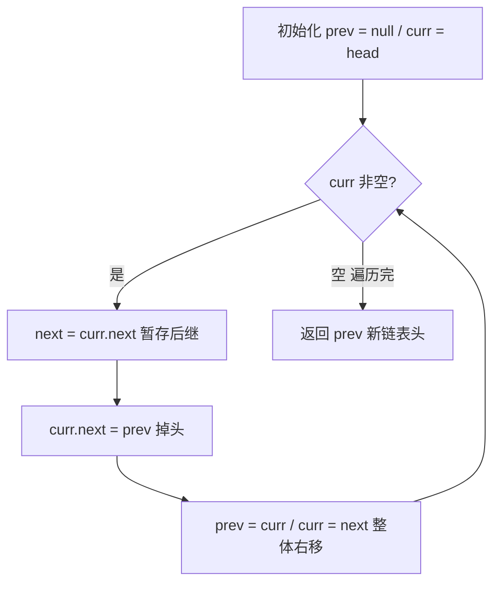
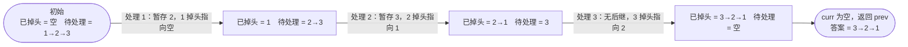

# 206. 反转链表 ✅

## 📌 题目

给你单链表的头节点 `head` ，请你反转链表，并返回反转后的链表。

示例：


```
输入：head = [1,2,3,4,5]
输出：[5,4,3,2,1]
```

🔗 [LeetCode 206](https://leetcode.cn/problems/reverse-linked-list/description/?envType=study-plan-v2&envId=top-100-liked)

## 🛒 人话理解 & 🧠 思路演进



**总体一句话**：用 `prev` / `curr` 双指针就地翻转——每步先存住后继 `next`，再把 `curr.next` 掉头指向 `prev`，最后双指针整体右移一格；走完整条链时 `prev` 恰好落在原尾节点（新链表头）。

### 🔬 逐步推演（动画式）

以 `head = 1→2→3` 为例——从左到右就是算法的时间线：**每个节点是一次状态快照（当前已掉头部分 + 待处理部分），箭头上写这一步处理了哪个节点、怎么掉头**：



### 为什么这道题如此重要
反转链表看似简单，却是链表操作的基石。就像建房子要先打好地基，做复杂的链表操作前必须深刻理解反转原理。无数高频面试题都建立在这个基础之上：K个一组反转链表、判断回文链表、链表重排序等等。真正理解了反转链表，这些题目就会迎刃而解。

### 问题描述
LeetCode第206题"反转链表"要求：给你单链表的头节点 head，请你反转链表，并返回反转后的链表。

例如：
```
输入：1 → 2 → 3 → 4 → 5
输出：5 → 4 → 3 → 2 → 1
```

### 递归解法：从简单说起
递归法虽然不是最优解，但它的思路最容易理解。想象你在玩多米诺骨牌，先把所有骨牌排好，然后从最后一张开始，一张张往回推。

### 递归的本质
递归反转的核心思想是：
1. 先假设子问题已经解决（后面的链表已经反转完成）
2. 然后解决当前节点如何与已反转部分衔接的问题

就像你要完成一个大项目，不用考虑下属如何完成他们的任务，你只需要考虑如何把大家的工作整合起来。

### 代码实现和详解

> 👉 代码实现见下方「🐍 Python 代码」

### 迭代解法：追求空间最优
迭代法虽然理解起来较难，但它是空间复杂度最优的解法。让我们通过一个生活场景来深入理解。

### 通过生活场景理解迭代
想象你是一个体操教练，正在教一排学生做"后滚翻"。每个学生原本都面向前方，你要让他们一个接一个地转身。关键是：每处理一个学生时，要确保：
1. 这个学生不会摔倒（保存next指针）
2. 他能拉住前一个学生的手（指向prev）
3. 准备好扶住下一个学生（移动指针）

### 代码实现和图解

> 👉 代码实现见下方「🐍 Python 代码」

### 迭代法的过程图解
以1→2→3→4→5为例：
```
初始状态：
prev = null, curr = 1
null ← 1 → 2 → 3 → 4 → 5

第一次迭代后：
prev = 1, curr = 2
null ← 1    2 → 3 → 4 → 5

第二次迭代后：
prev = 2, curr = 3
null ← 1 ← 2    3 → 4 → 5

最终状态：
null ← 1 ← 2 ← 3 ← 4 ← 5
```

### 深入理解的关键点

### 1. 指针操作的本质
每次操作都是在改变一个节点的"指向"。就像改变一个人的视线方向，原本看着前方，现在要回头看。

### 2. 迭代法的不变量
在任何时刻：
- prev指向的是已完成反转的部分
- curr指向正在处理的节点
- nextTemp保存着待处理的部分

### 3. 为什么需要三个指针
- prev：没有它，就不知道往哪里指
- curr：没有它，就不知道现在处理谁
- nextTemp：没有它，就会断链找不到后续节点

### 实战应用
这个基础算法在很多场景中都有应用：
1. 需要倒序处理链表时
2. 需要判断链表是否回文时
3. 需要按组反转链表时
4. 需要重排链表时

### 小结
掌握链表反转需要：
1. 理解递归和迭代两种思路的本质
2. 深入理解指针操作的含义
3. 反复练习直至形成肌肉记忆
4. 学会用生活场景类比，加深理解

建议：每天默写一遍这道题，直到闭着眼睛也能写对。因为它是链表操作中最基础也是最关键的操作，掌握了它，其他链表问题都会变得容易很多！

## 🐍 Python 代码

### 🥊 暴力解（朴素对照）

借助列表把链表节点全部读入，再倒序重建 next 指针——思路最直白，代价是 `O(n)` 额外空间。

```python
from typing import Optional

class Solution:
    def reverseList(self, head: Optional[ListNode]) -> Optional[ListNode]:
        if not head:
            return None
        # 1. 顺序收集所有节点
        nodes = []
        cur = head
        while cur:
            nodes.append(cur)
            cur = cur.next
        # 2. 倒序重连 next
        for i in range(len(nodes) - 1, 0, -1):
            nodes[i].next = nodes[i - 1]
        nodes[0].next = None         # 原头变新尾，置空
        return nodes[-1]             # 新头为原尾节点
```

- 时间复杂度：`O(n)`
- 空间复杂度：`O(n)`，需额外列表存所有节点
- ⚠️ 用了 `O(n)` 辅助空间。仅靠 `prev` / `curr` 两个指针就地翻转即可做到 `O(1)` 空间 → 演进到下方迭代解。

### ⚡ 最优解

```python
class Solution:
    def reverseList(self, head: Optional[ListNode]) -> Optional[ListNode]:
        if not head:
            return None
        # 初始化前驱节点和当前节点
        prev = None
        current = head
        # 遍历链表，反转指针
        while current:
            next_node = current.next   # 先存住下一个，否则一掉头就找不到后续了
            current.next = prev        # 掉头：当前节点指向前一个
            prev = current             # prev、current 整体右移一格
            current = next_node
        
        # 返回新的头节点（即原链表的最后一个节点）
        return prev
```

## 📝 你的笔记（飞书）

你已在飞书《001-链表基础详解》完成。该详解含你的「一句话人话版 + 寻宝/火车类比 + 解法」，复习时可对照。
