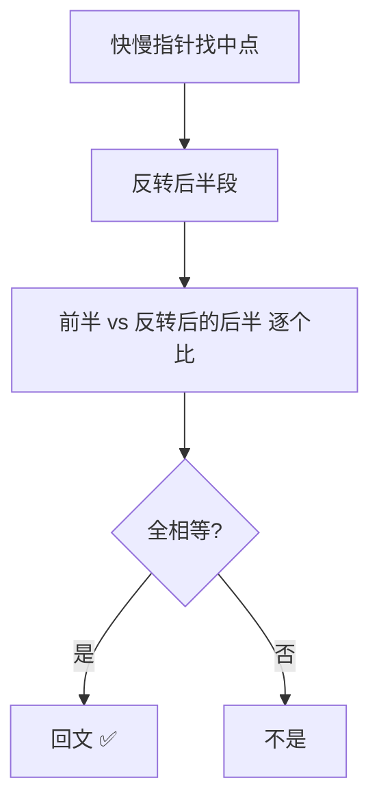

# 234. 回文链表 ✅

## 📌 题目

给你一个单链表的头节点 `head` ，请你判断该链表是否为回文链表。如果是，返回 `true` ；否则，返回 `false` 。

示例：


```
输入：head = [1,2,2,1]
输出：true
```

🔗 [LeetCode 234](https://leetcode.cn/problems/palindrome-linked-list/description/?envType=study-plan-v2&envId=top-100-liked)

## 🛒 人话理解 & 🧠 思路演进



### 生活中的回文现象
在日常生活中，回文无处不在。比如"上海自来水来自海上"、"12321"这样正着读和倒着读都一样的字符串或数字，就是回文。把这个概念扩展到链表，我们就得到了今天要讨论的回文链表问题：一个链表从前往后读和从后往前读的结果是否相同。

### 问题描述
LeetCode第234题"回文链表"要求：给你一个单链表的头节点 head，请判断该链表是否为回文链表。

例如：
```
输入：1 → 2 → 2 → 1
输出：true

输入：1 → 2 → 3 → 2 → 1
输出：true

输入：1 → 2 → 3 → 3 → 1
输出：false
```

### 基础知识准备
这道题的核心是利用我们之前学过的"反转链表"。如果不熟悉链表反转，建议先复习上一篇文章。记住，链表反转是一块基石，在这里我们要用它来解决更复杂的问题。

### 直观解法：转换为数组
最简单的想法是：把链表转换成数组，然后用双指针从两端向中间移动比较。这就像把一摞扑克牌摊开在桌上，从两端开始对比每张牌是否相同。

### 数组法实现

> 👉 代码实现见下方「🐍 Python 代码」

### 优化解法：反转后半部分
仔细思考，我们其实不需要额外的数组。可以用这个巧妙的方法：
1. 找到链表中点
2. 反转后半部分
3. 比较前后两半是否相同
4. （可选）恢复链表原状

这就像把一叠纸牌分成两半，把后半部分倒过来，然后一张张对比。

### 寻找中点：快慢指针法
想象两个人在跑道上跑步，一个速度是另一个的两倍。当快跑者跑到终点时，慢跑者正好在中点！

### 详细代码实现

> 👉 代码实现见下方「🐍 Python 代码」

### 图解过程
以1→2→3→2→1为例：
```
1) 初始状态：
1 → 2 → 3 → 2 → 1

2) 找到中点：
1 → 2 → [3] → 2 → 1
slow指向3

3) 反转后半部分：
1 → 2 → 3 ← 2 ← 1

4) 比较两半：
(1 → 2) 和 (1 → 2) 比较

5) 恢复原状：
1 → 2 → 3 → 2 → 1
```

### 复杂度分析
空间优化解法：
- 时间复杂度：O(n)
- 空间复杂度：O(1)，只使用几个指针
- 优点：空间效率高，且思路优雅
- 缺点：修改了原链表结构（虽然最后恢复了）

### 重要思维方式总结
1. **问题转化**：将回文判断转化为对称性比较

2. **空间优化思维**：
   - 不用额外数组存储
   - 利用原有空间进行操作

3. **分步思想**：
   - 找中点（快慢指针）
   - 反转后半段（链表反转）
   - 对比（双指针）
   - 恢复（再次反转）

4. **边界处理**：
   - 空链表
   - 单节点链表
   - 偶数/奇数长度的处理

### 实用技巧总结
解决类似问题的关键点：
1. 熟练掌握基础操作（如链表反转）
2. 善用快慢指针找中点
3. 考虑空间优化的可能性
4. 注意保护原始数据结构

相关的思维训练：
- 回文数判断
- 回文子串问题
- 链表中点问题
- 链表反转的各种变体

### 小结
回文链表问题是一个很好的例子，展示了如何将基础算法（如链表反转、快慢指针）组合起来解决更复杂的问题。它教会我们：
1. 基础算法的重要性
2. 空间优化的思维方式
3. 问题分解的方法
4. 代码的优雅性

下次遇到类似的对称性判断问题，不要急着用额外空间，想想是否可以通过改变数据结构本身来解决问题！

## 🐍 Python 代码

```python
class Solution:
    def isPalindrome(self, head: Optional[ListNode]) -> bool:
        if not head or not head.next:
            return True
        # 步骤一：使用快慢指针寻找到链表中间位置
        slow, fast = head, head
        while fast and fast.next:
            slow = slow.next
            fast = fast.next.next
        # 步骤二：对于链表后半部分进行反转
        def reverseLink(head):
            prev = None
            current = head
            while current:
                next_node = current.next
                current.next = prev
                prev = current
                current = next_node
            return prev
        slow = reverseLink(slow)
        # 步骤三：判断是否为回文链表
        while slow:
            if slow.val != head.val:
                return False
            slow, head = slow.next, head.next
        return True
```

## 📝 你的笔记（飞书）

你已在飞书《001-链表基础详解》完成。
