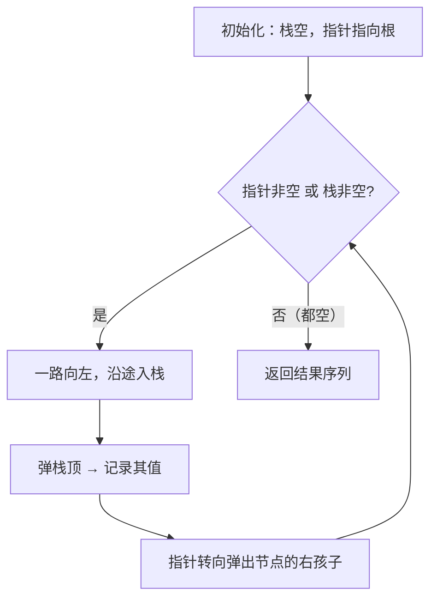
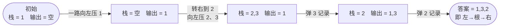

# 94. 二叉树的中序遍历

## 📌 题目

给定一个二叉树的根节点 `root` ，返回 _它的 **中序** 遍历_ 。

示例：


```
输入：root = [1,null,2,3]
输出：[1,3,2]
```

🔗 [LeetCode 94](https://leetcode.cn/problems/binary-tree-inorder-traversal/description/?envType=study-plan-v2&envId=top-100-liked)

## 🛒 人话理解 & 🧠 思路演进



**总体一句话**：中序遍历遵循「左 → 根 → 右」，迭代法用栈模拟——一路向左把节点压栈，到头后弹出栈顶记录、再转向右子树，重复直到栈空且指针也空。

### 🔬 逐步推演（动画式）

以 `root = [1,null,2,3]`（即 `1 → 右子 2 → 左子 3`）为例——从左到右就是中序遍历的时间线：**每个节点是一次状态快照（栈 / 输出），箭头上写这一步弹了谁、指针怎么转**：



### 生活中的遍历启示
想象你在一个迷人的森林里散步。森林里的每棵树都有自己独特的故事，而你的任务是以一种特定的方式依次聆听每棵树的声音。中序遍历就像是这样一次有序的森林漫步：先听左侧的树木，然后是当前所在的树，最后是右侧的树木。

### 遍历的本质
二叉树的中序遍历（LeetCode第94题）遵循一个优雅的顺序：
1. 先访问左子树
2. 再访问根节点
3. 最后访问右子树

这种方式特别适合有序二叉搜索树，因为它会按照升序输出节点值。

### 思路的进化之路

### 第一站：递归的诗意
递归是解决树遍历最自然的方式。就像讲一个故事：要了解整个故事，你需要先了解故事的左半部分，然后是核心情节，最后是右半部分。

> 👉 代码实现见下方「🐍 Python 代码」

### 第二站：迭代的智慧
递归虽然优雅，但对于深度较大的树可能导致栈溢出。迭代提供了一种显式管理"故事进度"的方式。

> 👉 代码实现见下方「🐍 Python 代码」

### 遍历的艺术与算法

### 模式匹配
让我们通过具体的树来理解遍历过程：
```
     4
   /   \
  2     6
 / \   / \
1   3 5   7
```

递归遍历顺序：
1 → 2 → 3 → 4 → 5 → 6 → 7

迭代遍历步骤：
1. 压入1、2
2. 弹出2，访问，压入3
3. 弹出3
4. 弹出4，访问
5. 压入5、6
... 如此类推

### 复杂度分析

递归方法：
- 时间复杂度：O(n)，每个节点访问一次
- 空间复杂度：O(h)，h为树的高度（递归栈）
- 优点：代码简洁，易于理解
- 缺点：可能栈溢出

迭代方法：
- 时间复杂度：O(n)
- 空间复杂度：O(h)
- 优点：显式控制遍历，避免递归栈溢出
- 缺点：代码略显复杂

### 进阶思考
1. Morris遍历：O(1)空间复杂度的遍历方法
2. 如何处理平衡与非平衡二叉树？
3. 前序、中序、后序遍历的本质区别？

### 实际应用场景
- 二叉搜索树的排序
- 表达式求值
- 文件系统遍历
- 编译器语法树分析

### 小结
中序遍历教会我们：
1. 递归思想的优雅
2. 如何系统地遍历树形结构
3. 迭代与递归的权衡
4. 数据结构遍历的通用思维方式

记住：遍历树就像漫步在知识的森林，重要的是保持好奇和系统性！

## 🐍 Python 代码

```python
class Solution:
    def inorderTraversal(self, root: Optional[TreeNode]) -> List[int]:
        result = []  # 初始化一个空列表来存储遍历结果
        self.inorder(root, result)  # 调用辅助递归函数进行中序遍历
        return result  # 返回遍历结果列表
    
    def inorder(self, root, result):
        if not root:  # 如果当前节点为空，直接返回
            return
        self.inorder(root.left, result)  # 递归遍历左子树
        result.append(root.val)  # 将当前节点的值加入结果列表
        self.inorder(root.right, result)  # 递归遍历右子树
        return result  # 返回结果列表（虽然这个返回值在主方法中没有用到）
```
```python
class Solution:
    def inorderTraversal(self, root: Optional[TreeNode]) -> List[int]:
        stack, result = [], []  # 初始化栈和结果列表
        
        while root or stack:  # 当根节点不为空或栈不为空时循环
            while root:  # 遍历到当前子树的最左节点
                stack.append(root)  # 将当前节点入栈
                root = root.left  # 移动到左子节点
            
            root = stack.pop()  # 弹出栈顶节点（最左节点）
            result.append(root.val)  # 将弹出节点的值加入结果列表
            root = root.right  # 移动到右子节点
        
        return result  # 返回结果列表
```
