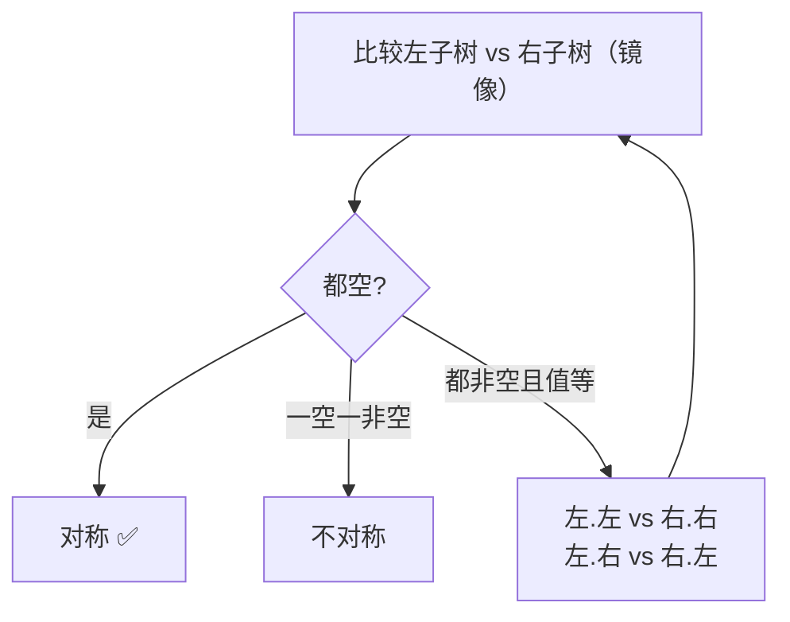

# 101. 对称二叉树

## 🛒 人话理解 & 🧠 思路演进



### 对称的诗意：生活中的平衡美学

想象一个完美的世界，两侧如同镜像般精准对称。在自然界中，对称常常意味着美感和和谐。二叉树的对称性也是如此 —— 一种近乎艺术的数学之美，它不仅仅是结构，更是一种深层的平衡哲学。

### 对称的本质：镜面的数学逻辑

🔗 [LeetCode 101](https://leetcode.cn/problems/symmetric-tree/description/?envType=study-plan-v2&envId=top-100-liked)

对称二叉树（LeetCode第101题）是一种特殊的树，它要求：
1. 根节点的左右子树完全镜像
2. 对应位置的节点具有相同的值
3. 树的结构在轴心处完美对折

这就像是一个精心设计的万花筒，每一个角度都呈现出令人惊叹的平衡。

### 递归解法：镜像对比的优雅

> 👉 代码实现见下方「🐍 Python 代码」

### 代码的深层逻辑解析

1. 第一层方法 `isSymmetric()`
   - 处理根节点特殊情况
   - 将复杂的对称判断委托给专门的镜像比较方法
   
2. 镜像比较方法 `isMirror()`
   - 首先处理节点为空的边界情况
   - 要求左右子树节点值相同
   - 递归比较左右子树的镜像位置

### 迭代方法：显式的对称之旅

> 👉 代码实现见下方「🐍 Python 代码」

### 迭代方法的独特视角

- 显式地模拟镜像遍历
- 使用队列管理节点配对
- 每次处理两个对应位置的节点
- 避免了递归可能的栈空间问题

### 性能分析：效率的数学之美

### 时间复杂度：O(n)
- 每个节点仅访问一次
- n为树中节点总数
- 无论递归还是迭代，都高效地遍历整棵树

### 空间复杂度
- 递归版本：O(h)，h为树的高度
  - 最坏情况可达O(n)
  - 最好情况（平衡树）为O(log n)
- 迭代版本：O(w)，w为树的最大宽度
  - 通常空间效率更可控

### 递归的诗：平衡与重复的艺术

对称二叉树不仅仅是一道算法题，更是递归思想的诗意表达。它启示我们：

- 复杂的对称可以通过简单的重复规则构建
- 递归是理解对称性的强大工具
- 代码的优雅源于思维的对称与平衡

探索对称二叉树就像在知识的镜子中发现宇宙的韵律，重要的是保持好奇和对美的敏感！

## 🐍 Python 代码

```python
class Solution:
    def isSymmetric(self, root: Optional[TreeNode]) -> bool:
        def mirror(l, r):
            if not l and not r:
                return True
            if not l or not r:
                return False
            # 镜像：左的左 对 右的右；左的右 对 右的左
            return (l.val == r.val
                    and mirror(l.left, r.right)
                    and mirror(l.right, r.left))
        return mirror(root.left, root.right)
```
