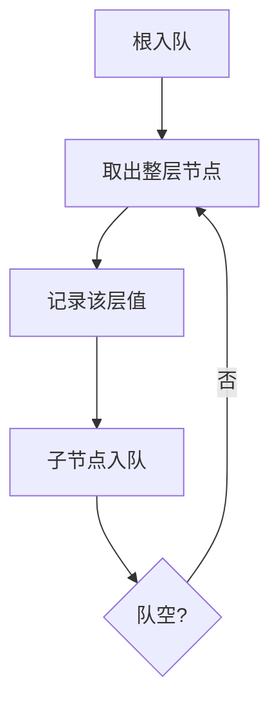

# 102. 二叉树的层序遍历

## 📌 题目

给你二叉树的根节点 `root` ，返回其节点值的 **层序遍历** 。 （即逐层地，从左到右访问所有节点）。

示例：

```
输入：root = [3,9,20,null,null,15,7]
输出：[[3],[9,20],[15,7]]
```

🔗 [LeetCode 102](https://leetcode.cn/problems/binary-tree-level-order-traversal/description/?envType=study-plan-v2&envId=top-100-liked)

## 🛒 人话理解 & 🧠 思路演进



### 从生活看遍历：层与层的对话

想象一个社交派对。人们不是随机交谈，而是按楼层、按桌次有序互动。二叉树的层序遍历，正如这样一场有组织的社交盛宴，每一层都有自己独特的节奏和故事。

### 层序遍历的本质

层序遍历（LeetCode第102题）的核心：
- 自上而下，从根开始
- 同一层的节点依次访问
- 先进先出的队列管理

### 递归解法：有序的层次之旅

> 👉 代码实现见下方「🐍 Python 代码」

### 迭代解法：队列的精确编排

> 👉 代码实现见下方「🐍 Python 代码」

### 性能分析

### 时间复杂度：O(n)
- 每个节点访问一次
- 节点数量决定遍历时间

### 空间复杂度：O(w)
- w为树的最大宽度
- 队列空间消耗
- 最坏情况可能接近O(n/2)

### 思考与拓展

1. 为什么队列适合层序遍历？
2. 如何处理特殊二叉树？
3. 还有哪些遍历方式？

### 应用场景

- 网络拓扑分析
- 组织结构层级展示
- 状态机的层次遍历
- 图形用户界面的渲染

### 遍历的启示

层序遍历教会我们：
- 有序胜于随机
- 系统性思考的重要性
- 复杂问题可以通过简单规则解决

记住，遍历树就像理解一个复杂系统，重要的是保持结构性思维！

## 🐍 Python 代码

```python
class Solution:
    def levelOrder(self, root: Optional[TreeNode]) -> List[List[int]]:
        if not root:
            return []  # 如果根节点为空，直接返回空列表
        
        result = []  # 用于存储最终的层序遍历结果
        queue = deque([root])  # 初始化队列，将根节点加入队列
        
        while queue:
            level_size = len(queue)  # 记录当前层的节点数
            current_level = []  # 用于存储当前层的节点值
            
            for _ in range(level_size):
                node = queue.popleft()  # 从队列中取出一个节点
                current_level.append(node.val)  # 将节点值加入当前层的列表
                
                if node.left:
                    queue.append(node.left)  # 如果节点有左子节点，将左子节点加入队列
                if node.right:
                    queue.append(node.right)  # 如果节点有右子节点，将右子节点加入队列
            
            result.append(current_level)  # 将当前层的节点值列表加入结果列表
        
        return result  # 返回最终的层序遍历结果
```
