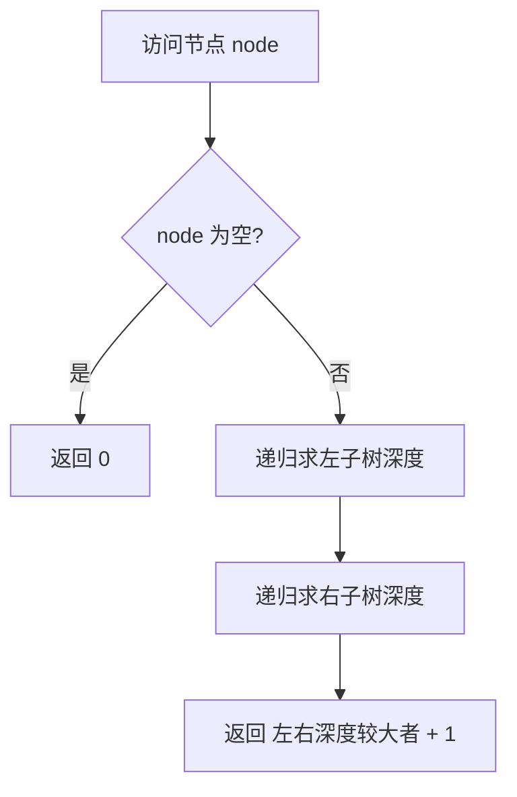
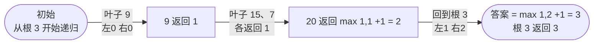

# 104. 二叉树的最大深度

## 📌 题目

给定一个二叉树 `root` ，返回其最大深度。
二叉树的 **最大深度** 是指从根节点到最远叶子节点的最长路径上的节点数。

示例：


```
输入：root = [3,9,20,null,null,15,7]
输出：3
```

🔗 [LeetCode 104](https://leetcode.cn/problems/maximum-depth-of-binary-tree/description/?envType=study-plan-v2&envId=top-100-liked)

## 🛒 人话理解 & 🧠 思路演进



**总体一句话**：树的最大深度 = 左右子树深度的较大者 + 1（+1 是当前节点自己），空树返回 0 作递归终止——自底向上把高度逐层累加。

### 🔬 逐步推演（动画式）

以 `root = [3,9,20,null,null,15,7]`（根 3，左叶 9，右 20→(15,7)）为例——从左到右就是自底向上累加深度的时间线：**每个节点是一次状态快照（当前节点 / 返回深度），箭头上写这一步怎么算**：



### 生命的高度：理解树的深度

想象一棵树，它从地底向天空生长。树的深度不仅仅是枝干的长度，更是生命的垂直延伸。在二叉树的世界里，深度代表了从根节点到最远叶子节点的最长路径。这是一种从根本到极限的探索旅程。

### 深度的本质：递归的诗与逻辑

二叉树的最大深度（LeetCode第104题）本质上是一个递归问题，它蕴含着令人惊叹的优雅逻辑。想象你正站在树的根部，要测量这棵树能长到多高。你会怎么做？很自然地，你会先测量左子树的高度，再测量右子树的高度，然后选择一个更高的，再加上根节点本身的高度。

### 递归思考的魔力

递归解法的核心在于将复杂问题分解为相似的小问题：

1. 如果是空树，深度为0
2. 如果是叶子节点，深度为1
3. 对于非叶子节点，深度 = max(左子树深度, 右子树深度) + 1

这种思路就像是一个不断缩小规模的放大镜，每一次递归都让我们更接近最终答案。

### 代码实现：从思路到现实

> 👉 代码实现见下方「🐍 Python 代码」

### 代码解析：每一行的思考

1. `if (root == null) return 0;`
   - 这是递归的"安全阀"，处理空树或遍历到叶子节点的情况
   - 确保递归不会无限进行
   
2. `int leftDepth = maxDepth(root.left);`
   - 递归计算左子树深度
   - 这一行体现了"分治"的智慧，将大问题拆分为相似的小问题
   
3. `int rightDepth = maxDepth(root.right);`
   - 同理计算右子树深度
   - 左右子树的深度互相独立，可以并行思考
   
4. `return Math.max(leftDepth, rightDepth) + 1;`
   - 选择更深的子树，并加上当前节点的高度
   - "+1"是关键，代表当前节点对总深度的贡献

### 深度分析：性能与复杂度

### 时间复杂度：O(n)

- 每个节点只访问一次
- n为树中节点总数
- 我们像一个勤奋的测量员，脚踏实地地丈量每一个节点

### 空间复杂度：O(h)

- h为树的高度
- 空间消耗来自递归调用栈
- 最坏情况（完全不平衡的树）可达O(n)
- 最好情况（完全平衡的树）为O(log n)

### 迭代方法：另一种视角

递归优雅，但有时我们需要更显式的控制。以下是迭代版本：

> 👉 代码实现见下方「🐍 Python 代码」

### 思考与延伸

1. 如何处理不同类型的二叉树？
2. 深度与平衡性有何关联？
3. 还有哪些递归可以如此优雅地解决？

### 实际应用场景

- 文件系统目录深度
- 组织架构层级分析
- 网络拓扑结构分析
- 博弈算法中的搜索深度控制

### 启示：递归的智慧

二叉树最大深度不仅仅是一道算法题，更是递归思想的生动诠释。它教会我们：

- 将复杂问题分解为相似的小问题
- 信任递归的"magic"：小问题的解会汇聚成大问题的答案
- 代码的优雅往往来自思维的清晰

探索二叉树就像攀登一座知识的高峰，重要的是保持好奇，步步为营！

## 🐍 Python 代码

```python
class Solution:
    def maxDepth(self, root: Optional[TreeNode]) -> int:
        if not root:
            return 0
        return max(self.maxDepth(root.left)+1,self.maxDepth(root.right)+1)
```
```python
class Solution:
    # 使用广度优先搜索 (BFS) 计算最大深度
    def maxDepth(self, root: Optional[TreeNode]) -> int:
        if not root:
            return 0  # 空树的深度为0
        
        maxDepth = 1  # 初始最大深度为1（至少有根节点）
        queue = deque()  # 创建一个队列来进行BFS遍历
        queue.append(root)  # 将根节点添加到队列中
        
        while len(queue):  # 当队列不为空时，继续遍历
            length = len(queue)  # 获取当前层的节点数量
            for i in range(length):
                head = queue.popleft()  # 弹出当前层的第一个节点
                if head.left is not None:  # 如果左子节点存在，加入队列
                    queue.append(head.left)
                if head.right is not None:  # 如果右子节点存在，加入队列
                    queue.append(head.right)
            if len(queue) == 0:  # 如果队列为空，说明已遍历完所有节点
                break
            maxDepth += 1  # 每处理完一层，最大深度加1
        
        return maxDepth  # 返回最终的最大深度
```
