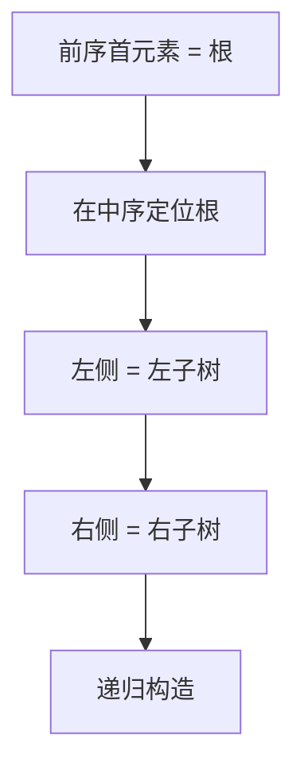

# 105. 从前序与中序遍历序列构造二叉树

## 📌 题目

给定两个整数数组 `preorder` 和 `inorder` ，其中 `preorder` 是二叉树的**先序遍历**， `inorder` 是同一棵树的**中序遍历**，请构造二叉树并返回其根节点。

示例：


```
输入：preorder = [3,9,20,15,7], inorder = [9,3,15,20,7]
输出：[3,9,20,null,null,15,7]
```

🔗 [LeetCode 105](https://leetcode.cn/problems/construct-binary-tree-from-preorder-and-inorder-traversal/description/?envType=study-plan-v2&envId=top-100-liked)

## 🛒 人话理解 & 🧠 思路演进



### 现实映射：破碎陶罐的复原
考古学家发现了一个破碎的陶罐，残片上记录着两种特殊符号序列：
- 前序符号：按"中心→左→右"顺序记录的图案
- 中序符号：按"左→中心→右"顺序记录的图案

现在需要根据这两种符号序列，复原陶罐原本的立体结构。这正是我们今天要解决的算法难题！


### 问题描述
LeetCode第105题要求：给定两个整数数组preorder和inorder，其中preorder是二叉树的前序遍历，inorder是同一棵树的中序遍历，请构造并返回这颗二叉树。

示例：
```
输入：
preorder = [3,9,20,15,7]
inorder = [9,3,15,20,7]

输出：
    3
   / \
  9  20
    /  \
   15   7
```

### 直觉解法：递归分治
就像考古学家分层剥离土层，我们可以用分治策略层层解析：

1. **定位根节点**：前序数组的第一个元素是根节点
2. **划分左右区间**：在中序数组中找到根节点，左边是左子树，右边是右子树
3. **递归构建**：根据区间长度切割前序数组，递归构建左右子树

### 实现

> 👉 代码实现见下方「🐍 Python 代码」

**复杂度分析**  
时间复杂度：O(n²)（每次递归需要线性查找根节点）  
空间复杂度：O(n)（递归栈深度）

### 忍者解法：哈希表预处理的奥义
真正的考古大师会提前制作符号索引表！通过预处理中序数组，我们可以将时间复杂度优化到线性级别。

### 核心优化点
1. **哈希映射**：预先存储中序数组的值与索引的对应关系
2. **全局指针**：使用指针跟踪前序数组的构建进度

### 关键步骤演示（以示例说明）
```
中序哈希表：{9:0, 3:1, 15:2, 20:3, 7:4}

构建过程：
1. pre[0]=3 作为根，中序中索引1
   → 左子树区间[0,0]，右子树区间[2,4]
2. 递归构建左子树：pre[1]=9
   → 中序索引0，无左右子树
3. 递归构建右子树：pre[2]=20
   → 中序索引3，分割左右区间...
```

### 实现

> 👉 代码实现见下方「🐍 Python 代码」

**复杂度分析**  
时间复杂度：O(n)  
空间复杂度：O(n)（哈希表存储）

### 解法对比
| 方法         | 时间复杂度 | 空间复杂度 | 优势               |
|--------------|------------|------------|--------------------|
| 递归分治     | O(n²)      | O(n)       | 无需额外空间       |
| 哈希预处理法 | O(n)       | O(n)       | 时间效率最优       |

### 模式总结
本题体现了两个关键算法思想：

1. **分治递归**：将复杂问题分解为子问题递归求解
2. **空间换时间**：通过预处理建立快速查询结构

这种模式可以扩展到：
- 从中序与后序遍历构造二叉树
- 从前序与后序遍历构造二叉树（需特殊处理）
- 其他需要定位分割点的问题

### 考古大师心法
优秀的算法设计就像文物复原：
1. **定位锚点**：快速找到关键分割点（根节点）
2. **分层解析**：递归处理各个结构层次
3. **工具准备**：预先建立索引工具（哈希表）提升效率

记住：当遇到需要频繁查找元素的场景时，不妨先问问自己——能否通过预处理建立快速访问的通道？

## 🐍 Python 代码

```python
class Solution:
    def buildTree(self, preorder: List[int], inorder: List[int]) -> Optional[TreeNode]:
        # 如果输入的先序或中序遍历为空，则返回 None
        if not preorder or not inorder:
            return None
        
        # 先序遍历的第一个元素是根节点
        root_val = preorder[0]
        root = TreeNode(root_val)
        
        # 在中序遍历中找到根节点的位置
        root_index = inorder.index(root_val)
        
        # 递归构建左子树
        # 先序遍历中，根节点后的前 `root_index` 个元素是左子树的先序遍历
        # 中序遍历中，根节点前的 `root_index` 个元素是左子树的中序遍历
        root.left = self.buildTree(preorder[1:1 + root_index], inorder[:root_index])
        
        # 递归构建右子树
        # 先序遍历中，从 `1 + root_index` 到末尾的元素是右子树的先序遍历
        # 中序遍历中，从 `root_index + 1` 到末尾的元素是右子树的中序遍历
        root.right = self.buildTree(preorder[1 + root_index:], inorder[root_index + 1:])
        
        # 返回构建的根节点
        return root
```
