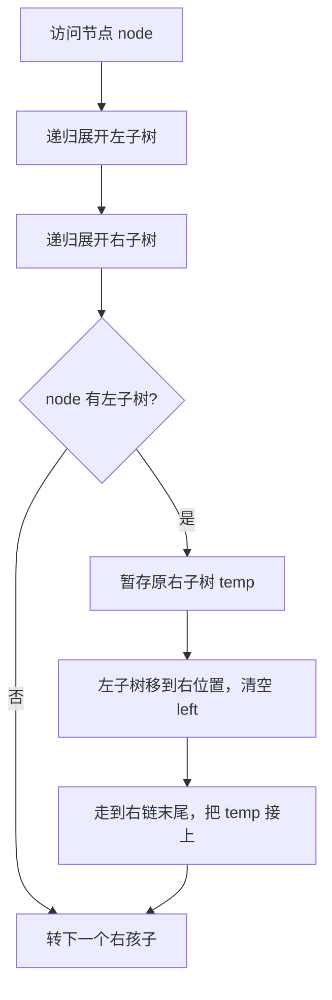

# 114. 二叉树展开为链表

## 📌 题目

给你二叉树的根结点 `root` ，请你将它展开为一个单链表：
- 展开后的单链表应该同样使用 `TreeNode` ，其中 `right` 子指针指向链表中下一个结点，而左子指针始终为 `null` 。
- 展开后的单链表应该与二叉树 [**先序遍历**](https://baike.baidu.com/item/%E5%85%88%E5%BA%8F%E9%81%8D%E5%8E%86/6442839?fr=aladdin) 顺序相同。

示例：

```
输入：root = [1,2,5,3,4,null,6]
输出：[1,null,2,null,3,null,4,null,5,null,6]
```

🔗 [LeetCode 114](https://leetcode.cn/problems/flatten-binary-tree-to-linked-list/description/?envType=study-plan-v2&envId=top-100-liked)

## 🛒 人话理解 & 🧠 思路演进



**总体一句话**：对每个节点——先递归把左右子树各自展开成链，再把「左链整体接到右边、原右链接到左链末尾」，最终所有节点只有 right 指针，顺序即前序。

### 🔬 逐步推演（动画式）

以 `root = [1,2,5,3,4,null,6]`（即 `1 →(2,5)`，`2→(3,4)`，`5→(_,6)`）为例——从左到右就是自底向上把树捋直的时间线（用 1→2 表示 right 链）：**每个节点是一次状态快照（处理到哪个节点 / 右侧链形态），箭头上写这一步把谁的左链甩到右边、原右链接到哪**：


### 现实映射：圣诞灯饰的魔法
想象你有一串圣诞树造型的彩灯，每个分岔处都有两个小灯泡。现在你想把它改造成一条直线悬挂在屋檐下。要求所有灯泡必须保持原来的点亮顺序，且只能用右侧的挂钩连接。这就是我们今天要解决的算法问题！


### 问题描述
LeetCode第114题要求：给定一个二叉树的根节点，原地将它展开为一个单链表，展开后的链表顺序应与二叉树的前序遍历顺序一致。所有节点的右子指针指向下一个节点，左子指针始终为null。

示例：
```
输入：
    1
   / \
  2   5
 / \   \
3   4   6

输出：
1
 \
  2
   \
    3
     \
      4
       \
        5
         \
          6
```

### 直觉解法：前序遍历+重建
最直接的思路就像拆解圣诞灯饰：
1. 先完整记录所有灯泡的位置（前序遍历）
2. 按照顺序重新组装成链条

### 实现

> 👉 代码实现见下方「🐍 Python 代码」

**复杂度分析**  
时间复杂度：O(n)  
空间复杂度：O(n)（递归栈+列表存储）

### 忍者解法：原地修改的奥义
真正的忍者不需要额外空间！我们需要在遍历的同时完成链表重组，就像在拆解灯饰的过程中直接重新连接灯泡。

### 核心思想：寻找前驱节点
在前序遍历中，每个节点的后继其实是其左子树的最右节点。抓住这个规律，我们可以：

1. 当前节点有左子树时：
   - 找到左子树的最右节点（前驱节点）
   - 将当前节点的右子树接到前驱节点的右侧
   - 将左子树移到右侧，左指针置空

2. 移动到右子节点，重复上述过程

### 关键步骤演示（以示例为例）
```
初始状态：
    1
   / \
  2   5
 / \   \
3   4   6

第1步：处理节点1
左子树最右节点是4
将5接到4的右侧：
    1
   / 
  2   
 / \   
3   4
     \
      5
       \
        6
然后左子树移到右侧：
    1
     \
      2   
     / \   
    3   4
         \
          5
           \
            6

第2步：处理节点2
同理操作后变为：
    1
     \
      2
       \
        3
         \
          4
           \
            5
             \
              6
```

### 实现

> 👉 代码实现见下方「🐍 Python 代码」

**复杂度分析**  
时间复杂度：O(n)（每个节点被访问两次）  
空间复杂度：O(1)

### 解法对比
| 方法         | 时间复杂度 | 空间复杂度 | 修改方式 |
|--------------|------------|------------|----------|
| 前序遍历+重建 | O(n)       | O(n)       | 非原地   |
| 原地修改法    | O(n)       | O(1)       | 原地     |

### 模式总结
这道题体现了两个重要算法思想：

1. **莫里斯遍历思想**：通过修改树结构来实现O(1)空间遍历
2. **链表重组技巧**：寻找前驱节点的操作模式

这种模式可以扩展到：
- 将二叉树展开为中序链表
- 将二叉搜索树转换为循环双向链表
- 其他需要原地修改树结构的问题

### 忍者心法
真正的算法高手，就像优秀的工匠改造灯饰：
1. **洞察结构**：发现前驱节点的关键作用
2. **精细操作**：在遍历时同步完成结构调整
3. **节约资源**：用最少的空间完成最复杂的改造

记住：当题目要求原地修改时，往往需要找到当前结构的某种内在规律，通过巧妙的指针操作来达成目标。

## 🐍 Python 代码

### 🥊 暴力解（朴素对照）

展开后的链表就是前序遍历顺序。朴素做法：先 DFS 前序把所有节点按顺序读进数组，再顺着数组依次重连 `right` 指针、清空 `left`。

```python
from typing import Optional


class Solution:
    def flatten(self, root: Optional[TreeNode]) -> None:
        if not root:
            return

        order = []

        # 前序遍历，把节点按访问顺序收集起来
        def preorder(node):
            if not node:
                return
            order.append(node)
            preorder(node.left)
            preorder(node.right)

        preorder(root)
        # 顺着前序序列重连成链表
        for i in range(len(order) - 1):
            order[i].left = None
            order[i].right = order[i + 1]
        order[-1].left = None
        order[-1].right = None
```

- 时间复杂度：`O(n)`，遍历一次、重连一次
- 空间复杂度：`O(n)`，额外用一个数组存下所有节点（外加递归栈）
- ⚠️ 多开了 O(n) 数组且不是原地。其实可以在遍历的同时直接调整指针——找到左子树前驱后把右子树挂过去，演进到下方 O(1) 额外空间的原地解。

### ⚡ 最优解

```python
class Solution:
    def flatten(self, root: Optional[TreeNode]) -> None:
        if not root:
            return
        
        # 先递归展开左右子树
        self.flatten(root.left)
        self.flatten(root.right)
        
        # 如果有左子树
        if root.left:
            # 保存当前的右子树
            right_subtree = root.right
            
            # 将左子树移动到右子树的位置
            root.right = root.left
            root.left = None  # 清空左子树
            
            # 找到右子树的最右节点
            current = root
            while current.right:
                current = current.right
            
            # 将保存的原右子树接到最右节点
            current.right = right_subtree
```
