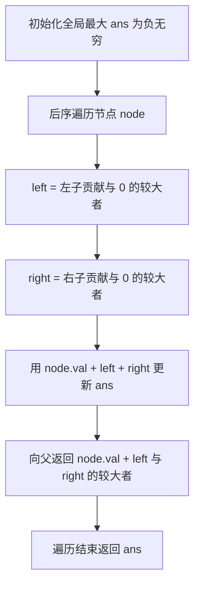
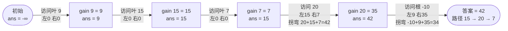

# 124. 二叉树中的最大路径和

## 📌 题目

二叉树中的**路径**被定义为一条节点序列，序列中每对相邻节点之间都存在一条边。同一个节点在一条路径序列中**至多出现一次**。该路径**至少包含一个节点**，且**不一定经过根节点**。

**路径和**是路径中各节点值的总和。给你一个二叉树的根节点 `root`，返回其**最大路径和**。

示例：
```
输入：root = [-10,9,20,null,null,15,7]
输出：42
解释：最优路径是 15 -> 20 -> 7 ，路径和为 15 + 20 + 7 = 42
```

🔗 [LeetCode 124](https://leetcode.cn/problems/binary-tree-maximum-path-sum/description/?envType=study-plan-v2&envId=top-100-liked)

## 🛒 人话理解 & 🧠 思路演进



**总体一句话**：后序遍历每个节点，用「左增益 + 节点值 + 右增益」刷新全局最大拐弯路径和，但向上传给父节点时只能二选一（左或右），因为一条路无法同时拐进左右两支。

### 🔬 逐步推演（动画式）

以 `root = [-10,9,20,null,null,15,7]`（树形 `-10 / 9,20 / 15,7`）为例——从上往下一行行后序遍历，**每个节点是一次状态快照（向父返回的单链增益 gain 与全局最大 ans），箭头上写当前节点怎么算、是否刷新 ans**：



### 生活中的算法
把每个节点想象成一座山头，节点值是这座山的「海拔」（可能是负数，代表洼地）。你想找一条**连绵山脊**，使沿途海拔之和最大。规则是：这条山脊只能沿山间小路（树边）走，**不能分叉、不能走回头路**。

对任意一座山 `node` 来说，如果想让路径**穿过它**，那么最多可以从它的左、右两条支脉各取一条（取增益为正的那段），在 `node` 处「拐弯」。而如果把路径**向上传给父节点**，则只能二选一（左或右），因为一条路无法同时走两条支脉再往上。

### 问题描述
在二叉树中找一条节点序列（沿边相连、不重复经过节点），使其节点值之和最大。路径可以从任意节点出发、到任意节点结束。节点值可能为负。

### 关键概念：贡献（gain）
定义 `gain(node)` 为**以 node 为起点、向下延伸的最大单链路径和**：
- 如果某条支脉的贡献是负数，不如不走 → 用 `max(支脉贡献, 0)` 截断
- `gain(node) = node.val + max(gain(left), gain(right), 0)` ... 准确说是 `node.val + max(left_gain, right_gain)`（其中 left_gain、right_gain 已各自与 0 取过最大）

### 两种用途
对每个节点，算出 `left = max(gain(node.left), 0)`、`right = max(gain(node.right), 0)` 后：

1. **更新答案**：经过 `node` 的「拐弯路径」和 = `node.val + left + right`，用它更新全局最大值。
2. **返回给父节点**：只能选一支，返回 `node.val + max(left, right)`。

> 为什么返回时不能 `left + right` 都带？因为父节点要用这个值继续往上连，一条链不可能同时拐进左和右。

### 示例演示（root = [-10,9,20,null,null,15,7]）
```
        -10
        /  \
       9    20
            / \
          15   7

gain(9)  = 9
gain(15) = 15
gain(7)  = 7
在 node=20：left=15, right=7 → 经过 20 的拐弯路径 = 20+15+7 = 42（更新答案）
gain(20) = 20 + max(15,7) = 35
在 node=-10：left=max(9,0)=9, right=max(35,0)=35
          拐弯路径 = -10+9+35 = 34 < 42，不更新
最终答案 = 42
```

### 复杂度
- 时间：O(n)，每个节点访问一次
- 空间：O(h)，h 为树高（递归栈），最坏 O(n)

## 🐍 Python 代码

### 🥊 暴力解（朴素对照）

以每个节点为路径「最高点」，暴力收集它向左、向右能延伸出的所有子路径和，两两组合取最大——三重递归，思路最直白。

```python
from typing import List, Optional

# Definition for a binary tree node.
# class TreeNode:
#     def __init__(self, val=0, left=None, right=None):
#         self.val = val
#         self.left = left
#         self.right = right

class Solution:
    def maxPathSum(self, root: Optional[TreeNode]) -> int:
        ans = float('-inf')

        def path_sums(node: Optional[TreeNode]) -> List[int]:
            """收集从 node 向下（含 node 自身）出发的所有单链路径和"""
            if not node:
                return []
            sums = [node.val]
            for child in (node.left, node.right):
                for s in path_sums(child):
                    sums.append(node.val + s)
            return sums

        def dfs(node: Optional[TreeNode]) -> None:
            """枚举每个节点作为最高点，组合左右子路径取最大"""
            nonlocal ans
            if not node:
                return
            ans = max(ans, node.val)               # 路径只含 node 自己
            left_sums = path_sums(node.left)       # 左侧所有向下路径和
            right_sums = path_sums(node.right)     # 右侧所有向下路径和
            best_left = max([0] + left_sums)       # 左侧可接的最大增益（负数不接）
            best_right = max([0] + right_sums)     # 右侧可接的最大增益
            ans = max(ans, node.val + best_left + best_right)  # 经过 node 的拐弯路径
            dfs(node.left)
            dfs(node.right)

        dfs(root)
        return ans
```

- 时间复杂度：`O(n²)`，每个节点都要对整棵子树重新枚举所有路径
- 空间复杂度：`O(n)`，递归栈与路径列表
- ⚠️ 反复枚举子路径导致超时。注意到「负贡献不如不要」→ 用 `max(gain, 0)` 截断后一次后序遍历即可，演进到下方 `O(n)` 解。

### ⚡ 最优解

```python
class Solution:
    def maxPathSum(self, root: Optional[TreeNode]) -> int:
        ans = float("-inf")

        def gain(node: Optional[TreeNode]) -> int:
            """以 node 为起点的最大向下单链路径和"""
            nonlocal ans
            if not node:
                return 0
            # 负贡献不如不要，与 0 取最大
            left = max(gain(node.left), 0)
            right = max(gain(node.right), 0)
            # 经过 node 的「拐弯路径」：左 + 根 + 右
            ans = max(ans, node.val + left + right)
            # 向上只能走一支
            return node.val + max(left, right)

        gain(root)
        return ans
```
