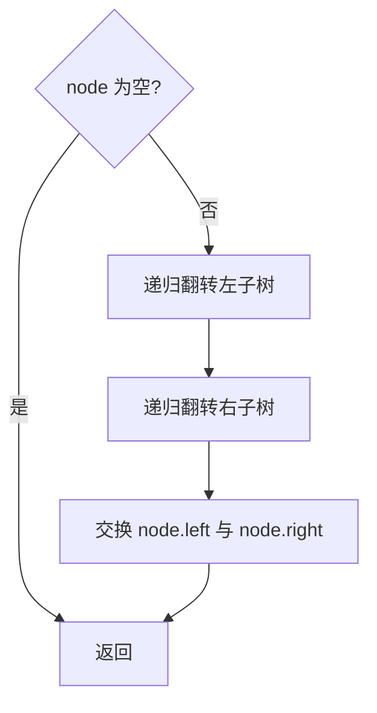
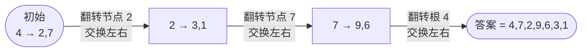

# 226. 翻转二叉树

## 📌 题目

给你一棵二叉树的根节点 `root` ，翻转这棵二叉树，并返回其根节点。

示例：


```
输入：root = [4,2,7,1,3,6,9]
输出：[4,7,2,9,6,3,1]
```

🔗 [LeetCode 226](https://leetcode.cn/problems/invert-binary-tree/description/?envType=study-plan-v2&envId=top-100-liked)

## 🛒 人话理解 & 🧠 思路演进



**总体一句话**：后序遍历每个节点，先把它的左右子树各递归翻转好，再就地交换左右孩子指针——递归到底再逐层向上"换手"，整棵树就成了镜像。

### 🔬 逐步推演（动画式）

以 `root = [4,2,7,1,3,6,9]`（树形 `4 / 2,7 / 1,3,6,9`）为例——后序遍历自下而上逐节点交换左右孩子，**每个节点是一次状态快照（交换后该节点的左右孩子），箭头上写访问了谁、做了什么**（叶子 1/3/6/9 交换空孩子无变化，故略）：



### 树的镜像：生活中的启示

想象你站在一面魔法镜前，树木在镜子中神奇地翻转。左变右，上变下，整个世界仿佛瞬间颠倒，却保持着原有的结构和精髓。这正是二叉树翻转的本质 —— 一种保持根本不变，却完全重构的奇妙变换。

### 翻转的本质：节点的镜像重构

二叉树翻转（LeetCode第226题）意味着对于树中的每个节点，我们交换其左右子树。这个过程就像是给树木穿上镜面外衣，保持原有节点值不变，但改变它们的空间布局。

### 翻转的三个关键步骤

1. 交换当前节点的左右子树
2. 递归地翻转左子树
3. 递归地翻转右子树

### 递归解法：代码中的镜像魔法

> 👉 代码实现见下方「🐍 Python 代码」

### 代码解析：每一行的深层思考

1. `if (root == null) return null;`
   - 递归的安全阀
   - 处理空树或遍历到叶子节点的边界情况
   
2. `TreeNode leftSubtree = root.left;`
   - 在交换前先保存左子树
   - 防止左子树信息在第一次赋值时丢失
   
3. `root.left = invertTree(root.right);`
   - 将右子树（经过翻转）赋值给左子树位置
   - 递归调用确保子树也被完整翻转
   
4. `root.right = invertTree(leftSubtree);`
   - 将原左子树（经过翻转）赋值给右子树位置
   - 完成当前节点的镜像重构

### 迭代方法：显式控制的翻转之旅

> 👉 代码实现见下方「🐍 Python 代码」

### 迭代方法的独特视角

- 使用队列进行显式的层序遍历
- 每次弹出一个节点，就地交换其左右子树
- 通过队列管理遍历的"进度"
- 避免了递归可能导致的栈溢出风险

### 性能分析：时间与空间的博弈

### 时间复杂度：O(n)
- 每个节点仅访问一次
- n为树中节点总数
- 无论递归还是迭代，都高效地遍历整棵树

### 空间复杂度
- 递归版本：O(h)，h为树的高度
  - 最坏情况可达O(n)
  - 最好情况（平衡树）为O(log n)
- 迭代版本：O(w)，w为树的最大宽度
  - 通常空间效率更高

### 思考与拓展

1. 为什么交换左右子树就完成了树的镜像？
2. 如何处理不同类型的二叉树翻转？
3. 这种翻转对树的其他性质有何影响？

### 实际应用场景

- 图像处理中的对称变换
- 计算机图形学的镜像效果
- 二叉树算法的对称性研究
- 数据可视化中的布局重构

### 深度思考：递归的诗与逻辑

翻转二叉树不仅仅是一道算法题，更是递归思想的诗意展现。它启示我们：

- 复杂问题可以通过相似的小问题逐步解决
- 递归是一种强大的思维工具
- 代码的优雅源于思维的清晰和简洁

记住，翻转二叉树就像在知识的镜子中探索对称与变换，重要的是保持好奇和开放的心态！

## 🐍 Python 代码

```python
class Solution:
    def invertTree(self, root: Optional[TreeNode]) -> Optional[TreeNode]:
        def exchange(root):
            if not root:
                return 
            root.left,root.right=root.right,root.left
            exchange(root.left)
            exchange(root.right)
        exchange(root)
        return root
```
```python
class Solution:
    def invertTree(self, root: Optional[TreeNode]) -> Optional[TreeNode]:
        if not root:
            return root        
        # 初始化队列并将根节点入队
        queue = deque([root])
        # 当队列不为空时，进行广度优先遍历
        while queue:
            # 弹出队首元素
            head = queue.popleft()
            # 交换左右子节点
            head.left, head.right = head.right, head.left
            # 将非空的左右子节点分别入队
            if head.left:
                queue.append(head.left)
            if head.right:
                queue.append(head.right)
        # 返回反转后的树的根节点
        return root
```
