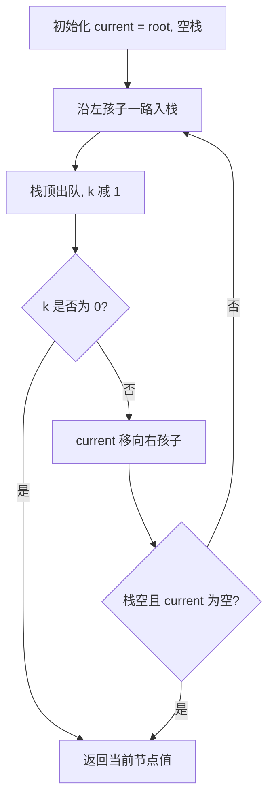
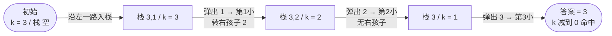

# 230. 二叉搜索树中第 K 小的元素

## 📌 题目

给定一个二叉搜索树的根节点 `root` ，和一个整数 `k` ，请你设计一个算法查找其中第 `k` 小的元素（从 1 开始计数）。

示例：

```
输入：root = [3,1,4,null,2], k = 1
输出：1
```

🔗 [LeetCode 230](https://leetcode.cn/problems/kth-smallest-element-in-a-bst/description/?envType=study-plan-v2&envId=top-100-liked)

## 🛒 人话理解 & 🧠 思路演进



**总体一句话**：用栈模拟 BST 的中序遍历（左→根→右即升序），每弹出一个节点就把计数器 k 减 1，减到 0 时弹出的那个节点就是第 K 小。

### 🔬 逐步推演（动画式）

以 `root = [3,1,4,null,2]`（树形 `3 / 1,4 / null,2`）、`k = 3` 为例——用栈模拟中序遍历，**每个节点是一次状态快照（当前栈内容与计数器 k），箭头上写弹出/入栈了谁、k 怎么变**：



### 生活中的算法
想象你在图书馆的书架前，所有书籍都按照编号从小到大排列。现在要找到第5本编号最小的书，你会怎么做？很简单，只需要从左往右数到第5本即可。

这正是二叉搜索树（BST）的天然特性——中序遍历的结果就是有序序列。今天我们要解的这道题，就像在BST这座"数字图书馆"中，快速找到第K本"书"。

### 问题描述
LeetCode第230题"二叉搜索树中第K小的元素"要求：给定一个二叉搜索树的根节点和一个整数k，找出其中第k小的元素。

例如，给定BST：
```
    3
   / \
  1   4
   \
    2
```
当k=1时，返回1；k=3时，返回3。

### 最直观的解法：中序遍历法
就像在图书馆里把书全部搬到地上再数到第k本，我们可以通过中序遍历将BST转换为有序数组，然后直接取第k-1个元素。

### 算法步骤
1. 对BST进行中序遍历，得到升序数组
2. 返回数组中第k-1个元素

用示例树模拟这个过程：
```
中序遍历顺序：1→2→3→4
当k=3时，数组第三个元素是3
```

实现：

> 👉 代码实现见下方「🐍 Python 代码」

### 优化解法：遍历时提前返回
但如果我们只需要第k本，何必要把整个书架都搬空？发现数到第k本时可以直接停止！

### 改进思路
1. 在中序遍历过程中记录访问次序
2. 当计数器等于k时立即返回结果
3. 利用BST特性提前终止遍历

### 算法步骤（迭代法）
1. 使用栈模拟中序遍历
2. 每次弹出节点时计数器加1
3. 当计数器等于k时立即返回当前节点值

用示例树模拟（k=3）：
```
栈操作流程：
1. 3入栈→3的左孩子1入栈→1的左孩子null
2. 弹出1，计数器=1≠3
3. 处理1的右子树2→2入栈→2的左孩子null
4. 弹出2，计数器=2≠3
5. 弹出3，计数器=3→找到答案3！
```

代码：

> 👉 代码实现见下方「🐍 Python 代码」

### 终极优化：Morris遍历法
如果连栈都不想用怎么办？就像在书架间穿梭时，用临时标记记录回程路线！

### Morris遍历原理
1. 利用叶子节点的空指针记录回溯路径
2. 在遍历时临时修改树结构，之后恢复
3. 实现O(1)空间复杂度

### 算法步骤
1. 当前节点cur初始化为根节点
2. 当cur不为空时循环：
   - 如果cur无左子树：
     - 计数器加1，若等于k则返回
     - cur移向右子树
   - 否则：
     - 找到cur左子树的最右节点pre
     - 若pre的右指针为空：将其指向cur，cur移向左子树
     - 若pre的右指针为cur：恢复为空，处理当前节点，cur移向右子树

示例运行（k=3）：
```
初始状态：
    3
   / \
  1   4
   \
    2

步骤：
1. cur=3，左子树存在
2. pre=2（1的右子树的最右）
3. pre.right=3，cur=1
4. cur=1，左子树不存在→计数器=1≠3→cur=1.right=2
5. cur=2，左子树不存在→计数器=2≠3→cur=2.right=3
6. 此时pre=2的右指针指向3→恢复pre.right=null→计数器+1=3→返回3
```

实现：

> 👉 代码实现见下方「🐍 Python 代码」

### 解法对比
| 方法               | 时间复杂度 | 空间复杂度 | 特点                     |
|--------------------|------------|------------|--------------------------|
| 递归中序遍历       | O(n)       | O(n)       | 简单但空间消耗大         |
| 迭代中序遍历       | O(n)       | O(h)       | 最优平衡（h为树高）      |
| Morris遍历         | O(n)       | O(1)       | 空间最优但修改树结构     |

### 题目模式总结
这道题揭示了BST类问题的核心解法：
1. **中序遍历有序性**：BST问题的解题基石
2. **遍历优化**：通过提前终止或空间优化提升效率
3. **Morris技巧**：在有限制条件下的空间优化方案

同类问题扩展：
- 验证二叉搜索树
- BST转换为累加树
- BST中的众数

解决这类问题的通用思路：
1. 确认是否利用中序特性
2. 根据空间限制选择遍历方式
3. 在遍历过程中记录关键信息

### 小结
通过这道题，我们不仅掌握了三种不同时空复杂度的解法，更重要的是理解了BST的核心特性——中序遍历的有序性。就像在有序的书架上找书，关键是要掌握高效的检索方法。

记住：算法优化往往是在时空复杂度之间寻找平衡。在面试中，通常优先推荐迭代法中序遍历法，既保证了O(h)的空间复杂度，又易于理解和实现。

## 🐍 Python 代码

### 🥊 暴力解（朴素对照）

不管什么 BST 特性，先把整棵树拍平成一个数组、排序，再直接取第 k 个——最朴素直观，但白白浪费了 BST 的有序性。

```python
from typing import Optional

# Definition for a binary tree node.
# class TreeNode:
#     def __init__(self, val=0, left=None, right=None):
#         self.val = val
#         self.left = left
#         self.right = right

class Solution:
    def kthSmallest(self, root: Optional[TreeNode], k: int) -> int:
        vals = []

        def dfs(node: Optional[TreeNode]) -> None:
            if not node:
                return
            vals.append(node.val)
            dfs(node.left)
            dfs(node.right)

        dfs(root)               # 收集所有节点值
        vals.sort()             # 排序
        return vals[k - 1]      # 取第 k 小
```

- 时间复杂度：`O(n log n)`，排序主导
- 空间复杂度：`O(n)`，存下全部节点值
- ⚠️ BST 本身就是有序的，排序属于「锦上添花」反而更慢。利用 BST 中序遍历即升序的特性，边遍历边计数，数到第 k 个就停，演进到下方 `O(h)` 空间的迭代中序解。

### ⚡ 最优解

```python
class Solution:
    def kthSmallest(self, root: Optional[TreeNode], k: int) -> int:
        stack = []
        current = root
        
        while current or stack:
            # 先遍历左子树，将所有左子节点压入栈中
            while current:
                stack.append(current)
                current = current.left
            
            # 从栈中弹出一个节点，访问该节点
            current = stack.pop()
            k -= 1  # 每访问一个节点，k 减 1
            
            # 如果 k 为 0，说明当前节点是第 k 小的元素，直接返回
            if k == 0:
                return current.val
            
            # 继续遍历右子树
            current = current.right
```
