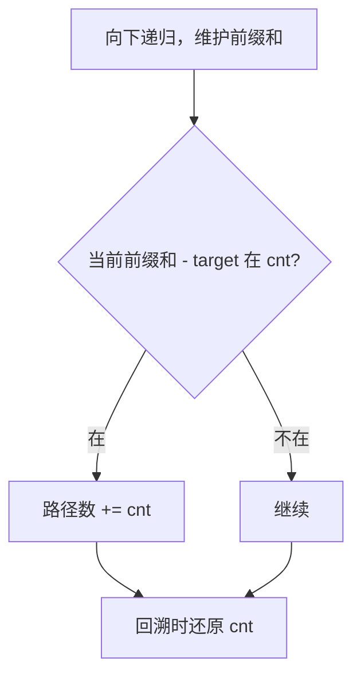

# 437. 路径总和 III

## 📌 题目

给定一个二叉树的根节点 `root` ，和一个整数 `targetSum` ，求该二叉树里节点值之和等于 `targetSum` 的 **路径** 的数目。

**路径** 不需要从根节点开始，也不需要在叶子节点结束，但是路径方向必须是向下的（只能从父节点到子节点）。

示例：


```
输入：root = [10,5,-3,3,2,null,11,3,-2,null,1], targetSum = 8
输出：3
解释：和等于 8 的路径有 3 条，如图所示。
```

🔗 [LeetCode 437](https://leetcode.cn/problems/path-sum-iii/description/?envType=study-plan-v2&envId=top-100-liked)

## 🛒 人话理解 & 🧠 思路演进



### 现实映射：宝藏地图的密码破解
考古学家发现了一张古老的宝藏地图，地图上标注了一棵神秘的二叉树，每个节点都藏有一个数字密码。为了找到宝藏，我们需要计算从任意节点出发，向下追踪路径，使得路径上的数字之和恰好等于目标值的所有可能路径。

这正是我们今天要解决的算法难题——**路径总和 III**！


### 问题描述
LeetCode第437题要求：给定一个二叉树的根节点 `root` 和一个整数 `targetSum`，返回该二叉树中路径和等于 `targetSum` 的路径数目。路径不需要从根节点开始，也不需要在叶子节点结束，但必须是从父节点到子节点的方向。

示例：
```
输入：
root = [10,5,-3,3,2,null,11,3,-2,null,1], targetSum = 8

输出：3

解释：
路径1：5 → 3
路径2：5 → 2 → 1
路径3：-3 → 11
```

### 直觉解法：双重递归
就像考古学家需要逐层挖掘和逐点分析，我们可以用双重递归的策略来解决这个问题：

1. **外层递归**：遍历每个节点，作为路径的起点
2. **内层递归**：从当前节点出发，向下搜索所有可能的路径，并计算路径和

### 实现

> 👉 代码实现见下方「🐍 Python 代码」

**复杂度分析**  
时间复杂度：O(n²)（每个节点作为起点，最坏情况下需要遍历整棵树）  
空间复杂度：O(n)（递归栈深度）

---

### 忍者解法：前缀和与哈希表的奥义
真正的考古大师会记录每一步的线索！通过使用前缀和和哈希表，我们可以将时间复杂度优化到线性级别。

### 核心优化点
1. **前缀和**：记录从根节点到当前节点的路径和
2. **哈希表**：存储前缀和的出现次数，快速查找是否存在满足条件的路径

### 关键步骤演示（以示例说明）
```
目标值：8

前缀和哈希表：{0:1} （初始化）

构建过程：
1. 根节点10，前缀和10 → 查找10-8=2，不存在
   → 更新哈希表：{0:1, 10:1}
2. 左子节点5，前缀和15 → 查找15-8=7，不存在
   → 更新哈希表：{0:1, 10:1, 15:1}
3. 左子节点3，前缀和18 → 查找18-8=10，存在（计数+1）
   → 更新哈希表：{0:1, 10:1, 15:1, 18:1}
...
```

### 实现

> 👉 代码实现见下方「🐍 Python 代码」

**复杂度分析**  
时间复杂度：O(n)（只需遍历一次树）  
空间复杂度：O(n)（哈希表存储）

---

### 解法对比
| 方法         | 时间复杂度 | 空间复杂度 | 优势               |
|--------------|------------|------------|--------------------|
| 双重递归     | O(n²)      | O(n)       | 实现简单           |
| 前缀和+哈希表 | O(n)       | O(n)       | 时间效率最优       |

---

### 模式总结
本题体现了两个关键算法思想：

1. **前缀和**：通过记录累加和，快速计算任意区间的和
2. **哈希表优化**：通过空间换时间，将查找操作优化到常数级别

这种模式可以扩展到：
- 数组中子数组和等于目标值的问题
- 其他需要快速计算区间和的场景

---

### 考古大师心法
优秀的算法设计就像破解宝藏密码：
1. **记录线索**：通过前缀和记录每一步的路径和
2. **快速查找**：利用哈希表快速定位满足条件的路径
3. **回溯清理**：在递归返回时恢复状态，避免干扰其他路径

记住：当遇到需要频繁计算区间和或路径和的场景时，不妨先问问自己——能否通过前缀和和哈希表来优化查找效率？

## 🐍 Python 代码

### 🥊 暴力解（朴素对照）

双重递归：外层让每个节点都当一次「路径起点」，内层从这个起点向下穷举所有可能的路径和，逐个比对目标值——思路最直白，但每个起点都要重算一遍。

```python
from typing import Optional

# Definition for a binary tree node.
# class TreeNode:
#     def __init__(self, val=0, left=None, right=None):
#         self.val = val
#         self.left = left
#         self.right = right

class Solution:
    def pathSum(self, root: Optional[TreeNode], targetSum: int) -> int:
        def count_from(node: Optional[TreeNode], cur: int) -> int:
            """以 node 为起点向下穷举，统计路径和等于 targetSum 的路径数"""
            if not node:
                return 0
            cur += node.val
            hit = 1 if cur == targetSum else 0
            return hit + count_from(node.left, cur) + count_from(node.right, cur)

        if not root:
            return 0
        # 枚举每个节点作为路径起点
        return (count_from(root, 0)
                + self.pathSum(root.left, targetSum)
                + self.pathSum(root.right, targetSum))
```

- 时间复杂度：`O(n²)`，最坏情况下每个节点都当起点，又把整棵子树重算一遍
- 空间复杂度：`O(n)`，递归栈深度
- ⚠️ 同一条路径被反复累加计算。借鉴数组的「前缀和 + 哈希表」思路：沿根到当前节点维护前缀和，`curSum - targetSum` 在哈希表里出现几次就有几条合法路径，一次遍历搞定，演进到下方 `O(n)` 解。

### ⚡ 最优解

```python
class Solution:
    def pathSum(self, root: Optional[TreeNode], targetSum: int) -> int:
        def dfs(node, currSum):
            if not node:
                return 0
            
            # 更新当前路径和
            currSum += node.val
            
            # 计算从某个祖先节点到当前节点的路径和是否等于 targetSum
            # 即 (currSum - targetSum) 是否在 prefix_sum_count 中存在
            count = prefix_sum_count.get(currSum - targetSum, 0)
            
            # 更新前缀和字典，记录当前路径和出现的次数
            prefix_sum_count[currSum] = prefix_sum_count.get(currSum, 0) + 1
            
            # 递归遍历左子树和右子树
            count += dfs(node.left, currSum)
            count += dfs(node.right, currSum)
            
            # 回溯：移除当前节点对应的路径和，以便不影响其他分支的路径计数
            prefix_sum_count[currSum] -= 1
            
            return count
        
        # 前缀和哈希表，记录每个路径和出现的次数
        # 初始值为 {0: 1}，表示从根节点到当前节点的路径和为0的路径有一条（即空路径）
        prefix_sum_count = {0: 1}
        
        return dfs(root, 0)
```
