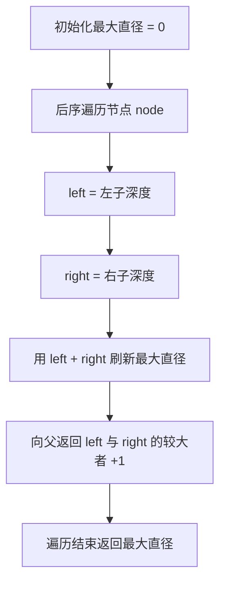
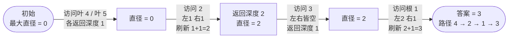

# 543. 二叉树的直径

## 📌 题目

给你一棵二叉树的根节点，返回该树的 **直径** 。
二叉树的 **直径** 是指树中任意两个节点之间最长路径的 **长度** 。这条路径可能经过也可能不经过根节点 `root` 。
两节点之间路径的 **长度** 由它们之间边数表示。

示例：


```
输入：root = [1,2,3,4,5]
输出：3
解释：3 ，取路径 [4,2,1,3] 或 [5,2,1,3] 的长度。
```

🔗 [LeetCode 543](https://leetcode.cn/problems/diameter-of-binary-tree/description/?envType=study-plan-v2&envId=top-100-liked)

## 🛒 人话理解 & 🧠 思路演进



**总体一句话**：后序遍历每个节点，用「左子深度 + 右子深度」刷新全局最大直径（边数），但向上传给父节点时只取左右深度较大者加 1，因为穿过父节点的路径不可能两边都拐。

### 🔬 逐步推演（动画式）

以 `root = [1,2,3,4,5]`（树形 `1 / 2,3 / 4,5`）为例——后序遍历自下而上，**每个节点是一次状态快照（向父返回的深度与全局最大直径），箭头上写访问了谁、left+right 怎么刷新直径**（叶子 4/5 深度 1、节点 3 深度 1，刷新均不破纪录，合并略过）：



### 生命的横跨：寻找树中的最大距离

想象你站在一片茂密的森林中，试图找出从一个极端到另一个极端最长能走多远。在二叉树的世界里，直径就是这样一种量度 —— 它不仅仅是一个数字，更是树的生命力和广度的见证。

### 直径的本质：不仅仅是长度

二叉树的直径（LeetCode第543题）是树中任意两个节点之间最长路径的长度。这个定义乍看可能简单，但蕴含着深刻的算法智慧。关键在于：
- 路径可以不经过根节点
- 长度定义为路径经过的边的数量
- 需要遍历整棵树才能找到最长路径

### 解题思路：寻径之旅的递归哲学

解决这个问题的核心是理解：树的直径 = 左子树深度 + 右子树深度

> 👉 代码实现见下方「🐍 Python 代码」

### 代码的深层逻辑解析

1. `maxDiameter` 全局变量
   - 记录树的最大直径
   - 在遍历过程中不断更新
   
2. `calculateDepth()` 方法
   - 同时完成两个任务：
     a. 计算节点深度
     b. 更新最大直径
   
3. 直径计算的关键：`leftDepth + rightDepth`
   - 代表穿过当前节点的最长路径
   - 不一定经过根节点

### 迭代方法：显式深度遍历

> 👉 代码实现见下方「🐍 Python 代码」

### 性能分析：算法的呼吸

### 时间复杂度：O(n)
- 每个节点仅访问常数次
- n为树中节点总数

### 空间复杂度：O(h)
- h为树的高度
- 最坏情况可达O(n)
- 最好情况（平衡树）为O(log n)

### 深度思考：直径背后的数学之美

1. 为什么深度和直径如此紧密相连？
2. 如何理解树的"横跨"概念？
3. 递归如何帮助我们解决复杂的遍历问题？

### 实际应用场景

- 网络拓扑分析
- 社交网络中的影响力研究
- 生物进化树的直径研究
- 组织结构的层级分析

### 递归的诗：寻径的艺术

二叉树直径不仅仅是一道算法题，更是递归思想的诗意展现。它教会我们：

- 复杂问题可以通过重复的简单逻辑解决
- 全局性质可以通过局部遍历逐步揭示
- 代码的优雅源于对问题本质的深刻理解

记住，探索二叉树的直径就像穿越知识的森林，重要的是保持好奇和系统的思考！

## 🐍 Python 代码

### 🥊 暴力解（朴素对照）

把每个节点都当成路径的「最高点」，每次都重新调用一遍求左子树深度、右子树深度，加起来更新答案——思路最直白，但深度被反复重算。

```python
from typing import Optional

# Definition for a binary tree node.
# class TreeNode:
#     def __init__(self, val=0, left=None, right=None):
#         self.val = val
#         self.left = left
#         self.right = right

class Solution:
    def diameterOfBinaryTree(self, root: Optional[TreeNode]) -> int:
        def depth(node: Optional[TreeNode]) -> int:
            """求以 node 为根的子树高度"""
            if not node:
                return 0
            return 1 + max(depth(node.left), depth(node.right))

        def dfs(node: Optional[TreeNode]) -> int:
            if not node:
                return 0
            # 经过 node 的路径长度 = 左高度 + 右高度
            through = depth(node.left) + depth(node.right)
            return max(through, dfs(node.left), dfs(node.right))

        return dfs(root)
```

- 时间复杂度：`O(n²)`，每个节点都要重算一遍左右子树高度
- 空间复杂度：`O(h)`，递归栈，h 为树高
- ⚠️ 深度信息被反复计算。其实在一次后序遍历里就能顺手得到每个节点的左右深度，顺便更新答案，无需重复递归，演进到下方 `O(n)` 解。

### ⚡ 最优解

```python
class Solution:
    def diameterOfBinaryTree(self, root: Optional[TreeNode]) -> int:
        maxDiameter = 0
        
        def depth(node: TreeNode) -> int:
            nonlocal maxDiameter
            if not node:
                return 0
            leftDepth = depth(node.left)
            rightDepth = depth(node.right)
            # 经过本节点的最长路径 = 左深度 + 右深度(以边数计)，用它刷新全局最大直径
            maxDiameter = max(maxDiameter, leftDepth + rightDepth)
            
            # 注意：函数对外返回的是深度(供父节点累加路径)，最大直径是用 nonlocal 顺带更新的副作用
            return max(leftDepth, rightDepth) + 1
        
        depth(root)
        return maxDiameter
```
