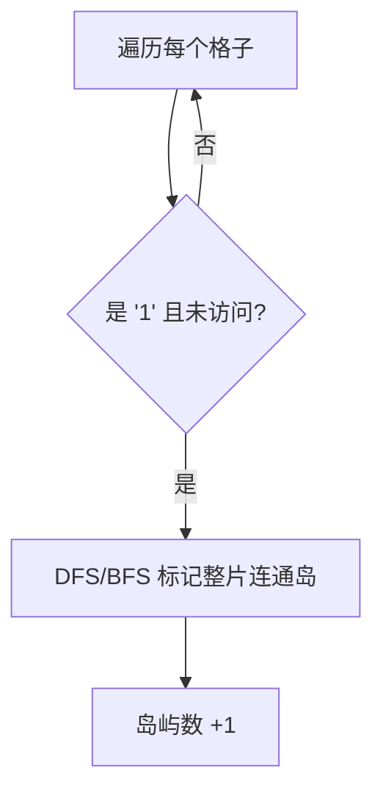

# 200. 岛屿数量

## 📌 题目

给你一个由 `1`（陆地）和 `0`（水）组成的的二维网格，请你计算网格中岛屿的数量。

岛屿总是被水包围，并且每座岛屿只能由水平方向和/或竖直方向上相邻的陆地连接形成。

此外，你可以假设该网格的四条边均被水包围。

示例：
```
输入：grid = [
  ["1","1","1","1","0"],
  ["1","1","0","1","0"],
  ["1","1","0","0","0"],
  ["0","0","0","0","0"]
]
输出：1
```

🔗 [LeetCode 200](https://leetcode.cn/problems/number-of-islands/description/?envType=study-plan-v2&envId=top-100-liked)

## 🛒 人话理解 & 🧠 思路演进



👋 大家好，我是忍者算法。今天我们要聊的这道题，在谷歌、微软、字节的面试中经常出现。它不只是考察代码能力，更是在测试你对搜索算法的理解深度。

### 🎯 从一张旧地图说起

想象一下，你正在研究一张古老的藏宝图：
- 蓝色的海水中散落着若干座岛屿
- 每座岛屿都由若干块相连的陆地组成
- 你需要数清楚到底有多少座独立的岛屿

这不就是今天要解决的算法题吗？

### 💡 问题的本质

LeetCode 200题"岛屿数量"是这样描述的：
```
输入一个由 '1'（陆地）和 '0'（水）组成的二维网格
要求计算网格中岛屿的数量（岛屿是由相邻陆地单元组成的区域）

示例：
输入：
[
  ['1','1','0','0','0'],
  ['1','1','0','0','0'],
  ['0','0','1','0','0'],
  ['0','0','0','1','1']
]
输出：3
```

🤔 看起来简单？等等，这里有几个关键点：
1. 什么算"相邻"？（上下左右四个方向）
2. 如何避免重复计算同一个岛屿？
3. 如何高效地探索整个地图？

### 🎨 绘画给我们的启发

想象你在给这张地图上色：
- 发现一块陆地，就用红色笔把它涂掉
- 顺着这块陆地，把所有相连的陆地都涂红
- 完成后，又发现新的未涂色的陆地，换个颜色继续...

每换一次颜色，就代表发现了一座新岛屿！这就是深度优先搜索（DFS）的思想。

### ⚡ 代码实现：深度优先搜索

> 👉 代码实现见下方「🐍 Python 代码」

### 🔍 解法要点解析

就像探索一座未知的岛屿：
1. 发现陆地就开始探索
2. 把探索过的地方标记一下（防止迷路）
3. 向四个方向继续探索
4. 直到这座岛屿探索完毕
5. 寻找下一座未探索的岛屿

### 📊 复杂度分析

时间复杂度：O(M × N)
- M 和 N 是地图的行数和列数
- 每个格子最多被访问一次

空间复杂度：O(M × N)
- 最坏情况：整个地图都是陆地
- 递归调用栈的深度可能达到 M × N

### 🎯 面试官最爱追问

1. Q：如何处理超大地图？
   A：可以考虑分块处理，或使用广度优先搜索（BFS）减少栈空间

2. Q：如果不能修改输入数组呢？
   A：可以用额外的visited数组记录访问状态

3. Q：如何计算最大岛屿面积？
   A：只需在DFS时统计每个岛屿的面积即可

### 💡 举一反三

这个解题思路还可以用在：
- 封闭岛屿的数量
- 最大岛屿面积
- 岛屿的周长
- 不同岛屿的数量

### 🎁 思考题

如果要求每座岛屿必须是正方形才计数，怎么修改代码？

```
示例：
1 1 1    这个算一座岛
1 1 1    （3×3的正方形）
1 1 1

1 1 1    这个不算
1 1 1    （非正方形）
1 1 0
```

如果你知道答案？请在评论区留言～

## 🐍 Python 代码

### 🥊 暴力解（朴素对照）

不开原地修改、另开一个 `visited` 矩阵做标记，DFS 照样连通整片岛——最直白，但白吃一份 `O(M·N)` 空间。

```python
from typing import List

class Solution:
    def numIslands(self, grid: List[List[str]]) -> int:
        if not grid:
            return 0
        rows, cols = len(grid), len(grid[0])
        # 额外开一个 visited 矩阵，不修改原网格
        visited = [[False] * cols for _ in range(rows)]
        count = 0

        def dfs(r: int, c: int):
            if r < 0 or r >= rows or c < 0 or c >= cols:
                return
            if grid[r][c] == '0' or visited[r][c]:
                return
            visited[r][c] = True  # 标记访问过
            dfs(r + 1, c)
            dfs(r - 1, c)
            dfs(r, c + 1)
            dfs(r, c - 1)

        for r in range(rows):
            for c in range(cols):
                if grid[r][c] == '1' and not visited[r][c]:
                    count += 1
                    dfs(r, c)
        return count
```

- 时间复杂度：`O(M × N)`，每个格子最多访问一次
- 空间复杂度：`O(M × N)`，额外 `visited` 矩阵 + 递归栈
- ⚠️ 多吃一份矩阵空间。观察到可以直接把访问过的陆地原地改成 `'0'` → 演进到下方 `O(1)` 额外空间的原地 DFS。

### ⚡ 最优解

```python
class Solution:
    def numIslands(self, grid: List[List[str]]) -> int:
        # 如果网格为空，直接返回0
        if not grid:
            return 0

        # 获取网格的行数和列数
        rows, cols = len(grid), len(grid[0])
        count = 0

        def dfs(r: int, c: int):
            """
            使用深度优先搜索 (DFS) 标记从 (r, c) 开始的所有相连的陆地。
            """
            # 检查边界条件，如果超出边界或者当前单元格是水，则返回
            if r < 0 or r >= rows or c < 0 or c >= cols or grid[r][c] == '0':
                return
            
            # 将当前单元格标记为已访问（即变为 '0'）
            grid[r][c] = '0'
            
            # 递归访问上下左右四个方向
            dfs(r + 1, c)  # 下
            dfs(r - 1, c)  # 上
            dfs(r, c + 1)  # 右
            dfs(r, c - 1)  # 左

        # 遍历整个网格
        for r in range(rows):
            for c in range(cols):
                # 如果当前单元格是陆地（'1'），则发现了一个新的岛屿
                if grid[r][c] == '1':
                    count += 1
                    # 使用DFS标记整个岛屿
                    dfs(r, c)

        return count
```
