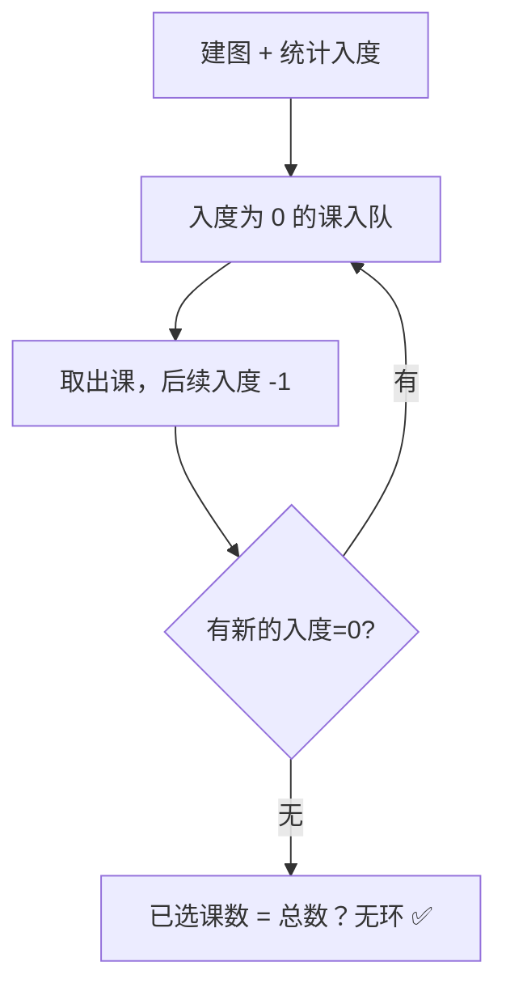

# 207. 课程表

## 📌 题目

你这个学期必须选修 `numCourses` 门课程，记为 `0` 到 `numCourses - 1` 。

在选修某些课程之前需要一些先修课程。 先修课程按数组 `prerequisites` 给出，其中 `prerequisites[i] = [ai, bi]` ，表示如果要学习课程 `ai` 则 **必须** 先学习课程  `bi` 。

- 例如，先修课程对 `[0, 1]` 表示：想要学习课程 `0` ，你需要先完成课程 `1` 。

请你判断是否可能完成所有课程的学习？如果可以，返回 `true` ；否则，返回 `false` 。

示例：
```
输入：numCourses = 2, prerequisites = [[1,0]]
输出：true
解释：总共有 2 门课程。学习课程 1 之前，你需要完成课程 0 。这是可能的。
```

🔗 [LeetCode 207](https://leetcode.cn/problems/course-schedule/description/?envType=study-plan-v2&envId=top-100-liked)

## 🛒 人话理解 & 🧠 思路演进



大家好，我是忍者算法。今天要聊的这道题，困扰了无数求职者。但只要掌握了正确的思维方法，你会发现它其实很优雅。

### 🎓 从选课系统说起

小明最近在给弟弟规划大学课程，发现了一个有趣的问题：
- "要学高数2，得先学高数1"
- "要学数据结构，得先学C语言"
- "要学操作系统，得先学数据结构"

这不就是今天要解决的算法题吗？

### 💡 问题的本质

LeetCode 207题"课程表"的描述是这样的：
```
你总共需要修完 numCourses 门课程
prerequisites[i] = [ai, bi] 表示：想要学习课程 ai ，必须先完成课程 bi

判断是否可能完成所有课程的学习？

示例：
输入：numCourses = 4, prerequisites = [[1,0],[2,1],[3,2]]
输出：true
解释：可以按照 0→1→2→3 的顺序学习
```

### 🤔 这题的关键是什么？

本质上，我们在判断：课程之间的依赖关系是否形成了"环"。
- 如果有环：比如 A依赖B、B依赖C、C依赖A，那就不可能完成
- 如果无环：就一定存在一种可行的学习顺序

这就是典型的**拓扑排序**问题！

### 🎬 模拟运行：看看算法是如何工作的

让我们用一个具体例子，一步步看清算法的运行过程：

```
课程数：4
依赖关系：[[1,0], [2,1], [3,2]]

Step 1: 构建邻接表和入度数组
课程0 → 被课程1依赖
课程1 → 被课程2依赖
课程2 → 被课程3依赖

入度统计：
课程0：0个依赖
课程1：1个依赖（依赖0）
课程2：1个依赖（依赖1）
课程3：1个依赖（依赖2）

Step 2: BFS遍历过程
第一轮：
- 入度为0的课程：[0]
- 将0加入队列
- 学习0后，课程1的入度减1（变为0）

第二轮：
- 入度为0的课程：[1]
- 将1加入队列
- 学习1后，课程2的入度减1（变为0）

第三轮：
- 入度为0的课程：[2]
- 将2加入队列
- 学习2后，课程3的入度减1（变为0）

第四轮：
- 入度为0的课程：[3]
- 将3加入队列
- 没有更多依赖需要解除

最终顺序：0 → 1 → 2 → 3
学习课程总数：4（等于课程总数，说明可行）
```

### ⚡ 代码实现：BFS解法

> 👉 代码实现见下方「🐍 Python 代码」

### 🎯 算法要点解析

拓扑排序的精髓在于：
1. 找到所有没有依赖的节点（入度为0）
2. 删除这些节点，并更新其他节点的依赖状态
3. 重复以上步骤，直到：
   - 所有节点都被删除（有解）
   - 或剩下的节点都有依赖（无解）

### 📊 复杂度分析

时间复杂度：O(N + E)
- N是课程数量
- E是依赖关系的数量

空间复杂度：O(N + E)
- 邻接表和队列的空间开销

### 🎯 面试官最爱追问

1. Q：如何输出一个可行的学习顺序？
   A：只需要将BFS过程中的课程号按顺序记录下来

2. Q：能不能用DFS解决？
   A：可以，通过检测环的方式实现

3. Q：如果有多个可行解，如何输出字典序最小的解？
   A：将队列改为优先队列，按课程号排序

### 💡 举一反三

这个模板还可以解决：
- 任务调度
- 软件包依赖管理
- 项目构建顺序
- 施工工序安排

### 🎁 思考题

如果每门课程都有一个学习时长，求完成所有课程的最短时间？
```
例如：
课程时长：[3,2,4,1]（小时）
依赖关系：[[1,0],[2,1],[3,2]]
```

如果你知道答案，或者有自己的想法？欢迎在评论区留言、讨论～

### 📝 代码模板总结

拓扑排序的通用步骤：
1. 统计入度
2. 将入度为0的节点入队
3. BFS删除节点并更新入度
4. 判断是否所有节点都被删除

## 🐍 Python 代码

```python
class Solution:
    def canFinish(self, numCourses: int, prerequisites: List[List[int]]) -> bool:
        # 1. 初始化邻接表和入度表
        # 邻接表（graph）：记录每门课的后续课，即哪些课依赖于这门课
        # 入度表（in_degree）：记录每门课有多少门前置课（依赖的课程）
        graph = {i: [] for i in range(numCourses)}  # 每门课的后续课程列表
        in_degree = {i: 0 for i in range(numCourses)}  # 每门课的前置课个数

        # 2. 构建图结构和入度表
        # 遍历所有的前置课程关系 [a, b]，表示要先学课程 b 再学课程 a
        for course, prereq in prerequisites:
            graph[prereq].append(course)  # 课程 b 指向课程 a，表示 a 依赖 b
            in_degree[course] += 1  # 课程 a 的前置课程数加 1

        # 3. 找到所有没有前置课程的课程（即入度为 0 的课程）
        queue = deque([course for course in in_degree if in_degree[course] == 0])

        # 记录已经学完的课程数量
        completed_courses = 0

        # 4. 进行广度优先搜索（BFS）
        while queue:
            current_course = queue.popleft()  # 从队列中取出一门可以学习的课程
            completed_courses += 1  # 这门课算作已经学完

            # 对这门课的后续课程进行处理
            for next_course in graph[current_course]:
                in_degree[next_course] -= 1  # 该后续课的前置课程少了一门
                if in_degree[next_course] == 0:  # 如果该课的前置课程已经全部学完
                    queue.append(next_course)  # 将其加入队列

        # 5. 判断是否所有课程都学完了
        return completed_courses == numCourses  # 如果已学完的课程数量等于总课程数，则返回 True
```
