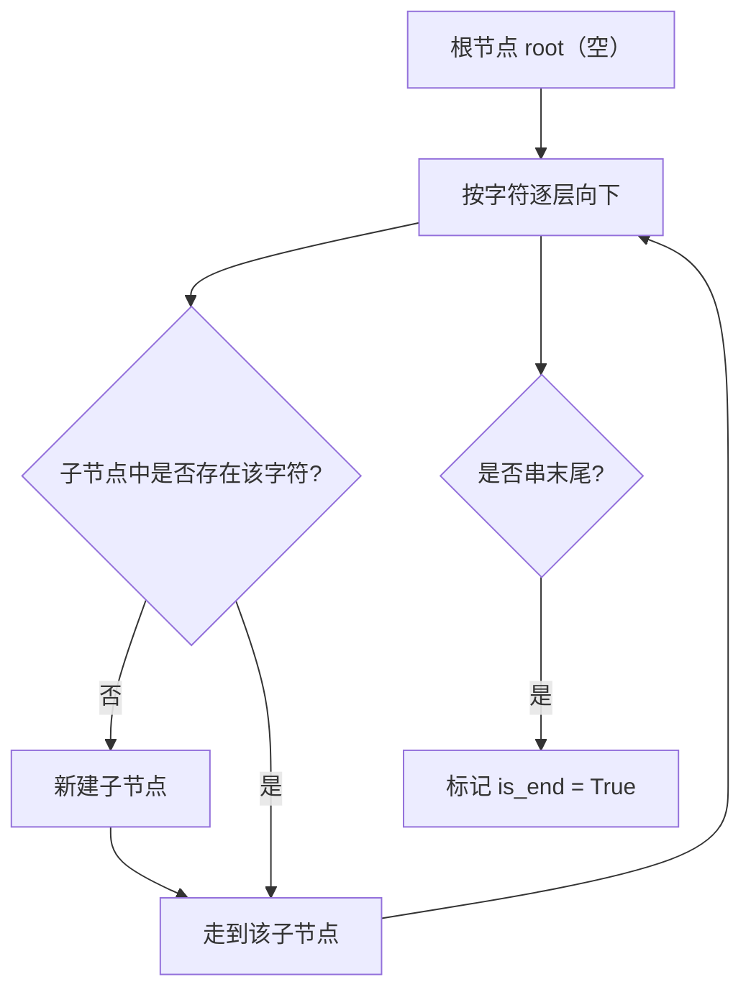

# 208. 实现 Trie (前缀树)

## 📌 题目

**Trie**（发音类似 "try"）或者说**前缀树**，是一种树形数据结构，用于高效地存储和检索字符串数据集中的键。这一数据结构有相当多的应用情景，例如自动补全和拼写检查。

请你实现 Trie 类：
- `Trie()` 初始化前缀树对象
- `insert(word)` 向前缀树中插入字符串 `word`
- `search(word)` 如果字符串 `word` 在前缀树中，返回 `true`；否则返回 `false`
- `startsWith(prefix)` 如果之前插入的字符串 `word` 中至少有一个以 `prefix` 为前缀，返回 `true`；否则返回 `false`

示例：
```
输入：
["Trie", "insert", "search", "search", "startsWith", "insert", "search"]
[[], ["apple"], ["apple"], ["app"], ["app"], ["app"], ["app"]]
输出：[null, null, true, false, true, null, true]
```

🔗 [LeetCode 208](https://leetcode.cn/problems/implement-trie-prefix-tree/description/?envType=study-plan-v2&envId=top-100-liked)

## 🛒 人话理解 & 🧠 思路演进



### 生活中的算法
回忆一下**字典的检索方式**：你要查 "apple"，不会从头扫每一页，而是先翻到首字母 'a' 的区域，再在 'a' 下面找第二个字母 'p'，层层缩小范围。前缀树（Trie）就是把这种「**按前缀逐级分流**」的思想固化成一棵树：**公共前缀共享同一条路径**。

所以 "apple"、"app"、"apply" 会共用 `a → p → p` 这段路径，只是在后面分叉或打上「到此是一个完整单词」的标记。

### 问题描述
实现一个支持 `insert / search / startsWith` 的前缀树。所有输入仅由小写英文字母组成。

### 数据结构
每个节点有两个东西：
- `children`：映射「字符 → 子节点」。题目限小写字母，可用长度 26 的数组；这里用字典更通用。
- `is_end`：布尔标记，表示「从根到当前节点恰好构成一个完整单词」。

> 注意区分：走到某节点 ≠ 该节点是一个完整单词。例如插入 "apple" 后，"app" 的末尾节点 `is_end` 仍是 `False`，所以 `search("app")` 返回 `False`，但 `startsWith("app")` 返回 `True`。

### 三个操作的套路
1. **insert**：从根出发，逐个字符向下；没有子节点就新建；走完后把末节点 `is_end = True`。
2. **search**：逐字符向下定位末节点；返回 `末节点存在 且 is_end == True`。
3. **startsWith**：逐字符向下定位末节点；返回 `末节点存在`（不看 `is_end`）。

后两个只有「**最后要不要检查 `is_end`**」的差别，可抽出一个内部辅助方法 `_find(prefix)` 返回末节点。

### 示例演示（依次 insert "apple"、insert "app"）
```
insert("apple"):
  root -a-> n1 -p-> n2 -p-> n3 -l-> n4 -e-> n5   标记 n5.is_end=True
insert("app"):
  复用 root -a-> n1 -p-> n2 -p-> n3，标记 n3.is_end=True
search("app")   -> 到 n3，is_end=True  -> True
search("appl")  -> 到 n4，is_end=False -> False
startsWith("ap")-> 到 n2，存在         -> True
```

### 复杂度
- 时间：每个操作 O(L)，L 为插入/查询字符串长度（与树中单词总数无关）
- 空间：O(Σ·总字符数)，Σ 为字符集大小

## 🐍 Python 代码

```python
class Trie:
    def __init__(self):
        self.children = {}   # 字符 -> 子 Trie 节点
        self.is_end = False  # 从根到当前节点是否构成一个完整单词

    def insert(self, word: str) -> None:
        node = self
        for ch in word:
            if ch not in node.children:
                node.children[ch] = Trie()
            node = node.children[ch]
        node.is_end = True

    def search(self, word: str) -> bool:
        node = self._find(word)
        return node is not None and node.is_end

    def startsWith(self, prefix: str) -> bool:
        return self._find(prefix) is not None

    def _find(self, s: str):
        """沿字符走到末节点，找不到返回 None"""
        node = self
        for ch in s:
            if ch not in node.children:
                return None
            node = node.children[ch]
        return node
```
