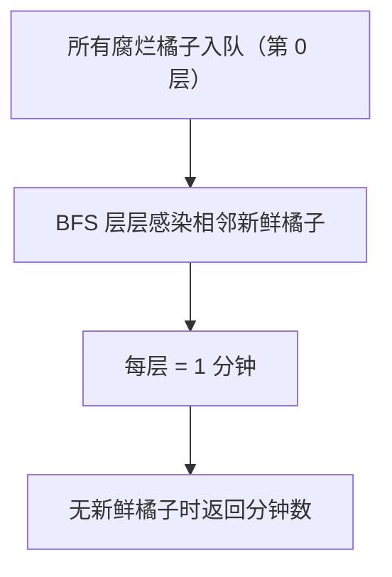

# 994. 腐烂的橘子

## 📌 题目

在给定的 `m x n` 网格 `grid` 中，每个单元格可以有以下三个值之一：

- 值 `0` 代表空单元格；
- 值 `1` 代表新鲜橘子；
- 值 `2` 代表腐烂的橘子。

每分钟，腐烂的橘子 **周围 4 个方向上相邻** 的新鲜橘子都会腐烂。

返回直到单元格中没有新鲜橘子为止所必须经过的最小分钟数。如果不可能，返回 `-1`。

示例：

```
输入：grid = [[2,1,1],[1,1,0],[0,1,1]]
输出：4
```

🔗 [LeetCode 994](https://leetcode.cn/problems/rotting-oranges/description/?envType=study-plan-v2&envId=top-100-liked)

## 🛒 人话理解 & 🧠 思路演进



各位算法忍者们，欢迎来到忍者算法。今天要聊的这道题，让我想起了在生鲜电商实习时的一个场景...

### 🍊 从生鲜仓库说起

产品经理："我们仓库里有一批橘子，已经发现有几个坏掉了。假设每天坏橘子会污染它周围的新鲜橘子，我们需要预估多少天后所有橘子会坏掉，这样才能及时调整库存..."

听起来是不是很像LeetCode 994题？

### 💡 问题的本质

这道题是这样描述的：
```
在一个 N × M 的网格中，每个单元格有三种可能的值：
- 0 表示空格子
- 1 表示新鲜橘子
- 2 表示腐烂的橘子

每分钟，腐烂的橘子会让上、下、左、右四个方向的新鲜橘子腐烂。
求需要多少分钟，整个网格中的橘子都会腐烂？如果不可能全部腐烂，返回 -1。

示例：
输入：[
    [2,1,1],
    [1,1,0],
    [0,1,1]
]
输出：4
```

### 🤔 第一反应可能是DFS？

很多同学看到网格搜索就想到DFS（深度优先搜索）。但等等，这题有个关键词：**时间**！

想象一下腐烂过程：
- 第0分钟：初始状态，有些橘子已经腐烂
- 第1分钟：这些腐烂橘子同时感染周围的橘子
- 第2分钟：新腐烂的橘子又同时感染周围的...

这不就是**广度优先搜索(BFS)**的经典场景吗？

### ⚡ 代码实现：BFS的完美运用

> 👉 代码实现见下方「🐍 Python 代码」

### 🎯 解题关键点

就像处理仓库里的水果：

1. 先统计现状：
   - 有多少新鲜橘子
   - 哪些位置已经腐烂

2. 模拟腐烂过程：
   - 每分钟所有腐烂橘子同时发挥"作用"
   - 用队列记录每一轮新腐烂的橘子

3. 终止条件：
   - 要么所有橘子都腐烂（返回时间）
   - 要么有橘子永远不会腐烂（返回-1）

### 📊 复杂度分析

时间复杂度：O(M × N)
- M和N是网格的行数和列数
- 每个格子最多被访问一次

空间复杂度：O(M × N)
- 最坏情况：所有橘子都腐烂
- 队列可能需要存储所有格子的坐标

### 🎯 面试官最爱追问

1. Q：如何优化空间复杂度？
   A：实际上这是最优解了，因为我们必须追踪每个腐烂的橘子

2. Q：如果橘子是3D放置的呢？
   A：只需将方向数组改为六个方向（上下左右前后）

3. Q：如何输出每个橘子腐烂的具体时间？
   A：可以用一个额外的二维数组记录时间戳

### 💡 举一反三

这个BFS模板还可以用在：
- 迷宫最短路径问题
- 僵尸感染问题
- 单词演变问题
- 细胞扩散问题

### 🎁 思考题

如果有些格子是"隔离区"（值为3），腐烂不能透过它传播，如何修改代码？

```
例如：
2 1 1    这里的3像墙一样
1 3 1    阻止腐烂传播
0 1 1
```

如果你知道答案？欢迎在评论区留言～

### 📝 面试技巧

回答这题时，建议这样组织语言：
1. 先说明为什么选择BFS（时间维度的特点）
2. 解释统计新鲜橘子的必要性
3. 强调队列size的作用（区分不同时间层）

## 🐍 Python 代码

```python
class Solution:
    def orangesRotting(self, grid: List[List[int]]) -> int:
        if not grid:
            return -1

        rows, cols = len(grid), len(grid[0])
        fresh_count = 0
        queue = deque()

        # 初始化队列和新鲜橘子计数
        for r in range(rows):
            for c in range(cols):
                if grid[r][c] == 2:
                    queue.append((r, c))  # 将所有初始腐烂的橘子加入队列
                elif grid[r][c] == 1:
                    fresh_count += 1  # 统计新鲜橘子的数量

        # 定义四个方向：上下左右
        directions = [(1, 0), (-1, 0), (0, 1), (0, -1)]
        minutes_passed = 0  # 记录时间

        # 广度优先搜索
        while queue and fresh_count > 0:
            minutes_passed += 1  # 每处理完一轮，时间增加1分钟
            for _ in range(len(queue)):
                r, c = queue.popleft()  # 从队列中取出一个腐烂的橘子
                for dr, dc in directions:
                    nr, nc = r + dr, c + dc  # 计算相邻的单元格位置
                    if 0 <= nr < rows and 0 <= nc < cols and grid[nr][nc] == 1:
                        # 如果相邻单元格是新鲜橘子，将其变为腐烂橘子
                        grid[nr][nc] = 2
                        fresh_count -= 1  # 新鲜橘子数量减少1
                        queue.append((nr, nc))  # 将新腐烂的橘子加入队列

        # 检查是否还有新鲜橘子
        if fresh_count == 0:
            return minutes_passed  # 如果没有新鲜橘子，返回经过的分钟数
        else:
            return -1  # 如果还有新鲜橘子，返回-1
```
