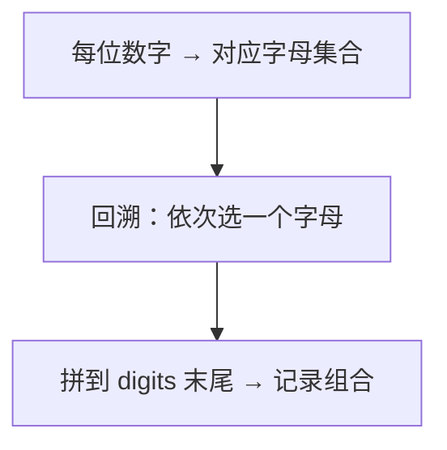

# 17. 电话号码的字母组合

## 📌 题目

给定一个仅包含数字 `2-9` 的字符串，返回所有它能表示的字母组合。答案可以按 **任意顺序** 返回。

给出数字到字母的映射如下（与电话按键相同）。注意 1 不对应任何字母。


示例：
```
输入：digits = "23"
输出：["ad","ae","af","bd","be","bf","cd","ce","cf"]
```

🔗 [LeetCode 17](https://leetcode.cn/problems/letter-combinations-of-a-phone-number/description/?envType=study-plan-v2&envId=top-100-liked)

## 🛒 人话理解 & 🧠 思路演进



👉 今天带你轻松掌握 LeetCode 17 题「电话号码的字母组合」

大家好，我是忍者算法。今天要聊的这道题，是面试中的经典题目，它不仅考察了递归回溯的思维，更是字符串处理的典型案例。来看看如何优雅地解决它！

### 🤔 从生活场景说起
还记得诺基亚手机的九宫格键盘吗？
- 按键2对应"abc"
- 按键3对应"def"
- 按键4对应"ghi"
...

当我们要输入"hello"时，需要按：44-33-555-555-666

这个场景，其实就是今天算法题的反向操作！

### 💡 题目剖析
LeetCode 17 要求我们：
给定一个仅包含数字2-9的字符串，返回所有它能表示的字母组合。
```
输入："23"
输出：["ad","ae","af","bd","be","bf","cd","ce","cf"]
```

关键点在于：
1. 每个数字对应多个字母
2. 需要找出所有可能的组合

就像在九宫格键盘上：
- 按下"2"，可能是"a"、"b"或"c"
- 按下"3"，可能是"d"、"e"或"f"

### 😅 新手常见误区
很多人一开始会想：用多层循环搞定！

> 👉 代码实现见下方「🐍 Python 代码」

这样做的问题：
- 代码死板：输入长度不固定怎么办？
- 扩展性差：如果需求变化就要改很多代码

### 🚀 递归回溯：优雅的解法
来看看高手是怎么做的：

> 👉 代码实现见下方「🐍 Python 代码」

这就像：
1. 拿起手机，准备输入
2. 每按一个数字，就有多个字母可选
3. 选择一个字母，继续下一个数字
4. 直到输入完所有数字，就得到一种组合

### 🎯 面试常见追问
1. 为什么用递归回溯？
   - 问题具有"选择"的特征
   - 需要尝试所有可能性
   - 符合"树形结构"的思维模型

2. 时间复杂度是多少？
   - O(3^N × 4^M)
   - N是对应三个字母的数字个数
   - M是对应四个字母的数字个数（比如7和9）

3. 如何优化内存使用？
   - 使用StringBuilder代替String
   - 复用路径变量而不是创建新的

### 📚 解题技巧总结
记住这个"回溯三部曲"：
1. 选择：append当前字母
2. 探索：递归处理下一个数字
3. 撤销：删除当前字母

## 🐍 Python 代码

```python
class Solution:
    def letterCombinations(self, digits: str) -> List[str]:
        if not digits:
            return []
        
        digit_to_letters = {
            '2': 'abc', '3': 'def', '4': 'ghi', '5': 'jkl',
            '6': 'mno', '7': 'pqrs', '8': 'tuv', '9': 'wxyz'
        }
        
        result = ['']
        
        for digit in digits:
            # 重新构建结果列表，每个结果加上当前数字对应的字母
            new_result = []
            for letter in digit_to_letters[digit]:
                for combination in result:
                    new_result.append(combination + letter)
            result = new_result
        
        return result
```
