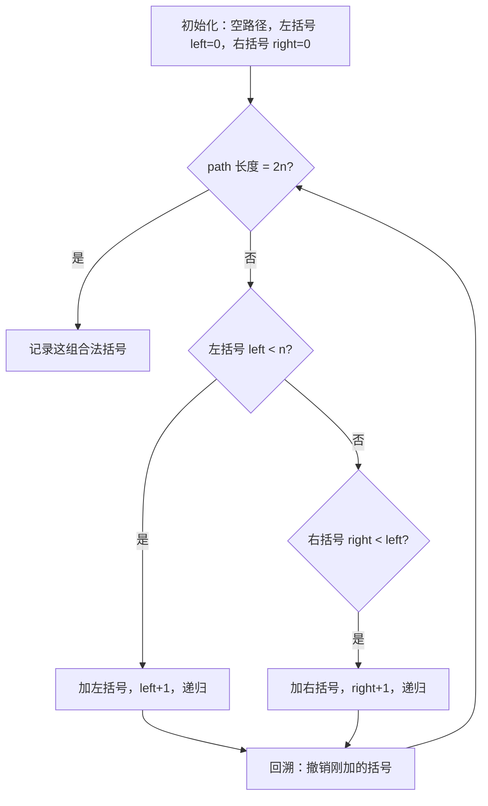

# 22. 括号生成

## 📌 题目

数字 `n` 代表生成括号的对数，请你设计一个函数，用于能够生成所有可能的并且 **有效的** 括号组合。

示例：
```
输入：n = 3
输出：["((()))","(()())","(())()","()(())","()()()"]
```

🔗 [LeetCode 22](https://leetcode.cn/problems/generate-parentheses/description/?envType=study-plan-v2&envId=top-100-liked)

## 🛒 人话理解 & 🧠 思路演进



**总体一句话**：在回溯中实时跟踪已用的左/右括号数，只要「左括号没用满」就能加 `(`、「右括号少于左括号」就能加 `)`，靠这两条平衡约束边生成边剪枝，长度凑到 `2n` 就收一个合法组合。

### 🔬 逐步推演（动画式）

以 `n = 2`（共 2 对括号）为例——从左到右就是回溯的时间线：**每个节点是一次路径快照（path 与 left/right 真实值），箭头上写这一步加了哪个括号、做了什么决策**：

```mermaid
flowchart LR
    S0(["初始<br/>path = 空　left = 0　right = 0"]) -->|"left 0<2<br/>加左括号"| S1["path = (<br/>left = 1　right = 0"]
    S1 -->|"left 1<2<br/>再加左括号"| S2["path = ((<br/>left = 2　right = 0"]
    S2 -->|"left 已满，right 0<2<br/>加右括号"| S3["path = (()<br/>left = 2　right = 1"]
    S3 -->|"right 1<2<br/>补最后右括号，长度到 4"| S4["记录 (())<br/>left = 2　right = 2"]
    S4 -->|"回溯到 path = (，改走右分支<br/>right 0<1 加右括号"| S5["path = ()<br/>left = 1　right = 1"]
    S5 --> Ans(["答案<br/>结果 = (()),()()"])
```



大家好，我是忍者算法。今天要讲的LeetCode 22题「括号生成」看似简单，却暗藏玄机。据统计90%的面试者都在此栽跟头，让我们用最通俗的方式彻底搞懂它！

### 📝 从生活场景说起
想象你在编辑器里写代码，VS Code会实时检查括号是否匹配：
- 每输入一个左括号"("，就期待后面会有个右括号")"与之配对
- 右括号数量不能超过左括号
- 最终左右括号数量必须相等

这不就是我们今天要解决的问题吗？

### 💡 题目解析
**题目要求**：
给定一个正整数n，生成所有可能且有效的括号组合。要求：
- 生成n对括号的所有组合
- 每个组合都必须是有效的括号序列
- 输出不能有重复组合

**示例**：
输入：n = 3
输出：["((()))", "(()())", "(())()", "()(())", "()()()"]

### 😱 常见误区大揭秘
1. **无脑回溯**：不加约束生成所有可能组合，产生大量无效序列
2. **忽视平衡性**：没有控制左右括号数量关系，导致非法组合
3. **终止条件混淆**：不清楚何时应该停止添加括号

就像写代码时随意输入括号，最后发现一堆语法错误！

### 🚀 优雅的解题思路
### 核心算法：回溯 + 平衡约束

> 👉 代码实现见下方「🐍 Python 代码」

### 算法思维图解
1. **状态跟踪**：实时记录已使用的左括号(open)和右括号(close)数量
2. **关键约束**：
   - 左括号数量不超过n
   - 右括号数量不超过左括号数量
3. **决策过程**：在每一步都面临两个选择：
   - 添加左括号？
   - 添加右括号？

就像编辑器的实时语法检查：
- 输入左括号时检查是否达到上限
- 输入右括号时确保有未匹配的左括号
- 达到期望长度时完成一个组合

### 🏆 效率优化要点
1. **空间优化**：使用StringBuilder替代String拼接
2. **提前剪枝**：通过括号计数快速判断无效路径
3. **递归优化**：避免创建过多String对象

### 💼 面试必问三连击
1. **为什么要跟踪open和close？**
   - 保证括号序列的合法性
   - 控制生成过程中的平衡约束

2. **如何保证不重复生成？**
   - 通过严格的生成顺序：优先考虑左括号
   - 利用回溯过程中的约束条件自然去重

3. **能否用其他方法解决？**
   - 动态规划方案
   - 深度优先搜索
   - 按位枚举（但不推荐）

### 📌 解题技巧总结
把握三个核心要点：
1. **平衡原则**：右括号数不超过左括号
2. **计数约束**：左右括号各n个
3. **回溯思维**：在保证合法性的前提下尝试所有可能

## 🐍 Python 代码

### 🥊 暴力解（朴素对照）

不管合不合法，先把所有长度 `2n` 的 `(`、`)` 序列全生成出来（共 `2^(2n)` 个），再逐个用计数法验证是否为有效括号。

```python
from typing import List

class Solution:
    def generateParenthesis(self, n: int) -> List[str]:
        result = []

        def valid(s: str) -> bool:
            bal = 0
            for ch in s:
                if ch == '(':
                    bal += 1
                else:
                    bal -= 1
                if bal < 0:        # 右括号提前出现 → 非法
                    return False
            return bal == 0

        # 递归枚举每一位放 '(' 或 ')' 的所有序列
        def gen(cur: str):
            if len(cur) == 2 * n:
                if valid(cur):
                    result.append(cur)
                return
            gen(cur + '(')
            gen(cur + ')')

        gen('')
        return result
```

- 时间复杂度：`O(2^(2n) × n)`，枚举全部序列再逐个验证
- 空间复杂度：`O(2^(2n) × n)`，存所有候选序列
- ⚠️ 生成了一堆必然非法的序列（如全是 `(`）。在递归时实时统计左/右括号数、非法就立即剪掉 → 演进到下方 `O(4^n / √n)` 的剪枝回溯解。

### ⚡ 最优解

```python
class Solution:
    def generateParenthesis(self, n: int) -> List[str]:
        def backtrack(path, left, right):
            # 如果生成的括号长度达到了 2 * n，说明所有括号对已经放置完毕
            if len(path) == 2 * n:
                result.append("".join(path))  # 将生成的括号组合加入结果列表
                return

            # 如果左括号数量还没有达到 n，继续放置左括号
            if left < n:
                path.append('(')  # 放置左括号
                backtrack(path, left + 1, right)  # 递归
                path.pop()  # 回溯，撤销放置的左括号
            
            # 如果右括号数量小于左括号数量，继续放置右括号
            if right < left:
                path.append(')')  # 放置右括号
                backtrack(path, left, right + 1)  # 递归
                path.pop()  # 回溯，撤销放置的右括号

        result = []
        backtrack([], 0, 0)  # 初始状态：空路径，0 左括号，0 右括号
        return result
```
