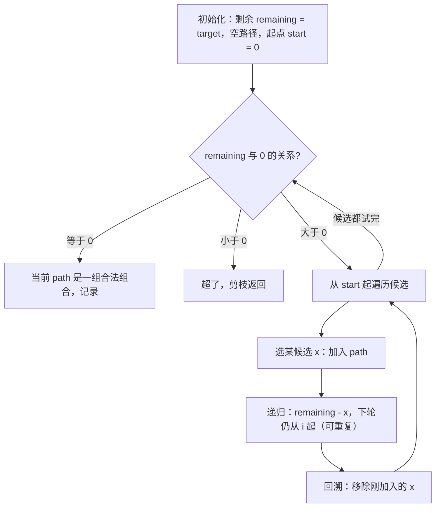

# 39. 组合总和

## 📌 题目

给你一个 **无重复元素** 的整数数组 `candidates` 和一个目标整数 `target` ，找出 `candidates` 中可以使数字和为目标数 `target` 的 所有 **不同组合** ，并以列表形式返回。你可以按 **任意顺序** 返回这些组合。

`candidates` 中的 **同一个** 数字可以 **无限制重复被选取** 。如果至少一个数字的被选数量不同，则两种组合是不同的。 

对于给定的输入，保证和为 `target` 的不同组合数少于 `150` 个。

示例：
```
输入：candidates = [2,3,6,7], target = 7
输出：[[2,2,3],[7]]
解释：
2 和 3 可以形成一组候选，2 + 2 + 3 = 7 。注意 2 可以使用多次。
7 也是一个候选， 7 = 7 。
仅有这两种组合。
```

🔗 [LeetCode 39](https://leetcode.cn/problems/combination-sum/description/?envType=study-plan-v2&envId=top-100-liked)

## 🛒 人话理解 & 🧠 思路演进



**总体一句话**：用一个「剩余目标 `remaining`」做减法回溯——每选一个候选就把它从 `remaining` 里扣掉，扣成 0 就记录、扣成负就剪枝；靠「下轮从当前下标 `i` 起选」既允许重复选取、又保证组合按非降序产生从而天然去重。

### 🔬 逐步推演（动画式）

以 `candidates = [2,3,6,7]`，`target = 7` 为例——从左到右就是回溯的时间线：**每个节点是一次路径快照（path 与 remaining 真实值），箭头上写这一步选了谁、做了什么决策**：

```mermaid
flowchart LR
    S0(["初始<br/>path = 空　remaining = 7"]) -->|"选 2<br/>7−2 = 5 > 0 继续"| S1["path = 2<br/>remaining = 5"]
    S1 -->|"选 2<br/>5−2 = 3 > 0 继续"| S2["path = 2,2<br/>remaining = 3"]
    S2 -->|"选 2 凑不齐，换 3<br/>3−3 = 0 命中"| S3["记录 2,2,3<br/>结果 = 2,2,3"]
    S3 -->|"回溯到起点，换选 7<br/>7−7 = 0 命中"| S4["记录 7<br/>结果 = 2,2,3;7"]
    S4 -->|"回溯到起点，试选 6<br/>7−6 = 1，候选最小 2 也超"| S5["path = 6<br/>remaining = 1 → 剪枝"]
    S5 --> Ans(["答案<br/>2,2,3;7"])
```



大家好，我是忍者算法。今天要挑战的这道题，表面是数字组合游戏，实则暗藏回溯算法的精髓。据说90%的面试者都会忽视关键细节，让我们用5分钟彻底攻克LeetCode 39题「组合总和」！

### 🛒 一个真实的生活场景  
小明在超市凑满减活动，手握100元优惠券发愁：  
- "巧克力20元，薯片15元，可乐5元..."  
- "同一商品可以拿多件"  
- "怎样才能刚好凑满100元的所有组合？"  

这场景竟与算法题完美对应！让我们揭开题目的真面目。

### 💡 算法题解析  
**题目要求**：  
给定无重复元素的数组和一个目标数，找出所有**唯一组合**，满足：  
- 组合中数字**和等于目标**  
- **同一数字可无限次使用**  
- 解集**不能有重复组合**（如[2,2,3]和[3,2,2]视为同一组合）

**示例**：  
输入：candidates = [2,3,5], target = 8  
输出：[[2,2,2,2],[2,3,3],[3,5]]

### 😱 新手易踩的三个坑  
1. **暴力枚举**：直接遍历所有子集，产生大量重复组合（时间复杂度O(2^n)）  
2. **遗漏剪枝**：不排序直接处理，无法提前终止无效搜索  
3. **路径回溯**：忘记移除已添加元素，导致结果串扰  

就像在超市盲目拿商品，既浪费时间又容易拿错！

### 🚀 高手的解题秘籍  
### 核心思路：回溯算法 + 剪枝优化  

> 👉 代码实现见下方「🐍 Python 代码」

### 算法图解  
1. **排序数组**：[2,3,5] → [2,3,5]（为剪枝铺垫）  
2. **构建决策树**：每个节点代表选择某个元素  
3. **剪枝策略**：当累计值超过target时停止向下搜索  
4. **路径记录**：用List保存当前选择路径  

就像在超市：  
- 先按价格排序商品（排序）  
- 从便宜的开始拿（剪枝）  
- 记录已选商品（路径）  
- 凑满金额立即结算（终止条件）  

### 🏆 复杂度优化关键  
1. **排序剪枝**：时间复杂度从O(2^n)降到O(n^(target/min))  
2. **避免重复**：通过start参数控制选择范围，保证组合唯一性  
3. **空间优化**：复用path列表，空间复杂度O(target/min)  

### 💼 面试灵魂三问  
1. **为什么需要排序？**  
   - 实现剪枝优化，提前终止无效搜索路径  
   - 保证组合元素的递增顺序，避免重复组合  

2. **如何处理元素重复使用？**  
   - 递归时传递start=i而非i+1，允许重复选择当前元素  

3. **算法适用哪些变种题？**  
   - 组合总和II（不可重复使用元素）  
   - 电话号码字母组合  
   - 全排列问题  

### 📌 核心技巧总结  
掌握回溯三板斧：  
1. **选择**：记录当前决策  
2. **约束**：通过剪枝减少搜索  
3. **撤销**：回溯到上一步状态

## 🐍 Python 代码

### 🥊 暴力解（朴素对照）

不剪枝、也不提前终止：老老实实把每个候选加进路径继续递归，只有当剩余和 ≤ 0 时才停下来判断。

```python
from typing import List

class Solution:
    def combinationSum(self, candidates: List[int], target: int) -> List[List[int]]:
        result = []

        def backtrack(remaining: int, path: List[int], start: int):
            # 剩余 < 0 → 这条路废了，但前面没有提前判断，硬走到这里才停
            if remaining < 0:
                return
            if remaining == 0:
                result.append(path[:])
                return
            for i in range(start, len(candidates)):
                path.append(candidates[i])
                backtrack(remaining - candidates[i], path, i)  # 同一元素可重复选 → start=i
                path.pop()

        backtrack(target, [], 0)
        return result
```

- 时间复杂度：`O(n^(target/min))`，每个分支都递归到和为负才返回，浪费大量无效搜索
- 空间复杂度：`O(target/min)`，递归栈深度
- ⚠️ 没有排序，`remaining < 0` 的判断也不能尽早 break。先排序、循环里一旦 `candidates[i] > remaining` 就提前 break → 演进到下方带剪枝的回溯解。

### ⚡ 最优解

```python
class Solution:
    def combinationSum(self, candidates, target):
        result = []
        
        # 回溯函数，参数分别是当前组合路径、当前的总和、候选元素的起始索引
        def backtrack(remaining, path, start):
            # 如果剩余的数为 0，说明找到了一组合法的组合，加入结果集
            if remaining == 0:
                result.append(path[:])
                return
            # 如果剩余数小于 0，说明当前组合不合法，直接返回
            if remaining < 0:
                return
            
            # 从当前元素开始，尝试每个候选元素
            for i in range(start, len(candidates)):
                # 选择当前元素，递归搜索
                path.append(candidates[i])
                # 递归调用，remaining 减去当前元素，start 保持不变以允许重复选择同一元素
                backtrack(remaining - candidates[i], path, i)
                # 回溯：撤销当前选择
                path.pop()
        
        # 调用回溯函数，初始路径为空，目标是 target，从第 0 个元素开始
        backtrack(target, [], 0)
        
        return result
```
