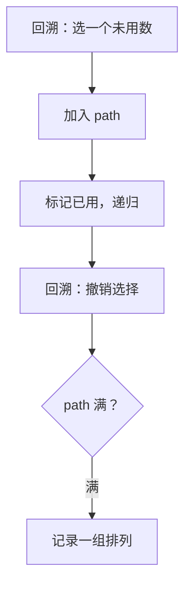

# 46. 全排列

## 📌 题目

给定一个不含重复数字的数组 `nums` ，返回其 _所有可能的全排列_ 。你可以 **按任意顺序** 返回答案。

示例：

```
输入：nums = [1,2,3]
输出：[[1,2,3],[1,3,2],[2,1,3],[2,3,1],[3,1,2],[3,2,1]]
```

🔗 [LeetCode 46](https://leetcode.cn/problems/permutations/description/?envType=study-plan-v2&envId=top-100-liked)

## 🛒 人话理解 & 🧠 思路演进



大家好，我是忍者算法。今天要拆解的这道题，是无数算法题的基础原型。很多同学第一次遇到时都会被绕晕，但只要理解了它的思维模式，你会发现自己打开了新世界的大门！

### 🧩 从密码锁说起

小红最近买了一个新型密码锁，发现了一个有趣的规律：
- 密码由3个不同数字组成
- 每个数字都必须使用且只能用一次
- 数字的顺序不同就算不同密码

这不就是典型的全排列问题吗？

### 💡 问题的本质

LeetCode 46题"全排列"的描述是这样的：
```
给定一个不含重复数字的数组 nums
返回其所有可能的全排列

示例：
输入：nums = [1,2,3]
输出：[[1,2,3],[1,3,2],[2,1,3],[2,3,1],[3,1,2],[3,2,1]]
```

### 🤔 这题的关键是什么？

本质上，我们在寻找：
1. 所有可能的元素组合方式
2. 通过递归回溯尝试所有选择路径
3. 及时剪枝避免重复使用元素

这就是经典的回溯算法问题！

### 🎬 模拟运行：看看算法是如何工作的

以nums=[1,2,3]为例，我们一步步拆解回溯过程：


Step 1: 选择第一个数字
- 可选1/2/3
- 假设选择1，当前路径[1]

Step 2: 选择第二个数字
- 剩下可选2/3
- 选择2，路径变为[1,2]

Step 3: 选择第三个数字
- 只剩3，得到完整排列[1,2,3]
- 回溯到上一步

Step 4: 撤销第二步的选择
- 路径回到[1]，重新选择3
- 路径变为[1,3]

Step 5: 选择第三个数字
- 只剩2，得到排列[1,3,2]
- 继续回溯...

直到遍历所有可能的路径！

### ⚡ 代码实现：回溯解法

> 👉 代码实现见下方「🐍 Python 代码」

### 🎯 算法要点解析

回溯法的精髓在于：
1. **路径选择**：记录已经做出的选择
2. **选择列表**：当前可选的元素集合
3. **终止条件**：到达决策树的底层
4. **状态重置**：回到上一层前的清理操作

### 📊 复杂度分析

时间复杂度：O(n×n!)
- 排列总数是n!种
- 每个排列需要O(n)时间复制到结果集

空间复杂度：O(n)
- 递归栈深度最大为n
- 使用布尔数组记录访问状态

### 🎯 面试官最爱追问

Q：如果数组包含重复元素怎么办？  
A：需要先排序，然后在回溯时跳过相同元素（LeetCode 47题）

Q：如何优化空间复杂度？  
A：可以通过交换元素实现原地排列，不需要额外空间记录状态

Q：如何按字典序输出结果？  
A：先对数组排序，回溯时按顺序选择元素

### 💡 举一反三

这个模板还可以解决：
- 组合总和（LeetCode 39）
- 子集问题（LeetCode 78）
- 电话号码字母组合（LeetCode 17）
- N皇后问题（LeetCode 51）

### 🎁 思考题

如果要求返回第k个排列，而不是所有排列，如何用O(n)的时间复杂度解决？

例如：
输入：n=3, k=3
输出："213"

如果你知道答案，或者有自己的想法？欢迎在评论区留言讨论～

### 📝 代码模板总结

回溯算法的通用步骤：
1. 定义结果集和路径
2. 遍历选择列表
3. 做出选择并更新状态
4. 递归进入下一层
5. 撤销选择并恢复状态

## 🐍 Python 代码

```python
class Solution:
    def permute(self, nums: List[int]) -> List[List[int]]:
        def backtrack(path, remaining):
            # 当剩余元素为空时，说明已经生成了一个完整的排列
            if not remaining:
                result.append(path[:])  # 将当前路径的副本添加到结果中（使用 path[:] 防止引用问题）
                return
            # 遍历剩余的每一个元素，尝试将其加入当前排列路径
            for i in range(len(remaining)):
                # 选择：将 remaining[i] 添加到路径中
                path.append(remaining[i])
                # 递归：将元素 i 从剩余元素中移除，继续生成剩下的排列
                # remaining[:i] + remaining[i+1:] 表示除了第 i 个元素的其余元素
                backtrack(path, remaining[:i] + remaining[i+1:])
                # 回溯：撤销选择，将刚加入的元素从路径中移除，尝试其他选择
                path.pop()

        result = []  # 存储所有生成的排列结果
        backtrack([], nums)  # 初始时路径为空，剩余元素为 nums
        return result  # 返回所有排列结果
```
```python
class Solution:
    def permute(self, nums):
        # 如果数组为空，返回一个空列表
        if len(nums) == 0:
            return []
        # 如果数组只有一个元素，返回它自己
        if len(nums) == 1:
            return [nums]
            
        result = []        
        # 遍历数组中的每一个元素
        for i in range(len(nums)):
            # 当前选择的元素
            current = nums[i]
            # 剩余的元素（除了当前元素之外的部分）
            remaining = nums[:i] + nums[i+1:]
            
            # 对剩余元素递归生成所有排列
            for p in self.permute(remaining):
                # 将当前元素加入到递归生成的排列前面
                result.append([current] + p)
        
        return result
```
