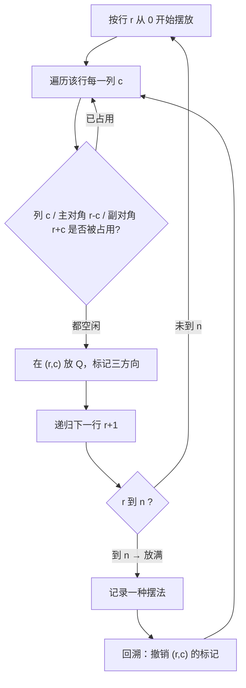
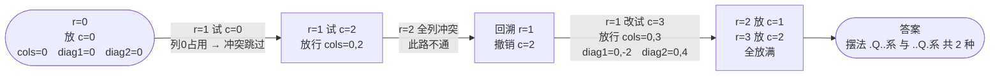

# 51. N 皇后

## 📌 题目

按照国际象棋的规则，皇后可以攻击与之处在**同一行、同一列或同一斜线**上的棋子。

**n 皇后问题**研究的是如何将 `n` 个皇后放置在 `n×n` 的棋盘上，并且使皇后彼此之间不能相互攻击。给你一个整数 `n`，返回所有不同的 n 皇后问题的解决方案。

每一种解法包含一个不同的棋子放置方案，其中 `'Q'` 和 `'.'` 分别代表了皇后和空位。

示例：
```
输入：n = 4
输出：[[".Q..","...Q","Q...","..Q."],["..Q.","Q...","...Q",".Q.."]]
解释：4 皇后问题存在两个不同的解法。
```

🔗 [LeetCode 51](https://leetcode.cn/problems/n-queens/description/?envType=study-plan-v2&envId=top-100-liked)

## 🛒 人话理解 & 🧠 思路演进



**总体一句话**：逐行各放一个皇后，每放一个就用三个集合 `cols / diag1(r-c) / diag2(r+c)` 做 `O(1)` 判冲突——能放就标记并往下递归，到第 n 行收一种解，回来撤销再试别的列。

### 🔬 逐步推演（动画式）

以 `n = 4` 为例，跟踪每行把皇后放到哪一列（行列均从 0 起），从左到右就是回溯的时间线——每个节点是一次摆放状态快照，箭头上写这一步在谁的位置做了什么、冲突还是放行：



### 生活中的算法
想象你是一位宴会主办方，要在一间方正的大厅里安排 `n` 位互不对眼的贵宾入座（`n` 行 `n` 列的座位）。每位贵宾都要求：**自己这一行、这一列，以及两条对角线方向上，不能再有其他人**。你的任务是把所有合法的排座方案都列出来。

这其实就是「同一行、同一列、两条对角线互不冲突」的约束满足问题。

### 问题描述
棋盘是 `n×n`，要放 `n` 个皇后，任意两个皇后不能同行、同列、同对角线。返回**所有**合法摆法，每个摆法用字符串列表表示（每行一个字符串，`Q` 是皇后，`.` 是空位）。

### 关键观察：一行只放一个
因为同一行不能有两个皇后，所以**每一行恰好放一个**。于是问题变成：**为第 0 行选一个列、第 1 行选一个列……第 n-1 行选一个列**，使得任意两行选的列各不相同，且不在同一对角线上。

这天然就是一个「回溯」结构：逐行做选择，冲突就回退。

### 三个方向的快速判断
放皇后 `(r, c)` 时，要保证它不与之前放的皇后冲突，只需查三个集合：

- **同列**：列号 `c` 是否用过 → 用集合 `cols`
- **主对角线（↘）**：同一条主对角线上 `r - c` 为定值 → 用集合 `diag1`
- **副对角线（↙）**：同一条副对角线上 `r + c` 为定值 → 用集合 `diag2`

> 为什么 `r - c`、`r + c` 能标识对角线？因为主对角线方向上，行和列同步增减，差值恒定；副对角线方向上，行增列减，和值恒定。

只要 `c ∈ cols` 或 `r-c ∈ diag1` 或 `r+c ∈ diag2`，这个位置就冲突，跳过。

### 示例演示（n = 4）
```
r=0: 试 c=0，放 Q → 标记 cols={0}, diag1={0}, diag2={0}
r=1: c=0 冲突(列)；c=1 冲突(主对角 1-1=0)；c=2 OK → 放 Q
r=2: 所有列都冲突 → 此路不通，回溯
r=1: 改放 c=3 → 继续……
最终得到两种解：
.Q..
...Q
Q...
..Q.

..Q.
Q...
...Q
.Q..
```

### 复杂度
- 时间：最坏 O(n!)，每行可选列数递减；实际远小于全排列
- 空间：O(n)，递归栈 + 三个集合

## 🐍 Python 代码

### 🥊 暴力解（朴素对照）

不放任何集合加速：放皇后前直接遍历已经摆好的行，逐格检查是否同列、同对角线冲突。

```python
from typing import List

class Solution:
    def solveNQueens(self, n: int) -> List[List[str]]:
        res = []
        queens = [-1] * n  # queens[r] = 第 r 行皇后所在列

        def conflict(r: int, c: int) -> bool:
            # 逐行扫描已放置的皇后，O(r) 判定是否冲突
            for prev in range(r):
                pc = queens[prev]
                if pc == c:                          # 同列
                    return True
                if abs(pc - c) == abs(prev - r):     # 同对角线（行差==列差）
                    return True
            return False

        def backtrack(r: int):
            if r == n:                               # 摆完所有行，收集一种解
                board = []
                for c in queens:
                    board.append('.' * c + 'Q' + '.' * (n - c - 1))
                res.append(board)
                return
            for c in range(n):
                if conflict(r, c):                   # 每个候选列都要 O(r) 扫一遍
                    continue
                queens[r] = c
                backtrack(r + 1)
                queens[r] = -1                       # 撤销

        backtrack(0)
        return res
```

- 时间复杂度：`O(n!)`，且每次冲突判定还需 `O(r)`，常数更大
- 空间复杂度：`O(n)`，递归栈 + queens 数组
- ⚠️ 冲突判定每次都线性扫描。用 `cols / diag1(r-c) / diag2(r+c)` 三个 `set` 做 `O(1)` 查表 → 演进到下方最优解。

### ⚡ 最优解

```python
class Solution:
    def solveNQueens(self, n: int) -> List[List[str]]:
        res = []
        cols, diag1, diag2 = set(), set(), set()  # 列 / 主对角(r-c) / 副对角(r+c)
        queens = [-1] * n  # queens[r] = 第 r 行皇后所在列

        def backtrack(r: int):
            if r == n:  # 所有行都放好，收集一种解
                board = []
                for c in queens:
                    board.append("." * c + "Q" + "." * (n - c - 1))
                res.append(board)
                return
            for c in range(n):
                if c in cols or (r - c) in diag1 or (r + c) in diag2:
                    continue  # 冲突，跳过该列
                # 做选择
                queens[r] = c
                cols.add(c); diag1.add(r - c); diag2.add(r + c)
                backtrack(r + 1)
                # 撤销选择（回溯）
                cols.discard(c); diag1.discard(r - c); diag2.discard(r + c)

        backtrack(0)
        return res
```
